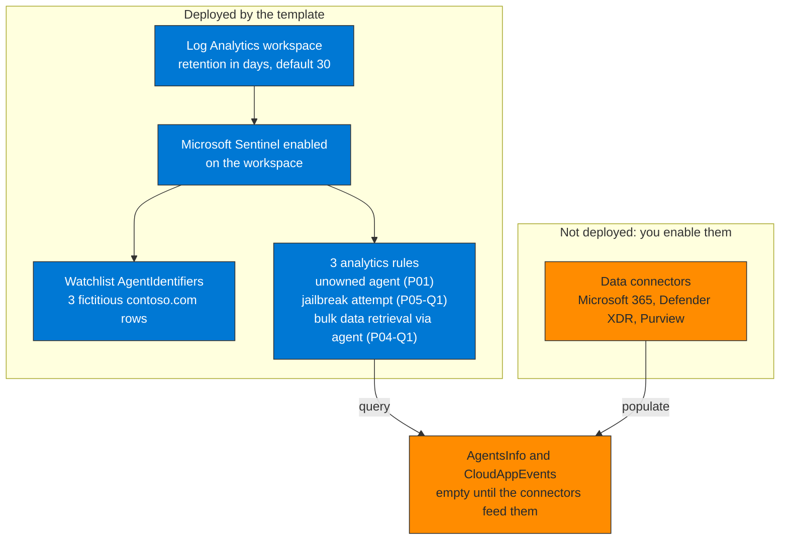

# ARM Templates

Deploy a pre-configured Microsoft Sentinel workspace for Track B and C labs.

## What Gets Deployed

- Log Analytics workspace with Microsoft Sentinel enabled
- 3 Sentinel analytics rules, aligned with the KQL Library: unowned agent (P01), jailbreak attempt (P05-Q1), bulk data retrieval via agent (P04-Q1)
- 1 watchlist: `AgentIdentifiers`, seeded with 3 fictitious `contoso.com` rows for reference

**Not included** — enable these separately before the rules can return real matches:
- **Data connectors.** This template does not deploy the Microsoft 365, Defender XDR, or Purview connectors. Without them, `AgentsInfo` and `CloudAppEvents` are empty and the rules have nothing to fire on. Connect them from Sentinel → Data connectors in your tenant, or via the demo tenant setup in `/Facilitator-Kit`.
- **Demo data.** No sample activity is pre-loaded. The rules run against your tenant's real telemetry once the connectors above are active.

**Schema note:** the analytics rules query `AgentsInfo` (Defender Advanced Hunting / Sentinel). The predecessor table `AIAgentsInfo` was retired 1 July 2026 — if you copy these queries elsewhere, confirm you're on the current schema (`CreatedDateTime`, `LifecycleStatus`, `Owners`, `Name` — note the display-name column is `Name`, not `AgentName`, confirmed live via `getschema` against tenant `AgentsInfo`, Sep 2026), not the old `AIAgentsInfo` column names.

**How to read it.** The blue components are what the template creates, in order: the workspace, Sentinel on top of it, then the watchlist and the three rules. The rules read AgentsInfo and CloudAppEvents, and those tables stay empty until you enable the Microsoft 365, Defender XDR and Purview connectors yourself. No demo data is pre-loaded either, so the rules run against your tenant's real telemetry.

## Deploy

## Parameters

| Parameter | Description | Default |
|-----------|-------------|---------|
| `workspaceName` | Sentinel workspace name | `agentic-security-lab` |
| `location` | Azure region | Resource group location |
| `retentionDays` | Log retention in days | `30` |

## Cost

Expected cost for lab duration (1 day): < $5 USD using the Sentinel 30-day trial.
