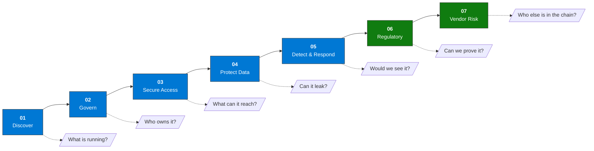
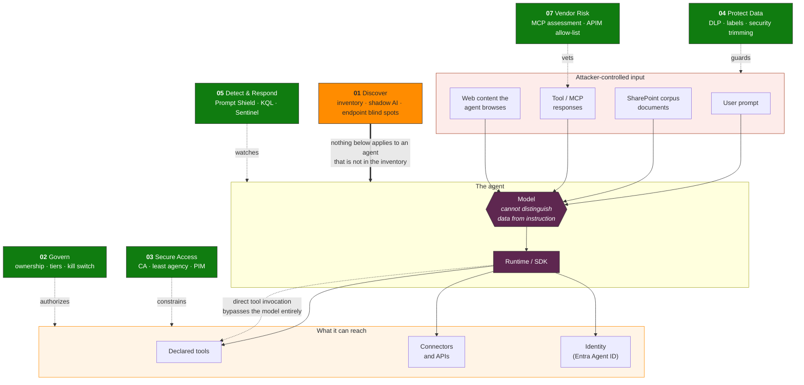

# Agent Zero Labs

**Practical security workshops for AI agents on the Microsoft stack.**

[](./LICENSE)
[](#choose-your-track)
[](./KQL-Library/README.md)
[](./skills/)
[](#framework-coverage)
[](#choose-your-track)

Seven security domains for agentic AI in the enterprise. Three audience tracks. Everything runs in a Microsoft 365 E5 demo tenant.

|  |  |
|---|---|
| **18 modules** across Executive, Architect, and SOC Engineer tracks | **38 KQL library queries** plus 20 query files bundled with skills, with per-file validation status |
| **30 agent skills** in agentskills.io format | **ARM template** deploys a preconfigured Sentinel workspace in one click |
| **10+ frameworks mapped** to concrete Microsoft controls | **Facilitator kit** with prerequisites, checklists, and impact signals |

[](https://portal.azure.com/#create/Microsoft.Template/uri/https%3A%2F%2Fraw.githubusercontent.com%2Fjcastanedacano%2Fagent-zero%2Fmain%2FARM-Templates%2Fazuredeploy.json)

**What this button gives you:** a Log Analytics workspace, Microsoft Sentinel enabled on it, 1 watchlist, and 3 analytics rules aligned with the KQL Library (unowned agent, jailbreak attempt, bulk data retrieval via agent). **What it does not give you:** data connectors or demo data — connect Microsoft 365 / Defender XDR / Purview yourself so the rules have telemetry to evaluate. See [`/ARM-Templates/README.md`](./ARM-Templates/README.md) for the full breakdown.

**Live series:** Agent Zero is also taught as a six-session live series with [Microsoft User Group Perú](https://www.youtube.com/@MUGdelPeru), every Friday from October 9, 2026 at 7:00 pm Lima time (GMT-5), free on YouTube. Each session includes a live lab.

**Companion site:** [Agentic Red-Team Map](https://agentic-redteam-map-78641.azurewebsites.net/) for the workshop.

**Author:** [Jorge Castañeda](https://github.com/jcastanedacano), Microsoft MVP (Security) · [LinkedIn](https://www.linkedin.com/in/jcastanedacano) · [jcastanedacano.com](https://www.jcastanedacano.com)

<details>
<summary><b>Full scope — every framework, control, and threat vector covered</b></summary>

<br>

A complete framework for securing agentic AI in enterprise Microsoft environments: 18 instructional modules across 3 audience tracks, 30 agent skills in agentskills.io format, 38 production KQL queries in the KQL Library, plus 20 query files bundled with skills (validation status tracked per file), ARM-deployable Sentinel workspace, and a full facilitator kit — covering the OWASP Top 10 for Agentic Applications (2026, ASI01–ASI10), the OWASP Top 10 for LLM Applications (2026, LLM01–LLM10), the OWASP Agentic Skills Top 10 (AST01–AST10), and aligned to MITRE ATLAS, NIST AI RMF, NIST CSF 2.0, ISO 42001, EU AI Act, CIS Controls v8.1 (AI Agent Companion Guide), MAESTRO (CSA 7-layer agentic threat model), PHANTOM-B (Shostack's STRIDE analog for LLMs), and the Microsoft AI Red Team Taxonomy of Failure Modes v2.0 (April 2026). Detection coverage includes behavioral drift monitoring, agent-to-agent prompt injection (multi-agent trust boundaries), canary tokens and honeytokens for RAG corpus integrity, Denial-of-Wallet and sponge example availability attacks, and AI-BOM supply chain provenance — aligned to the CLLMSP and CLLMSE certification bodies (Red Team Leaders / Joas A. Santos). Governance and detection extend to the highly-autonomous threat model: a tested three-level kill switch, sequence-based detection signatures for operations that vary their artifacts on every attempt, agent honeypot design, agent KYC, and an autonomy-graded incident taxonomy — organized against the Delay / Defend / Detect / Disrupt defense-in-depth framework.

</details>

---

## Contents

<details>
<summary><b>Expand table of contents</b></summary>

<br>

**Start here**
- [Choose your track](#choose-your-track)
- [Prerequisites](#prerequisites)
- [Quick start](#quick-start)
- [The seven domains](#the-seven-domains)

**What's inside**
- [Repository structure](#repository-structure)
- [Skills library](#skills-library)
- [KQL library](#kql-library)
- [Domain coverage at a glance](#domain-coverage-at-a-glance)

**How the threat model is built**
- [The agent attack surface](#the-agent-attack-surface)
- [Design principles](#design-principles)
- [Framework coverage](#framework-coverage)

**Reference**
- [How to use these labs](#how-to-use-these-labs)
- [Contributing](#contributing)
- [Related projects](#related-projects)
- [References](#references)

</details>

---

## Choose your track

Three parallel tracks. Pick by role and by how much lab access you have.


| Track | Audience | Format | Output |
|-------|----------|--------|--------|
| [**A — Executive**](./Track-A-Executive/README.md) | CISO / CTO / Director | Decision exercises, risk scenarios, roleplay — no lab access required | Risk Posture Map + Board Brief |
| [**B — Architect**](./Track-B-Architect/README.md) | Security Architect / Consultant | Hands-on labs in M365 E5 demo tenant + Azure AI Foundry | Gap Assessment + 90-day roadmap |
| [**C — SOC Engineer**](./Track-C-SOC-Engineer/README.md) | SOC Analyst / Security Engineer | KQL labs, Sentinel analytics rules, Purview, Entra CA, Logic Apps | Agentic incident response playbook |

> **Running a team event?** All three tracks can run in parallel. Share a 30-minute opening keynote on the seven domains, then split into track-specific rooms.

---

## Prerequisites

### Track A — No technical environment required
- Security or technology oversight role
- Familiarity with your organization's current AI tooling (helpful, not required)

### Track B — M365 E5 demo tenant
- Microsoft 365 E5 trial or CDX demo tenant
- **Microsoft Agent 365 onboarded in the tenant**, plus the **Microsoft 365 connector in Defender** (components *Microsoft Entra ID Management events* and *Microsoft 365 activities*): Defender's AI agent inventory (`AgentsInfo`), posture risk and threat detection depend on them (Modules 01–02). Agent 365 is included with Microsoft 365 E7 and is an add-on for E5, A5 and Business Premium. The registry inventory and basic governance actions come with Microsoft 365 Enterprise plans; policy templates, observability, tool access control (including MCP servers), the registry Graph API and access packages need E7 or Agent 365 ([service description](https://learn.microsoft.com/office365/servicedescriptions/microsoft-agent-365/microsoft-agent-365)). Setup: Defender portal → Settings → Security for AI → Get started. Allow 2–4 hours for data to appear (lab guidance, not re-verified in Oct 2026).
- Azure subscription with Contributor access
- Roles: Global Reader + Security Reader + Security Admin (demo tenant)
- Portals: Purview compliance, Defender XDR, Entra admin center, Copilot Studio admin, Power Platform admin

### Track C — M365 E5 + Sentinel workspace
- All Track B requirements (including Agent 365 license)
- Sentinel workspace deployed (use ARM template above)
- Roles: Security Admin + Sentinel Contributor + Compliance Administrator
- Portals: All Track B portals + Microsoft Sentinel + Logic Apps

→ Full details: [`/Facilitator-Kit/Prerequisites.md`](./Facilitator-Kit/Prerequisites.md)

---

## Quick Start

### Deploy the lab environment (Track B and C)

```bash
# Option 1 — Deploy to Azure button (above)
# Option 2 — Azure CLI
az deployment group create \
  --resource-group <your-rg> \
  --template-uri https://raw.githubusercontent.com/jcastanedacano/agent-zero/main/ARM-Templates/azuredeploy.json \
  --parameters workspaceName=agentic-security-lab
```

The ARM template deploys: Log Analytics workspace + Microsoft Sentinel + 3 pre-configured analytics rules (jailbreak detection, new agent without Entra identity or owner, data exfiltration) + agent watchlist.

### Start the workshop

1. **Facilitators:** Read [`/Facilitator-Kit/Prerequisites.md`](./Facilitator-Kit/Prerequisites.md) and run through [`/Facilitator-Kit/Lab-Environment-Checklist.md`](./Facilitator-Kit/Lab-Environment-Checklist.md) 24 hours before the session.
2. **Track A:** Start at [`Track-A-Executive/Module-01-Discover.md`](./Track-A-Executive/Module-01-Discover.md)
3. **Track B:** Deploy ARM template → start at [`Track-B-Architect/Module-01-Discover.md`](./Track-B-Architect/Module-01-Discover.md)
4. **Track C:** Deploy ARM template → start at [`Track-C-SOC-Engineer/Module-01-Discover.md`](./Track-C-SOC-Engineer/Module-01-Discover.md)

---

## The seven domains

Every track walks the same seven domains. Each one answers a question the previous one exposes.



**The dependency that matters:** an agent missing from Domain 01 is missing from every domain after it. It has no Conditional Access policy, no owner to escalate to, and no Sentinel rule watching it. The inventory gap is the gap in every subsequent layer.

| # | Domain | Core Question | Outcome |
|---|--------|---------------|---------|
| 01 | **Discover & Prioritize** | What agents are running, and does anyone know? | Complete inventory + risk classification |
| 02 | **Govern & Control** | Who owns each agent, and what's the lifecycle? | Every agent has an owner, policy, and lifecycle score |
| 03 | **Secure Access** | Do agents have only the access they need? | Least privilege verified + forensic identity traceability |
| 04 | **Protect Data** | Can agents exfiltrate data through prompts or connectors? | Data protected with forensic traceability in AI interactions |
| 05 | **Detect & Respond** | Is your SOC ready for agentic incidents? | Agents integrated into SOC: unified detection and response |
| 06 | **Regulatory Compliance** | Which EU AI Act tier applies, and what do DORA, ISO 42001, and NIST AI RMF require? | Compliance gap assessment + Purview Compliance Manager assessment + DORA action plan foundation (ECB/SSM deadline: 31 Oct 2026) |
| 07 | **Vendor & Third-Party AI Risk** | Which external AI vendors and MCP servers are connected, and have they been assessed? | Vendor scorecard (22 questions) + MCP server audit KQL |

---

## Repository structure

<details>
<summary><b>Expand full directory tree</b></summary>

<br>

```
agent-zero/
├── Track-A-Executive/               ← executive track (decision exercises, no lab access)
│   ├── README.md
│   ├── Module-01-Discover.md
│   ├── Module-02-Govern.md
│   ├── Module-03-SecureAccess.md
│   ├── Module-04-ProtectData.md
│   ├── Module-05-DetectRespond.md
│   └── Templates/
│       └── Board-AI-Security-Brief-Template.md  ← board brief template for CISO/executive
├── Track-B-Architect/               ← architect track (hands-on demo tenant labs)
│   ├── README.md
│   ├── Module-01-Discover.md
│   ├── Module-02-Govern.md
│   ├── Module-03-SecureAccess.md
│   ├── Module-04-ProtectData.md
│   ├── Module-05-DetectRespond.md
│   ├── Module-06-RegulatoryFrameworks.md        ← EU AI Act + NIST AI RMF + ISO 42001
│   ├── Module-07-VendorRisk.md                  ← third-party AI and MCP server risk
│   └── Templates/
│       └── Gap-Assessment-Template.md
├── Track-C-SOC-Engineer/            ← SOC engineer track (KQL, Sentinel, Purview, Entra CA)
│   ├── README.md
│   ├── Module-01-Discover.md
│   ├── Module-02-Govern.md
│   ├── Module-03-SecureAccess.md
│   ├── Module-04-ProtectData.md
│   ├── Module-05-DetectRespond.md
│   ├── Module-06-RedTeamPerspective.md          ← attacker perspective, 6 attacks
│   └── Templates/
│       └── Incident-Response-Playbook-Template.md
├── KQL-Library/                     ← 38 production-ready queries for Sentinel + Defender XDR
│   ├── README.md
│   ├── P01-Agent-Discovery.kql
│   ├── P02-Governance-Gaps.kql
│   ├── P03-Access-Anomalies.kql      ← Q7 membership inference + Q8 model inversion + Q11 BehaviorInfo + Q12 Agent ID object changes added
│   ├── P04-Exfiltration-Detection.kql
│   └── P05-Jailbreak-Detection.kql              ← Q7 LPCI + Q8 agentic ransomware chain
├── skills/                          ← 30 agent skills (agentskills.io format, ATLAS + NIST mapped)
│   ├── SCHEMA.md                    ← Universal Skill Format security manifest (OWASP AST04/AST10)
│   ├── discover/   (6 skills)
│   ├── govern/     (7 skills)
│   ├── secure/     (5 skills)
│   ├── protect/    (5 skills)
│   ├── detect/     (7 skills)
│   └── references/
│       └── frameworks.md            ← Cross-reference: ATLAS, D3FEND, NIST AI RMF, NIST CSF
├── docs/                            ← full reference list, framework mappings, controls and risk vectors
│   ├── references.md
│   ├── framework-coverage.md
│   └── controls-and-risk-vectors.md
├── ARM-Templates/                   ← Deploy a pre-configured Sentinel workspace in one click
│   ├── README.md
│   └── azuredeploy.json
└── Facilitator-Kit/                 ← Run the workshop: prerequisites, checklist, impact signals
    ├── README.md
    ├── Prerequisites.md
    ├── Lab-Environment-Checklist.md
    └── Impact-Indicators.md
```

</details>

---

## Skills Library

30 agent skills in [agentskills.io](https://agentskills.io) format, mapped to MITRE ATLAS (2026.09), D3FEND v1.3, NIST AI RMF, and NIST CSF 2.0.

Each skill includes: YAML frontmatter (pillar, subdomain, tags, framework mappings, license and role requirements), step-by-step workflow, KQL queries, and verification checklist.

| Pillar | Skills |
|--------|--------|
| [01 Discover](./skills/discover/) | `discover-inventory-agents-copilot-studio` · `discover-enumerate-foundry-agents` · `discover-shadow-ai-entra-principals` · `discover-classify-agent-connectors` · `discover-purview-dspm-ai` · `discover-third-party-ai-risk` |
| [02 Govern](./skills/govern/) | `govern-entra-agent-id` · `govern-agent365-approval-flow` · `govern-ca-policy-workload-identity` · `govern-dlp-policy-copilot-prompts` · `govern-lifecycle-decommission-agent` · `govern-pim-agent-roles` · `govern-foundry-rbac` |
| [03 Secure](./skills/secure/) | `secure-least-privilege-agent-identity` · `secure-managed-identity-foundry` · `secure-network-isolation-agent` · `secure-secret-management-keyvault` · `secure-ca-policy-agents` |
| [04 Protect](./skills/protect/) | `protect-data-loss-prevention-agent-outputs` · `protect-sensitivity-labels-ai-outputs` · `protect-purview-ai-hub-monitoring` · `protect-information-barriers-agents` · `protect-insider-risk-management-agents` |
| [05 Detect](./skills/detect/) | `detect-alert-prompt-injection-sentinel` · `detect-anomalous-agent-behavior` · `detect-data-exfiltration-agent` · `detect-agent-identity-abuse` · `detect-respond-playbook-agent-containment` · `detect-sentinel-mcp-server` · `detect-security-copilot-triage` |

→ [Framework cross-reference](./skills/references/frameworks.md) — the ATLAS table is generated from all 30 skills; every skill also carries its D3FEND, NIST AI RMF, and NIST CSF identifiers in its frontmatter.

---

## KQL Library

38 production-ready queries for Microsoft Sentinel and Defender Advanced Hunting, in five files (P01 to P05). Queries are validated against a live Microsoft 365 tenant using the Microsoft Graph Security `runHuntingQuery` API, with the date of the last validation listed per file (P04 targets Sentinel tables and has no validation date).

Index, usage and per-file validation status: [KQL-Library/README.md](./KQL-Library/README.md#schema-validation-status).

---

## Domain coverage at a glance

Every domain maps to named, configurable Microsoft controls and to the risk vectors the labs exercise and the KQL detects. The full list of controls and vectors per domain is in [docs/controls-and-risk-vectors.md](./docs/controls-and-risk-vectors.md).

| Domain | Microsoft controls | Risk vectors |
|---|---|---|
| 01 Discover & Prioritize | 6 | 5 |
| 02 Govern & Control | 12 | 9 |
| 03 Secure Access | 11 | 10 |
| 04 Protect Data | 8 | 8 |
| 05 Detect & Respond | 16 | 13 |
| 06 Regulatory Compliance | 6 | n/a |
| 07 Vendor & Third-Party AI Risk | 10 | 11 |
| **Total** | **69** | **56** |

Domain 06 is the evidence layer: it has controls but defends no risk vector of its own.

---

## The agent attack surface

Agents introduce four surfaces that traditional security tooling does not cover. Every domain in this framework maps to closing one of them.



**Domain 01 is the precondition, not a peer.** It sits above the others in orange because it does not guard a surface — it establishes that the agent exists at all. An agent absent from the inventory has no Conditional Access policy applied, no owner to escalate to, and no Sentinel rule watching it. Every green control below is silently inapplicable to it.

**Domain 06 (Regulatory) is not on this diagram** because it does not defend a surface either. It is the evidence layer: proving to an auditor or supervisor that the controls above were designed, deployed, and tested. It consumes the output of all seven domains rather than guarding any one of them.

**The dotted line matters most.** Every prompt-layer control assumes the model sits in the execution path. Research presented at BlackHat USA 2026 documented agent runtimes across three major SDKs that execute a supplied tool-call block **with no model invocation in between** — which means Prompt Shield, content filters, and every prompt-scoring KQL query never fire, because they were never in the path. See [Track B Module-02 point 11](./Track-B-Architect/Module-02-Govern.md).

**A convergent naming worth adopting when you brief this to others:** Microsoft's own Agent 365 governance materials describe this same surface with a six-flow shorthand — H2A (human-to-agent prompt), A2H (agent-to-human response), A2A (agent-to-agent invocation), A2LLM (agent-to-model inference), A2App (agent-to-application action), and agent-to-data-source read/write. It maps directly onto the diagram above: H2A/A2H is the user prompt edge, A2A is the direct-tool-invocation and agent-to-agent injection surface (Module 02 points 9 and 11), A2LLM is the model edge itself, and A2App plus the data-source edges are the blast radius on the right. Independent convergence on the same six control points, from a product governance angle rather than a security-research angle, is a reasonable signal that this is the right way to decompose the surface — use whichever vocabulary lands better with the audience in the room.

---

## Design Principles

Two concepts from Anthropic's [Zero Trust for AI Agents](https://www.anthropic.com/resources/zero-trust-for-ai-agents) inform the architecture of this framework:

**Least Agency** extends least privilege to agentic applications. Where least privilege restricts *what users and systems can access*, least agency goes further — restricting *what each agent tool can do*, *how often*, and *where*. Entra Agent ID + CA for Agents is the Microsoft-native implementation of least agency: the agent gets an identity, scoped permissions, and a policy that defines its blast radius before it ever runs.

**The "impossible vs. tedious" test** distinguishes real controls from friction. Ask of every mitigation: does this make an attack *impossible*, or just *tedious*? Rate limits, extra hops, and SMS-based MFA are tedious for a human attacker. An agentic adversary that can process thousands of steps per minute treats tedious controls as negligible overhead. Design for impossible first; treat tedious as a delay, not a defense.

**The control plane must be independent of the agent's reasoning path.** A policy engine that relies on the same reasoning context that generated the action provides no real safety boundary — if the agent's reasoning is influenced (via prompt injection, poisoned context, or LPCI), the safety evaluation is compromised too. The CAGE model operationalizes this separation: **C**lassify the proposed action, **A**pprove based on risk evidence (showing the actual command, not the agent's description of it), **G**ate execution through policy and least-privilege tools, **E**vidence-log the full chain — request, decision, action, and outcome. Approval screens that show only the agent's explanation become rubber stamps; the control plane must expose the actual execution artifact. Reference: Manoj Verma (2026) — "AI Agents Need a Control Plane Before They Touch Critical Systems."

**Tiered Autonomy** defines when an agent may act unilaterally and when it must stop for human approval. Three tiers: (1) *Full automation* for low-risk, reversible actions with bounded blast radius; (2) *Human approval* for medium-risk actions affecting multiple users, external systems, or sensitive data; (3) *Human-led* for high-risk actions — account disablement, data deletion, policy changes. Without explicit tier assignment, every agent defaults to tier 1, which is the most common governance gap in production deployments. The Microsoft AI Red Team Taxonomy v2.0 (April 2026) extends this with *consent architecture hardening*: HITL invocation must be deterministic (the agent cannot decide when to skip approval), compound actions must be decomposed into individually approvable steps, and action descriptions shown to approvers must resist semantic manipulation ("description laundering"). KQL P02-Q6 surfaces sessions where this decomposition is absent.

---

## Framework coverage

This framework does not invent a taxonomy. It maps six published threat models to the same Microsoft controls, so a finding in one vocabulary is traceable in the others.

| Framework | Scope | Effort to adopt | Best used for |
|---|---|---|---|
| **PHANTOM-B** | The LLM call | Low | First pass on every agent in the inventory (Module 01) |
| **OWASP Top 10 for Agentic Applications** | Agent system | Low | Vulnerability classification and reporting |
| **OWASP Top 10 for LLM Applications** | Model / inference layer | Low | Data exposure, unbounded consumption, supply chain at the model layer |
| **OWASP Agentic Skills Top 10** | Skill / MCP layer | Low | Third-party tool and plugin review (Module 07) |
| **CIS Controls v8.1** | Control catalog | Medium | Mapping agent work into an existing CIS program |
| **MAESTRO** | Multi-agent architecture | High | Cross-layer propagation in agent-to-agent designs |
| **HACCA** | Autonomous adversary | Strategic | Executive framing and defense-in-depth prioritization |

**Which to start with:** PHANTOM-B per agent, escalate to MAESTRO only when agents call other agents. The two answer different questions and the effort difference is real.

The mapping of each framework to the Microsoft controls (OWASP Agentic Top 10, OWASP Agentic Skills Top 10, MAESTRO, PHANTOM-B, CIS Controls AI Agent Companion Guide and HACCA) is in [docs/framework-coverage.md](./docs/framework-coverage.md).

---

## How to Use These Labs

**Self-paced learner:** Pick your track, start at Module 01, work through sequentially. Each module is standalone but the narrative builds. Track B extends to Module 07 and Track C to Module 06.

**Facilitator:** Read [`/Facilitator-Kit`](./Facilitator-Kit/README.md) before running any session — environment prep checklist, per-track prerequisites, and signals that the workshop is working.

**Team event:** Run all three tracks in parallel. Tracks A and B/C can share a 30-minute opening keynote on the seven domains, then split into track-specific rooms.

**Security operations:** Use the [skills library](./skills/) and [KQL Library](./KQL-Library/README.md) independently — each skill and query works standalone without the workshop context.

---

## Contributing

Contributions welcome. See [CONTRIBUTING.md](./CONTRIBUTING.md) for guidelines.

Areas where contributions are most valuable:
- Additional KQL queries for detection coverage gaps
- New skills for controls not yet covered (see [SCHEMA.md](./skills/SCHEMA.md) for the format)
- Lab exercises for regulated industries (financial services, healthcare, energy)
- ARM template improvements for faster lab environment deployment
- Translations of Track A materials

---

## License

MIT License. See [LICENSE](./LICENSE) for details.

---

## Related Projects

| Repository | What it does | How it differs from this project |
|------------|-------------|----------------------------------|
| [microsoft/Data-and-Agent-Governance-and-Security-Accelerator](https://github.com/microsoft/Data-and-Agent-Governance-and-Security-Accelerator) | Automates Purview DSPM for AI onboarding, DLP, sensitivity labels, and audit logging via `azd up` | Automation accelerator for deployment — not a learning framework. Use it after you understand what you're deploying. |
| [microsoft/agent-governance-toolkit](https://github.com/microsoft/agent-governance-toolkit) | Policy enforcement, zero-trust identity, execution sandboxing, and SRE for autonomous agents. Covers OWASP Agentic Top 10. | Framework-agnostic governance SDK (Python, any LLM). Complements this project's Microsoft-native focus. |
| [microsoft/agentic-ai-lab](https://github.com/microsoft/agentic-ai-lab) | Azure AI Foundry & Agents development workshop — RAG, MCP, red teaming, observability | Developer-focused lab for building agents, not securing them in enterprise environments. |
| [Cloud-Architekt/AzureAD-Attack-Defense](https://github.com/Cloud-Architekt/AzureAD-Attack-Defense) | Entra ID Attack & Defense Playbook: attack scenarios, detections, and mitigations for Microsoft Entra ID. Its Agent Identities chapter (announced September 2026) covers a three-phase agent attack lifecycle, "Living off the Agent's Tools", and the Agent ID object model. | Attacker-side reference for the identity plane. This project uses it in Track C Module 06 (point 8) and keeps its own detections and multi-track structure. |
| [Azure/Azure-Sentinel Training Lab](https://github.com/Azure/Azure-Sentinel/tree/master/Solutions/Training/Azure-Sentinel-Training-Lab) | Single-track Sentinel hands-on lab with pre-loaded data via ARM template | Sentinel product training for one audience. This project adds multi-track structure and an agentic security domain layer on top. |

---

## References

Primary sources only. The full list of 32 sources, with notes on how each one is used, is in [docs/references.md](./docs/references.md).

- [NIST AI Risk Management Framework](https://www.nist.gov/system/files/documents/2023/01/26/AI_RMF_1.0.pdf)
- [MITRE ATLAS](https://atlas.mitre.org/) (Adversarial Threat Landscape for AI Systems) and [MITRE D3FEND](https://d3fend.mitre.org/)
- [OWASP Top 10 for LLM Applications 2026](https://genai.owasp.org) and [OWASP Top 10 for Agentic AI Applications](https://genai.owasp.org/resource/owasp-top-10-for-agentic-ai-applications-v1-0/)
- [CISA: Careful Adoption of Agentic AI Services](https://www.cisa.gov/resources-tools/resources/careful-adoption-agentic-ai-services)
- [MAESTRO: Agentic AI Threat Modeling Framework (Cloud Security Alliance)](https://cloudsecurityalliance.org/blog/2025/02/06/agentic-ai-threat-modeling-framework-maestro)
- [PHANTOM-B: A STRIDE Analog for LLMs](https://arxiv.org/abs/2510.07192)
- [CIS Controls AI Agent Companion Guide](https://www.cisecurity.org/controls/ai-agent-companion-guide)
- [ECB/SSM supervisory letter SSM-2026-0301 on AI-enabled cybersecurity threats](https://www.bankingsupervision.europa.eu/press/letterstobanks/shared/pdf/2026/ssm.2026_letter_on_AI_enabled_cybersecurity_threats.en.pdf)
- [Conditional Access for agents](https://learn.microsoft.com/entra/identity/conditional-access/agent-id) (Microsoft Learn)
- [Transition AI agent security capabilities to Microsoft Agent 365](https://learn.microsoft.com/defender-xdr/security-for-ai/transition-agent-security-to-agent-365) (Microsoft Learn)
- [agentskills.io: agent skill format reference](https://agentskills.io)
