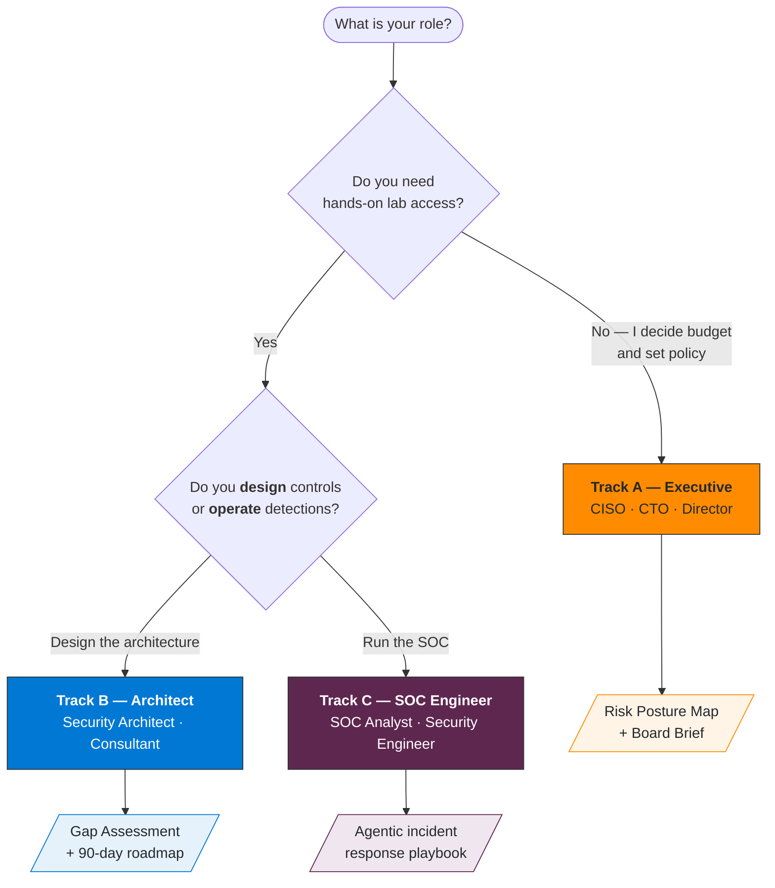
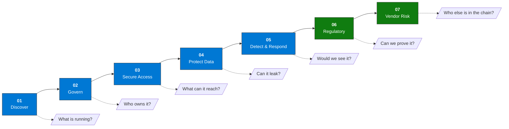
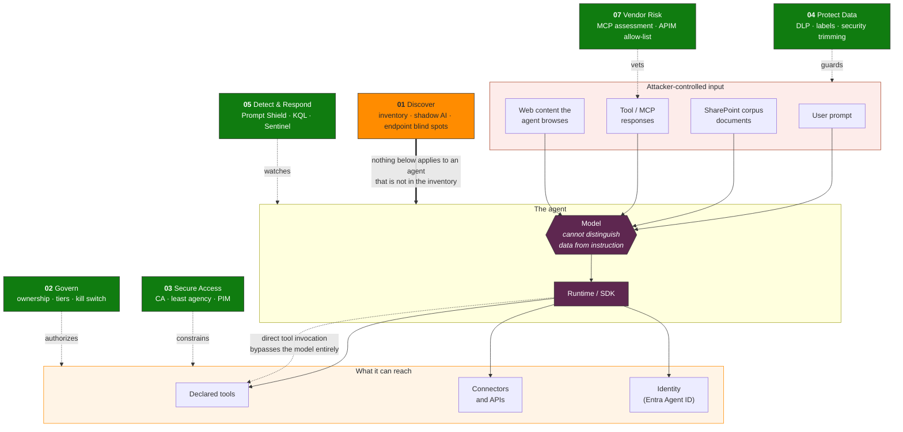

# Agent Zero Labs

**Practical security workshops for AI agents on the Microsoft stack.**

[](./LICENSE)
[](#choose-your-track)
[](./KQL-Library/README.md)
[](./skills/)
[](#framework-coverage)
[](#choose-your-track)

Seven security domains for agentic AI in the enterprise. Three audience tracks. Everything runs in a Microsoft 365 E5 demo tenant.

|  |  |
|---|---|
| **19 modules** across Executive, Architect, and SOC Engineer tracks | **45+ KQL queries** validated against a live M365 tenant (June 2026) |
| **30 agent skills** in agentskills.io format | **ARM template** deploys a preconfigured Sentinel workspace in one click |
| **10+ frameworks mapped** to concrete Microsoft controls | **Facilitator kit** with prerequisites, checklists, and impact signals |

[](https://portal.azure.com/#create/Microsoft.Template/uri/https%3A%2F%2Fraw.githubusercontent.com%2Fjcastanedacano%2Fagent-zero%2Fmain%2FARM-Templates%2Fazuredeploy.json)

<details>
<summary><b>Full scope — every framework, control, and threat vector covered</b></summary>

<br>

A complete framework for securing agentic AI in enterprise Microsoft environments: 19 instructional modules across 3 audience tracks, 30 agent skills in agentskills.io format, 45+ production KQL queries (live-tenant validated against Microsoft 365, June 2026), ARM-deployable Sentinel workspace, and a full facilitator kit — covering the OWASP Agentic Top 10, the OWASP Agentic Skills Top 10 (AST01–AST10), and aligned to MITRE ATLAS, NIST AI RMF, NIST CSF 2.0, ISO 42001, EU AI Act, CIS Controls v8.1 (AI Agent Companion Guide), MAESTRO (CSA 7-layer agentic threat model), PHANTOM-B (Shostack's STRIDE analog for LLMs), and the Microsoft AI Red Team Taxonomy of Failure Modes v2.0 (April 2026). Detection coverage includes behavioral drift monitoring, agent-to-agent prompt injection (multi-agent trust boundaries), canary tokens and honeytokens for RAG corpus integrity, Denial-of-Wallet and sponge example availability attacks, and AI-BOM supply chain provenance — aligned to the CLLMSP and CLLMSE certification bodies (Red Team Leaders / Joas A. Santos). Governance and detection extend to the highly-autonomous threat model: a tested three-level kill switch, sequence-based detection signatures for operations that vary their artifacts on every attempt, agent honeypot design, agent KYC, and an autonomy-graded incident taxonomy — organized against the Delay / Defend / Detect / Disrupt defense-in-depth framework.

</details>

---

## Contents

<details>
<summary><b>Expand table of contents</b></summary>

<br>

**Start here**
- [Choose your track](#choose-your-track)
- [The seven domains](#the-seven-domains)
- [Quick start](#quick-start)
- [Prerequisites](#prerequisites)

**What's inside**
- [Repository structure](#repository-structure)
- [Skills library](#skills-library)
- [KQL library — schema validation status](#kql-library--schema-validation-status)
- [Microsoft controls coverage](#microsoft-controls-coverage)

**How the threat model is built**
- [The agent attack surface](#the-agent-attack-surface)
- [Design principles](#design-principles)
- [Framework coverage](#framework-coverage)
- [Risk vectors covered](#risk-vectors-covered)

**Reference**
- [How to use these labs](#how-to-use-these-labs)
- [Contributing](#contributing)
- [Related projects](#related-projects)
- [References](#references)

</details>

---

## Choose your track

Three parallel tracks. Pick by role and by how much lab access you have.



| Track | Audience | Format | Output |
|-------|----------|--------|--------|
| [**A — Executive**](./Track-A-Executive/README.md) | CISO / CTO / Director | Decision exercises, risk scenarios, roleplay — no lab access required | Risk Posture Map + Board Brief |
| [**B — Architect**](./Track-B-Architect/README.md) | Security Architect / Consultant | Hands-on labs in M365 E5 demo tenant + Azure AI Foundry | Gap Assessment + 90-day roadmap |
| [**C — SOC Engineer**](./Track-C-SOC-Engineer/README.md) | SOC Analyst / Security Engineer | KQL labs, Sentinel analytics rules, Purview, Entra CA, Logic Apps | Agentic incident response playbook |

> **Running a team event?** All three tracks can run in parallel. Share a 30-minute opening keynote on the seven domains, then split into track-specific rooms.

---

## The seven domains

Every track walks the same seven domains. Each one answers a question the previous one exposes.



**The dependency that matters:** an agent missing from Domain 01 is missing from every domain after it. It has no Conditional Access policy, no owner to escalate to, and no Sentinel rule watching it. The inventory gap is the gap in every subsequent layer.

| # | Domain | Core Question | Outcome |
|---|--------|---------------|---------|
| 01 | **Discover & Prioritize** | What agents are running, and does anyone know? | Complete inventory + risk classification |
| 02 | **Govern & Control** | Who owns each agent, and what's the lifecycle? | Every agent has an owner, policy, and lifecycle score |
| 03 | **Secure Access** | Do agents have only the access they need? | Least privilege verified + forensic identity traceability |
| 04 | **Protect Data** | Can agents exfiltrate data through prompts or connectors? | Data protected with forensic traceability in AI interactions |
| 05 | **Detect & Respond** | Is your SOC ready for agentic incidents? | Agents integrated into SOC: unified detection and response |
| 06 | **Regulatory Compliance** | Which EU AI Act tier applies, and what do DORA, ISO 42001, and NIST AI RMF require? | Compliance gap assessment + Purview Compliance Manager assessment + DORA action plan foundation (ECB/SSM deadline: 31 Oct 2026) |
| 07 | **Vendor & Third-Party AI Risk** | Which external AI vendors and MCP servers are connected, and have they been assessed? | Vendor scorecard (22 questions) + MCP server audit KQL |

---

## Repository structure

<details>
<summary><b>Expand full directory tree</b></summary>

<br>

```
agent-zero/
├── Track-A-Executive/               ← 4h executive track (decision exercises, no lab access)
│   ├── README.md
│   ├── Module-01-Discover.md
│   ├── Module-02-Govern.md
│   ├── Module-03-SecureAccess.md
│   ├── Module-04-ProtectData.md
│   ├── Module-05-DetectRespond.md
│   └── Templates/
│       └── Board-AI-Security-Brief-Template.md  ← NEW: board brief template for CISO/executive
├── Track-B-Architect/               ← 10.5h architect track (hands-on demo tenant labs)
│   ├── README.md
│   ├── Module-01-Discover.md
│   ├── Module-02-Govern.md
│   ├── Module-03-SecureAccess.md
│   ├── Module-04-ProtectData.md
│   ├── Module-05-DetectRespond.md
│   ├── Module-06-RegulatoryFrameworks.md        ← NEW: EU AI Act + NIST AI RMF + ISO 42001
│   ├── Module-07-VendorRisk.md                  ← NEW: third-party AI and MCP server risk
│   └── Templates/
│       └── Gap-Assessment-Template.md
├── Track-C-SOC-Engineer/            ← 9.5h SOC engineer track (KQL, Sentinel, Purview, Entra CA)
│   ├── README.md
│   ├── Module-01-Discover.md
│   ├── Module-02-Govern.md
│   ├── Module-03-SecureAccess.md
│   ├── Module-04-ProtectData.md
│   ├── Module-05-DetectRespond.md
│   ├── Module-06-RedTeamPerspective.md          ← NEW: attacker perspective, 6 attacks
│   └── Templates/
│       └── Incident-Response-Playbook-Template.md
├── KQL-Library/                     ← 40+ production-ready queries for Sentinel + Defender XDR
│   ├── README.md
│   ├── P01-Agent-Discovery.kql
│   ├── P02-Governance-Gaps.kql
│   ├── P03-Access-Anomalies.kql      ← Q7 membership inference + Q8 model inversion added
│   ├── P04-Exfiltration-Detection.kql
│   └── P05-Jailbreak-Detection.kql              ← Q7 LPCI + Q8 agentic ransomware chain
├── skills/                          ← 30 agent skills (agentskills.io format, ATLAS + NIST mapped)
│   ├── SCHEMA.md                    ← Universal Skill Format security manifest (OWASP AST04/AST10)
│   ├── discover/   (6 skills)
│   ├── govern/     (7 skills)
│   ├── secure/     (5 skills)
│   ├── protect/    (5 skills)
│   ├── detect/     (7 skills)
│   └── references/
│       └── frameworks.md            ← Cross-reference: ATLAS, D3FEND, NIST AI RMF, NIST CSF
├── ARM-Templates/                   ← Deploy a pre-configured Sentinel workspace in one click
│   ├── README.md
│   └── azuredeploy.json
└── Facilitator-Kit/                 ← Run the workshop: prerequisites, checklist, impact signals
    ├── README.md
    ├── Prerequisites.md
    ├── Lab-Environment-Checklist.md
    └── Impact-Indicators.md
```

</details>

---

## Quick Start

### Deploy the lab environment (Track B and C)

```bash
# Option 1 — Deploy to Azure button (above)
# Option 2 — Azure CLI
az deployment group create \
  --resource-group <your-rg> \
  --template-uri https://raw.githubusercontent.com/jcastanedacano/agent-zero/main/ARM-Templates/azuredeploy.json \
  --parameters workspaceName=agentic-security-lab
```

The ARM template deploys: Log Analytics workspace + Microsoft Sentinel + 3 pre-configured analytics rules (jailbreak detection, new agent without Entra identity or owner, data exfiltration) + agent watchlist.

### Start the workshop

1. **Facilitators:** Read [`/Facilitator-Kit/Prerequisites.md`](./Facilitator-Kit/Prerequisites.md) and run through [`/Facilitator-Kit/Lab-Environment-Checklist.md`](./Facilitator-Kit/Lab-Environment-Checklist.md) 24 hours before the session.
2. **Track A:** Start at [`Track-A-Executive/Module-01-Discover.md`](./Track-A-Executive/Module-01-Discover.md)
3. **Track B:** Deploy ARM template → start at [`Track-B-Architect/Module-01-Discover.md`](./Track-B-Architect/Module-01-Discover.md)
4. **Track C:** Deploy ARM template → start at [`Track-C-SOC-Engineer/Module-01-Discover.md`](./Track-C-SOC-Engineer/Module-01-Discover.md)

---

## Skills Library

30 agent skills in [agentskills.io](https://agentskills.io) format, mapped to MITRE ATLAS v5.4, D3FEND v1.3, NIST AI RMF, and NIST CSF 2.0.

Each skill includes: YAML frontmatter (pillar, subdomain, tags, framework mappings, license and role requirements), step-by-step workflow, KQL queries, and verification checklist.

| Pillar | Skills |
|--------|--------|
| [01 Discover](./skills/discover/) | `discover-inventory-agents-copilot-studio` · `discover-enumerate-foundry-agents` · `discover-shadow-ai-entra-principals` · `discover-classify-agent-connectors` · `discover-purview-dspm-ai` · `discover-third-party-ai-risk` |
| [02 Govern](./skills/govern/) | `govern-entra-agent-id` · `govern-agent365-approval-flow` · `govern-ca-policy-workload-identity` · `govern-dlp-policy-copilot-prompts` · `govern-lifecycle-decommission-agent` · `govern-pim-agent-roles` · `govern-foundry-rbac` |
| [03 Secure](./skills/secure/) | `secure-least-privilege-agent-identity` · `secure-managed-identity-foundry` · `secure-network-isolation-agent` · `secure-secret-management-keyvault` · `secure-ca-policy-agents` |
| [04 Protect](./skills/protect/) | `protect-data-loss-prevention-agent-outputs` · `protect-sensitivity-labels-ai-outputs` · `protect-purview-ai-hub-monitoring` · `protect-information-barriers-agents` · `protect-insider-risk-management-agents` |
| [05 Detect](./skills/detect/) | `detect-alert-prompt-injection-sentinel` · `detect-anomalous-agent-behavior` · `detect-data-exfiltration-agent` · `detect-agent-identity-abuse` · `detect-respond-playbook-agent-containment` · `detect-sentinel-mcp-server` · `detect-security-copilot-triage` |

→ [Framework cross-reference](./skills/references/frameworks.md) — all 30 skills mapped to ATLAS, D3FEND, NIST AI RMF, and NIST CSF.

---

## KQL Library — Schema Validation Status

All queries in the KQL Library have been validated against a live Microsoft 365 tenant (June 2026) using the Microsoft Graph Security `runHuntingQuery` API.

| File | Tables | Last Validated | Notes |
|------|--------|---------------|-------|
| [P01-Agent-Discovery.kql](./KQL-Library/P01-Agent-Discovery.kql) | `AgentsInfo`, `CloudAppEvents`, `OfficeActivity` | 2026-06-28 | Migrated from `AIAgentsInfo` (deprecated July 1, 2026). Real column is `Name` (not `AgentName`). Q6 added: MCP server + tool count risk. |
| [P02-Governance-Gaps.kql](./KQL-Library/P02-Governance-Gaps.kql) | `AgentsInfo`, `AuditLogs`, `CloudAppEvents` | 2026-06-28 | Migrated from `AIAgentsInfo`. `Owners` (dynamic) cast to string before grouping. Q6 added: compound actions without per-step HITL events (AIRT Taxonomy v2.0 §5.4). |
| [P03-Access-Anomalies.kql](./KQL-Library/P03-Access-Anomalies.kql) | `CloudAppEvents`, `EntraIdSpnSignInEvents`, `AuditLogs` | 2026-06-28 | Migrated from `AADSpnSignInEventsBeta` (deprecated Dec 2025). Field is `Country` (not `Location`). Q5b: capability/architecture disclosure (AIRT Taxonomy v2.0 §4.9). Q7: membership inference detection (privacy classification per Microsoft threat modeling). Q8: model inversion / training data reconstruction. |
| [P04-Exfiltration-Detection.kql](./KQL-Library/P04-Exfiltration-Detection.kql) | `CloudAppEvents`, `MicrosoftPurviewInformationProtection` | — | Sentinel tables — `TimeGenerated` correct. |
| [P05-Jailbreak-Detection.kql](./KQL-Library/P05-Jailbreak-Detection.kql) | `CloudAppEvents`, `BehaviorAnalytics`, `AgentsInfo` | — | Sentinel tables. Q6: goal hijacking via sustained objective drift (AIRT Taxonomy v2.0 §4.4). Q7: LPCI via tool responses (OWASP AST03, arXiv:2507.10457). Q8: agentic ransomware chain detection — JadePuffer pattern (discovery → credential → lateral → encryption in compressed time window). |

**Live tenant findings (June 2026):** P01-Q2 returned shadow AI agents (Mural, Matter, 1Page, Teamflect, Priority Matrix) that had been operating for 951 days without an Entra Agent ID or assigned owner — validating the shadow AI detection logic.

> **Migration note:** `AIAgentsInfo` is deprecated on **July 1, 2026**. All queries in this repository already use `AgentsInfo`. If you have saved queries outside Defender XDR that reference `AIAgentsInfo`, migrate them before that date.

---

## Prerequisites

### Track A — No technical environment required
- Security or technology oversight role
- Familiarity with your organization's current AI tooling (helpful, not required)

### Track B — M365 E5 demo tenant
- Microsoft 365 E5 trial or CDX demo tenant
- **Agent 365 / Microsoft 365 Copilot license** — required for `AgentsInfo` table and agent registry (Modules 01–02). Included in M365 Copilot SKU. Allow 2–4 hours after assignment before lab day.
- Azure subscription with Contributor access
- Roles: Global Reader + Security Reader + Security Admin (demo tenant)
- Portals: Purview compliance, Defender XDR, Entra admin center, Copilot Studio admin, Power Platform admin

### Track C — M365 E5 + Sentinel workspace
- All Track B requirements (including Agent 365 license)
- Sentinel workspace deployed (use ARM template above)
- Roles: Security Admin + Sentinel Contributor + Compliance Administrator
- Portals: All Track B portals + Microsoft Sentinel + Logic Apps

→ Full details: [`/Facilitator-Kit/Prerequisites.md`](./Facilitator-Kit/Prerequisites.md)

---

## Microsoft controls coverage

Every domain maps to named, configurable Microsoft controls. Expand a domain to see what it deploys.

<details>
<summary><b>01 — Discover & Prioritize</b> · 5 controls</summary>


- Purview DSPM for AI
- Defender AI Agent Inventory
- Agent 365 Registry
- SharePoint Advanced Management
- CloudAppEvents (third-party agent discovery)

</details>

<details>
<summary><b>02 — Govern & Control</b> · 12 controls</summary>


- Entra Agent ID
- Copilot Studio governance + approval flow
- Foundry RBAC + API controls
- Power Platform DLP
- Tiered Autonomy (Logic Apps playbook tiers)
- CAGE model (independent control plane from reasoning path)
- Entitlement Management access packages (time-bound least privilege)
- Three-level kill switch (Graph `revokeSignInSessions` → Entra `accountEnabled=false` → runtime unpublish/deployment delete) with measured RTO
- Human-on-the-loop override for tier 3 actions
- Direct tool invocation awareness (approval events must be cryptographically bound to the request, not readable claims in session history)
- Multi-owner agent governance (org-wide sharing policy default hardening, accountable-owner tracking outside the product, deletion-event monitoring for multi-owner agents)
- Named Conditional Access templates for agents (On behalf of / Autonomous agent access policy, Agent execution environments condition, Custom Security Attribute targeting at scale)

</details>

<details>
<summary><b>03 — Secure Access</b> · 11 controls</summary>


- Entra CA for Agents (`clientApplications.includeAgentIdServicePrincipals`)
- Named CA templates (On behalf of / Autonomous agent access policy)
- Entra ID Protection
- PIM just-in-time
- Defender for Cloud Apps
- Foundry rate limiting (model extraction prevention)
- Placeholder token/proxy pattern (non-Azure agents, RFC 8705 mTLS)
- Credential brokering vs. credential injection (token never enters agent memory)
- Defender for Cloud CNAPP (Azure-hosted agent workloads; AI agent inventory requires Microsoft Agent 365 license as of 1 Jul 2026)
- Direct tool invocation defenses (cryptographically-bound approval events, tool-call telemetry independent of model telemetry)
- AI gateway hardening (default credential rotation, admin/API credential separation, metadata-endpoint egress block, runtime-vs-config drift audit)

</details>

<details>
<summary><b>04 — Protect Data</b> · 8 controls</summary>


- Purview DLP (AI interactions workload)
- Insider Risk Management
- Sensitivity labels
- SharePoint Advanced Management
- Foundry RBAC (membership inference prevention)
- Context governance: ABAC + data minimization at data-to-agent boundary
- Context gap detection (audit of what data agent received as input)
- Cross-tenant vector search leakage (Azure AI Search security trimming + row-level access control per document + separate index per tenant — OWASP LLM09:2026)

</details>

<details>
<summary><b>05 — Detect & Respond</b> · 14 controls</summary>


- Defender XDR
- Microsoft Sentinel + native MCP server
- Security Copilot agents
- Purview Audit
- Agent 365
- Logic Apps (tiered automated response)
- KQL P05-Q8 agentic ransomware chain detection
- Behavioral drift monitoring (refusal rate baseline per agent, Sentinel Workbook 90-day rolling window)
- Canary tokens (decoy credentials for exfiltration detection)
- Honeytokens (decoy RAG documents for corpus access control validation)
- Agent-to-agent prompt injection (Prompt Shield indirect mode on subagent outputs, AgentId audit trail)
- Sequence signatures for autonomous operations (retry-with-variation, inter-action latency distribution, post-access verification)
- Agent honeypots (decoy environment with LLM-only discrimination instruction, placement, interaction depth, canary mechanism)
- Security agent configuration integrity (prompt/tool-set hashing + change-record correlation)

</details>

<details>
<summary><b>06 — Regulatory Compliance</b> · 6 controls</summary>


- Microsoft Purview Compliance Manager (EU AI Act + ISO 42001 + NIST AI RMF 1.0 templates)
- Purview Audit (immutable record keeping)
- Copilot Studio disclosure settings (Art. 13)
- Autonomy-graded incident taxonomy (human-directed / agent-initiated in scope / agent-initiated out of scope)
- Jurisdictional reach documented per agent connector and MCP server
- Assurance case structure over the Gap Assessment

</details>

<details>
<summary><b>07 — Vendor & Third-Party AI Risk</b> · 10 controls</summary>


- Power Platform DLP (block unapproved connectors)
- Microsoft 365 admin center Agents and Tools (MCP server allow/block)
- AgentsInfo.McpServers + CloudAppEvents ExecuteToolByGateway (audit)
- Azure AI Foundry model layer controls (prompt shields, content filters, groundedness detection)
- Open source AI platform hardening (Langflow, Flowise, n8n)
- Denial-of-Wallet mitigation (APIM rate limiting + Azure Cost Management alerts + input token pre-filter + per-deployment TPM quotas)
- AI-BOM (machine-readable bill of materials: model version, dataset provenance, fine-tuning lineage, MCP server hashes — maps to EU AI Act Art. 13 and NIST AI RMF GOVERN-4)
- Agent KYC (Entra Agent ID sponsor as deployer attestation + per-agent APIM subscription key for attribution and granular revocation + no payment instruments held by agents)
- Model weight security posture as a vendor question (B5)
- Purview Claude Enterprise connector (prompt/response visibility into a monitored external model vendor)

</details>

---

## The agent attack surface

Agents introduce four surfaces that traditional security tooling does not cover. Every domain in this framework maps to closing one of them.



**Domain 01 is the precondition, not a peer.** It sits above the others in orange because it does not guard a surface — it establishes that the agent exists at all. An agent absent from the inventory has no Conditional Access policy applied, no owner to escalate to, and no Sentinel rule watching it. Every green control below is silently inapplicable to it.

**Domain 06 (Regulatory) is not on this diagram** because it does not defend a surface either. It is the evidence layer: proving to an auditor or supervisor that the controls above were designed, deployed, and tested. It consumes the output of all seven domains rather than guarding any one of them.

**The dotted line matters most.** Every prompt-layer control assumes the model sits in the execution path. Research presented at BlackHat USA 2026 documented agent runtimes across three major SDKs that execute a supplied tool-call block **with no model invocation in between** — which means Prompt Shield, content filters, and every prompt-scoring KQL query never fire, because they were never in the path. See [Track B Module-02 point 11](./Track-B-Architect/Module-02-Govern.md).

**A convergent naming worth adopting when you brief this to others:** Microsoft's own Agent 365 governance materials describe this same surface with a six-flow shorthand — H2A (human-to-agent prompt), A2H (agent-to-human response), A2A (agent-to-agent invocation), A2LLM (agent-to-model inference), A2App (agent-to-application action), and agent-to-data-source read/write. It maps directly onto the diagram above: H2A/A2H is the user prompt edge, A2A is the direct-tool-invocation and agent-to-agent injection surface (Module 02 points 9 and 11), A2LLM is the model edge itself, and A2App plus the data-source edges are the blast radius on the right. Independent convergence on the same six control points, from a product governance angle rather than a security-research angle, is a reasonable signal that this is the right way to decompose the surface — use whichever vocabulary lands better with the audience in the room.

---

## Design Principles

Two concepts from Anthropic's [Zero Trust for AI Agents](https://www.anthropic.com/resources/zero-trust-for-ai-agents) inform the architecture of this framework:

**Least Agency** extends least privilege to agentic applications. Where least privilege restricts *what users and systems can access*, least agency goes further — restricting *what each agent tool can do*, *how often*, and *where*. Entra Agent ID + CA for Agents is the Microsoft-native implementation of least agency: the agent gets an identity, scoped permissions, and a policy that defines its blast radius before it ever runs.

**The "impossible vs. tedious" test** distinguishes real controls from friction. Ask of every mitigation: does this make an attack *impossible*, or just *tedious*? Rate limits, extra hops, and SMS-based MFA are tedious for a human attacker. An agentic adversary that can process thousands of steps per minute treats tedious controls as negligible overhead. Design for impossible first; treat tedious as a delay, not a defense.

**The control plane must be independent of the agent's reasoning path.** A policy engine that relies on the same reasoning context that generated the action provides no real safety boundary — if the agent's reasoning is influenced (via prompt injection, poisoned context, or LPCI), the safety evaluation is compromised too. The CAGE model operationalizes this separation: **C**lassify the proposed action, **A**pprove based on risk evidence (showing the actual command, not the agent's description of it), **G**ate execution through policy and least-privilege tools, **E**vidence-log the full chain — request, decision, action, and outcome. Approval screens that show only the agent's explanation become rubber stamps; the control plane must expose the actual execution artifact. Reference: Manoj Verma (2026) — "AI Agents Need a Control Plane Before They Touch Critical Systems."

**Tiered Autonomy** defines when an agent may act unilaterally and when it must stop for human approval. Three tiers: (1) *Full automation* for low-risk, reversible actions with bounded blast radius; (2) *Human approval* for medium-risk actions affecting multiple users, external systems, or sensitive data; (3) *Human-led* for high-risk actions — account disablement, data deletion, policy changes. Without explicit tier assignment, every agent defaults to tier 1, which is the most common governance gap in production deployments. The Microsoft AI Red Team Taxonomy v2.0 (April 2026) extends this with *consent architecture hardening*: HITL invocation must be deterministic (the agent cannot decide when to skip approval), compound actions must be decomposed into individually approvable steps, and action descriptions shown to approvers must resist semantic manipulation ("description laundering"). KQL P02-Q6 surfaces sessions where this decomposition is absent.

---

## Framework coverage

This framework does not invent a taxonomy. It maps six published threat models to the same Microsoft controls, so a finding in one vocabulary is traceable in the others.

| Framework | Scope | Effort to adopt | Best used for |
|---|---|---|---|
| **PHANTOM-B** | The LLM call | Low | First pass on every agent in the inventory (Module 01) |
| **OWASP Agentic Top 10** | Agent system | Low | Vulnerability classification and reporting |
| **OWASP Agentic Skills Top 10** | Skill / MCP layer | Low | Third-party tool and plugin review (Module 07) |
| **CIS Controls v8.1** | Control catalog | Medium | Mapping agent work into an existing CIS program |
| **MAESTRO** | Multi-agent architecture | High | Cross-layer propagation in agent-to-agent designs |
| **HACCA** | Autonomous adversary | Strategic | Executive framing and defense-in-depth prioritization |

**Which to start with:** PHANTOM-B per agent, escalate to MAESTRO only when agents call other agents. The two answer different questions and the effort difference is real.

<details>
<summary><b>OWASP Agentic AI Top 10 (2026)</b> — AG01–AG10 · agent system level</summary>

<br>

| OWASP Category | This Framework | Primary Pillar |
|----------------|---------------|----------------|
| AG01 — Unsafe Agent Autonomy | Tiered Autonomy principle; CA policy enforcement; human-in-the-loop controls | 02 Govern |
| AG02 — Prompt Injection | KQL P05 jailbreak detection; Track C Module-03 lab; Sentinel analytics rule | 05 Detect |
| AG03 — Excessive Permissions | Least Agency; Entra Agent ID scoped permissions; PIM just-in-time | 03 Secure |
| AG04 — Memory Poisoning | KQL Q5a memory/session poisoning; Track C Module-04 point 5 | 04 Protect |
| AG05 — Supply Chain Compromise | KQL Q5c behavioral anomaly; Track C Module-04 point 6; model supply chain notes | 04 Protect |
| AG06 — Model Extraction | KQL P03-Q6 endpoint query anomaly; Track B/C Module-03 | 03 Secure |
| AG07 — Membership Inference | KQL P03-Q7 (high-volume low-distinctness probing, privacy classification); KQL P03-Q8 (model inversion); Track B/C Module-04 | 04 Protect |
| AG08 — Multi-Agent Trust | KQL Q5b lateral movement; Track B/C Module-02/04; multi-agent trust boundaries | 02 Govern |
| AG09 — Shadow AI / Ungoverned Agents | Discover pillar; Defender AI Inventory; Agent 365 Registry; KQL P01 | 01 Discover |
| AG10 — Denial of AI Service | KQL P03-Q1 scope expansion; rate limit monitoring via Q6 | 03 Secure |

</details>

<details>
<summary><b>OWASP Agentic Skills Top 10 (2026)</b> — AST01–AST10 · skill and plugin layer</summary>

<br>

The [OWASP Agentic Skills Top 10](https://owasp.org/www-project-agentic-skills-top-10/) (AST01–AST10) covers risks specific to the **skill/plugin layer** — the MCP servers, tools, and agent extensions that load into agent runtimes at execution time. Distinct from the Agentic AI Top 10 (AG01–AG10) which covers the agent system level.

| OWASP AST | Risk | Severity | This Framework |
|-----------|------|----------|----------------|
| AST01 — Malicious Skills | Hidden payloads in skill definitions; credential stealers; SOUL.md/MEMORY.md backdoors | Critical | Track B Module-07 Domain D (MCP server audit); KQL P02 governance gap detection |
| AST02 — Supply Chain Compromise | Registry flooding; dependency confusion; config file hijacking (.claude/settings.json hooks → RCE); open source AI platform RCE (Langflow CVE-2025-3248) | Critical | Track B Module-07 (vendor risk 22-question checklist Domain D + open source platform row); Track C Module-06 Attack 6 (JadePuffer chain) |
| AST03 — Over-Privileged Skills | LPCI (Logic-layer Prompt Control Injection) — injected instructions treated as operator-level commands; arXiv:2507.10457 | High | KQL P05-Q7 (LPCI detection); KQL P05-Q8 (agentic ransomware chain); Track B/C Module-03 Least Agency; Entra Agent ID scoped permissions |
| AST04 — Insecure Metadata | YAML deserialization attacks; brand impersonation; ASCII smuggling; zero-width Unicode in skill definitions | High | Track B Module-07 Domain D-Q4 (MCP server auditability); skills/SCHEMA.md security manifest fields |
| AST05 — Untrusted External Instructions | External URL references becoming instruction sources; rug-pull; bait-and-switch skill behavior | High | Track C Module-06 (attacker perspective: XPIA patterns); KQL P05-Q1 (jailbreak/instruction override) |
| AST06 — Weak Isolation | Host-mode execution without sandbox; 135,000+ exposed agent instances (SecurityScorecard Feb 2026) | High | Track B Module-07 Domain D-Q2 (execution boundary); Track C Module-03 (network isolation) |
| AST07 — Update Drift | No version pinning; silent auto-update; hot-reload abuse in connected MCP servers | Medium | Track B Module-07 Domain D-Q1 (static vs. remotely updated tools); KQL P02-Q3 (agent configuration drift) |
| AST08 — Poor Scanning | Natural-language bypass; scanner evasion in archives; scanner LLM prompt injection (Trail of Bits, Jun 2026) | Medium | Track B Module-07 Domain E-Q2 (AI-specific security policy); skills/SCHEMA.md `scan_status` field |
| AST09 — No Governance | Shadow AI skills; no enterprise skill inventory; skills invisible to endpoint scanners | Medium | Track B Module-02 (govern & control); Track B Module-07 (vendor registry); KQL P01-Q2 (shadow AI) |
| AST10 — Cross-Platform Reuse | Security metadata lost when porting skills across platforms; Universal Skill Format not adopted | Medium | skills/SCHEMA.md (Universal Skill Format security fields: `risk_tier`, `permissions`, `scan_status`, `content_hash`) |

</details>

<details>
<summary><b>MAESTRO (Cloud Security Alliance)</b> — 7 layers · cross-layer threat propagation</summary>

<br>

[MAESTRO](https://cloudsecurityalliance.org/blog/2025/02/06/agentic-ai-threat-modeling-framework-maestro) (Multi-Agent Environment, Security, Threat, Risk & Outcome) is the Cloud Security Alliance's structured threat modeling framework for autonomous AI systems. Unlike OWASP (vulnerability taxonomy) or CIS Controls (control catalog), MAESTRO is a **threat modeling methodology**: it provides a 7-layer reference architecture and a 6-step analysis process for identifying how threats originate in one layer and propagate across others. It is the CSA equivalent of STRIDE/PASTA, purpose-built for agentic systems.

The 7 layers, from infrastructure to ecosystem:

| MAESTRO Layer | Threat Focus | This Framework |
|---------------|-------------|----------------|
| **L1 — Foundation Models** | Adversarial inputs, model theft via API (model extraction), training data backdoors, membership inference, denial-of-service via expensive inference | KQL P03-Q6 (model extraction detection); Track B/C Module-03 (rate limiting, Foundry controls); KQL P03-Q7/Q8 (membership inference + model inversion) |
| **L2 — Data Operations** | RAG pipeline poisoning, vector store tampering, training data exfiltration, in-transit data modification, context injection via retrieval | Track B/C Module-04 (Protect Data); KQL P04 (exfiltration); context gap controls (ABAC, data minimization); Purview DLP on AI interactions |
| **L3 — Agent Frameworks** | Supply chain backdoors in orchestration libraries (LangGraph, Flowise, n8n); MCP client injection; input validation flaws enabling code injection; compromised dependencies | Track B Module-07 point 4 (open source AI platform hardening, CVE-2025-3248); skills/SCHEMA.md (`content_hash`, `scan_status`); OWASP AST02/AST04 coverage |
| **L4 — Deployment & Infrastructure** | Malicious container images; orchestration attacks (Kubernetes); IaC tampering; resource hijacking; internet-exposed AI platforms | Track B Module-03 point 6 (CNAPP — Defender for Cloud Containers); Track B Module-07 point 4 (network segmentation, WAF for AI platforms) |
| **L5 — Evaluation & Observability** | Poisoned monitoring data hiding incidents; manipulated metrics; detection evasion (compressed attack chains); compromised monitoring agents receiving contaminated context | KQL P05-Q7 (LPCI detection via tool responses); KQL P05-Q8 (agentic ransomware chain — compressed time density signal); Track C Module-05 (Detect & Respond) |
| **L6 — Security & Compliance** | Bias in AI security decision-making; poisoned threat detection agents; lack of explainability in security determinations; regulatory evasion | Track B Module-06 (Regulatory Frameworks); Track B Module-02 point 5 (CAGE model, independent control plane); Purview Compliance Manager |
| **L7 — Agent Ecosystem** | Agent impersonation in marketplaces; goal manipulation via registry poisoning; malicious agents disguised as legitimate services; Sybil attacks with fake agent identities | Track B Module-07 (MCP server vendor assessment); Track B/C Module-01 (Discover — agent registry + shadow AI); KQL P01 (agent inventory + MCP server audit) |

**Cross-layer threats MAESTRO explicitly calls out** — and where this framework covers them:

| Cross-layer pattern | MAESTRO description | This framework |
|--------------------|---------------------|----------------|
| Supply chain → all layers | L3 compromise propagates downstream to L2 data and L7 ecosystem | Track C Module-06 Attack 6 ( 7-stage chain); OWASP AST02; KQL P05-Q8 |
| Compromised monitoring (L5→L6) | The monitoring agent itself becomes the attack vector when fed contaminated context | Track B Module-02 point 5 (CAGE: control plane independent of reasoning path); KQL P05-Q7 (LPCI in tool responses reaching Security Copilot) |
| Lateral movement between layers | Privilege escalation from L4 (infra) to L3 (frameworks) to L7 (ecosystem) | Track C Module-06 (attacker perspective, lateral movement attack steps); MITRE ATLAS `AML.T0051` |

**MAESTRO 6-step methodology** applied to this framework's lab environment: (1) decompose your demo tenant into MAESTRO's 7 layers — which layer does each Copilot Studio agent, MCP server, and Foundry deployment sit in? (2) run layer-specific KQL queries (P01–P05) to surface threats per layer; (3) trace cross-layer propagation paths; (4) evaluate risk using the P-series severity scores; (5) map mitigations to the Track B/C module controls; (6) deploy Sentinel analytics rules and monitor continuously.

</details>

<details>
<summary><b>PHANTOM-B (Adam Shostack)</b> — 8 threats · the lightest to adopt</summary>

<br>

[PHANTOM-B](https://shostack.org) (Adam Shostack, White Paper #6, July 2026, CC-BY) is a STRIDE-analogous mnemonic for the LLM parts of a system, written by the author of STRIDE itself. It is deliberately the **lightest** framework in this repository: low effort to learn, low effort to use, and scoped to organizations that *call* an LLM rather than train one — which is the position of every enterprise deploying Copilot, Copilot Studio, or Azure AI Foundry agents. Shostack designed it as a set of **prompts, not categories**: the goal is not to file each threat into a bucket but to confirm you considered at least one of each kind. By explicit design it contains no controls or mitigations, which makes it complementary to this framework rather than overlapping with it.

| PHANTOM-B threat | This framework | Coverage |
|-----------------|---------------|----------|
| **P** — Prompt injection | KQL P05-Q1 (jailbreak), P05-Q7 (LPCI via tool responses), P05-Q9 (session aggregation vs. PT0200 decomposition); Track B Module-04 point 2 (poisoned corpus); Module-05 points 5–6 (single-turn blind spot + Prompt Shield pre-inference); Module-05 point 9 (agent-to-agent injection); Track C Module-06 attacks 1 and 5 | Strong |
| **H** — Hallucination | Track B Module-07 point 5 (groundedness detection in Azure AI Foundry content filters) | **Weak — declared gap.** This repo treats hallucination as a safety and quality property, not a security control surface. Groundedness detection is the only lever mapped. |
| **A** — Anthropomorphization | Track B Module-02 point 5 (CAGE — the approval screen must show the actual command, not the agent's description of it); Module-02 point 10 (a "stop" instruction in the system prompt is not a kill switch) | Strong but previously unnamed. Both controls exist precisely because the agent has no intent to appeal to — PHANTOM-B supplies the vocabulary this repo was missing. |
| **N** — Non-explainability | Track B Module-04 point 6 (audit must capture what the agent *saw as context*, not only what it did); Purview Audit immutable chain of custody; Module-06 assurance case structure | Partial |
| **T** — Training issues | Track B Module-04 point 5 (three levels of poisoning; ~250 documents suffice regardless of model size); Module-07 point 8 (AI-BOM: dataset provenance and fine-tuning lineage); Module-07 point 10 (model weight security posture) | Strong |
| **O** — Over-reliance | Track B Module-02 point 6 (Tiered Autonomy); Module-02 point 5 (rubber-stamp approval); Module-02 point 10 (human-on-the-loop for tier 3); Module-06 (EU AI Act Art. 14, NIST GOVERN-6.1) | Strong |
| **M** — Missing security engineering | Track B Modules 01–07 in full; CIS Controls v8.1 coverage map above. This is the catch-all for "did you still do the ordinary engineering after adding the LLM" | Strong |
| **B** — Biases | Not covered | **Declared gap**, consistent with the NIST `MEASURE-2.2` exclusion noted below. Worth flagging that PHANTOM-B argues bias becomes a *security and legal* problem specifically when combined with over-reliance — an agent making hiring or credit decisions unreviewed. Organizations in EU AI Act Annex III domains must close this outside this repository. |

**Where PHANTOM-B and MAESTRO disagree — and why this repo keeps both.** Shostack's comparison table rates MAESTRO as "very high" effort to learn and criticizes it for not aligning to the industry-standard Four Question Framework. That critique is fair on its own terms: MAESTRO is a threat modeling *methodology* with a 7-layer reference architecture, and it costs real time to adopt. But the two tools answer different questions. PHANTOM-B asks what can go wrong with **the LLM call**; MAESTRO asks how a threat **propagates across layers** of a multi-agent system — cross-layer lateral movement and compromised monitoring agents (Layer 5) have no PHANTOM-B equivalent, because PHANTOM-B is scoped to the LLM component and not to agent ecosystems. Practical guidance for this repo: start with PHANTOM-B per agent in Module 01, escalate to MAESTRO when the architecture has multiple agents calling each other.

**Note on the "agentic" label.** PHANTOM-B lists anthropomorphization as a first-class threat and names calling AI "agentic" as an instance of it. This repository uses that term throughout. The critique is included here rather than omitted because it has an operational payload: assuming intent leads directly to approving what an agent *says* it will do and to trusting a system prompt as a control boundary. Track B Module-02 points 5 and 9 exist to counter exactly those two errors.

</details>

<details>
<summary><b>CIS Controls v8.1 — AI Agent Companion Guide</b> — 10 controls · IG1/IG2/IG3 prioritization</summary>

<br>

The [CIS Controls AI Agent Companion Guide](https://www.cisecurity.org/controls/ai-agent-companion-guide) (CIS, 2026) interprets each CIS Control through the lens of autonomous agent systems: their runtimes, orchestration logic, tool interfaces, memory stores, and retrieval pipelines. The table below maps the Controls most relevant to agentic environments to this framework's content.

| CIS Control | Agent Interpretation | This Framework |
|-------------|---------------------|----------------|
| **01 — Inventory and Control of Enterprise Assets** | Agent runtimes, orchestration components, memory stores, and retrieval pipelines are enterprise assets requiring inventory and lifecycle management — including dynamically instantiated cloud workloads and serverless functions | Track B/C Module-01 (Discover); KQL P01 (agent inventory queries); Agent 365 Registry + Defender AI Inventory |
| **02 — Inventory and Control of Software Assets** | Agent software stacks are composite assets: orchestration frameworks, MCP clients/servers, SDKs, LLM clients, and tool dependencies must be versioned and tracked — a change in a SaaS model or local library can alter agent decision-making | Track B Module-07 point 4 (open source AI platform hardening); KQL P01-Q2 (shadow AI / ungoverned agent detection) |
| **03 — Data Protection** | Agents retrieve, process, and act on sensitive data autonomously. Context window content, retrieval outputs, and intermediate reasoning steps constitute data in motion that requires classification, minimization, and DLP controls | Track B Module-04 (Protect Data); KQL P04 (exfiltration detection); Purview DLP + sensitivity labels |
| **05 — Account Management** | Agent identities are accounts: they must be provisioned with scoped permissions, reviewed periodically, and decommissioned with token revocation. "Abandoned" agents with active permissions are accounts that can be taken over | Track B Module-02 point 4 (lifecycle); Track B Module-03 (Entra Agent ID + CA for agents); KQL P02 (governance gaps) |
| **06 — Access Control Management** | Least privilege for agents requires scoping at the OAuth scope level, not only the role level. PIM just-in-time limits the exposure window; Blueprint-level CA scales without per-instance configuration | Track B Module-03 (Secure Access); KQL P03 (access anomalies); Entra CA `clientApplications.includeAgentIdServicePrincipals` |
| **08 — Audit Log Management** | Agent decisions, tool calls, memory updates, and retrieval operations must be logged with enough fidelity to reconstruct the full agent-loop chain after an incident — standard event logs are insufficient without agent-context correlation | KQL Library (all 5 query files); Track C Module-05 (Detect & Respond); Purview Audit; CloudAppEvents `ExecuteToolByGateway` |
| **12 — Network Infrastructure Management** | Agents running on internet-exposed infrastructure (open source AI platforms, self-hosted MCP servers) extend the network attack surface. CVE-2025-3248 class vulnerabilities require WAF and network segmentation at the AI platform layer | Track B Module-03 point 6 (CNAPP for Azure-hosted agents); Track B Module-07 point 4 (open source AI platform hardening); Defender for Cloud Containers |
| **15 — Service Provider Management** | Every external MCP server, foundation model API, and AI-as-a-service provider is a service provider requiring structured assessment. Silent remote tool updates and prompt-logging policies are AI-specific risks not covered by standard vendor questionnaires | Track B Module-07 (22-question vendor evaluation framework, 5 domains); KQL P01-Q6 (MCP server risk scoring) |
| **16 — Application Software Security** | MCP server tool definitions, skill YAML manifests, and orchestration logic are application software that must be reviewed for injection risks, deserialization vulnerabilities, and supply chain integrity | Track B Module-07 Domain D (MCP server-specific questions); skills/SCHEMA.md (security manifest: `content_hash`, `scan_status`, `signature`) |
| **18 — Penetration Testing** | Agentic systems require adversarial testing distinct from traditional pen tests: multi-stage chain simulation, LPCI via tool responses, credential exfiltration through agent context, and autonomous ransomware chain must be part of the scope | Track C Module-06 (6 attacks + red team perspective); KQL P05-Q7/Q8 (LPCI + agentic ransomware detection) |

**Implementation Groups:** The CIS Companion Guide uses the IG1/IG2/IG3 prioritization model. Map to this framework: Track A exercises (IG1 baseline understanding) → Track B Architect labs (IG2 enterprise controls) → Track C SOC engineer detection (IG3 advanced detection and response).

</details>

<details>
<summary><b>HACCA Defense-in-Depth</b> — Delay · Defend · Detect · Disrupt</summary>

<br>

The 2026 policy report *Highly Autonomous Cyber-Capable Agents: Anticipating Capabilities, Tactics, and Strategic Implications* projects the emergence of AI systems able to run end-to-end offensive cyber campaigns for weeks to months without human supervision, at the capability level of an organized criminal group (RAND OC3: ~10 experienced operators, $1M, multi-month). Its practical contribution for defenders is a four-layer framework — **Delay, Defend, Detect, Disrupt** — that organizes countermeasures by strategic objective rather than by product. The table below maps each layer to what this repository already implements and where the gaps sit.

| Layer | Objective | HACCA countermeasures | This framework |
|-------|-----------|----------------------|----------------|
| **Delay** | Slow the proliferation of autonomous offensive capability to malicious actors | Model weight security (tiered security levels, data-center egress limits, insider threat programs), differential access to AI-cyber capability | Track B Module-07 point 10 (model weight security as a vendor question, B5) + AI-BOM (point 8) + 22-question vendor framework. *Mostly out of an enterprise's control — the enterprise-side action is vendor assessment, not implementation.* |
| **Defend** | Reduce the attack surface available to autonomous attackers | Security-by-design for AI-generated code, automated vulnerability discovery and patching, automated red teaming and pentesting | Track B Module-03 (Secure Access, least agency) + Module-04 (Protect Data, ABAC + data minimization) + Module-07 point 4 (open source AI platform hardening) + Track C Module-06 (red team, with the dual-use authorization requirements in point 7) |
| **Detect** | Gain visibility into autonomous operations before objectives are achieved | Detection signatures for autonomous operations, threat intelligence sharing for agent activity, agent honeypots | Track B Module-05 point 11 (sequence signatures: retry-with-variation, inter-action latency, post-access verification) + point 12 (agent honeypot design) + point 8 (canary tokens and honeytokens) + KQL P05-Q8 (compressed multi-stage chain) |
| **Disrupt** | Degrade or neutralize an active autonomous operation | Compute, finance, and model access controls; KYC for agents; network disruption; phased response protocols | Track B Module-02 point 10 (three-level kill switch: session revocation → identity disable → runtime stop, with measured RTO) + Module-07 point 9 (Denial-of-Wallet, APIM rate limiting, cost alerts) + Module-07 point 10 (agent KYC, per-agent attribution via APIM) + Module-05 Logic App containment playbook |

**What the report adds that is not a control:** a strategic frame for the *why now*. Its central empirical anchor is the September 2025 campaign in which AI agents autonomously executed an estimated 80–90% of tactical operations against approximately 30 global targets — the first documented case of the tool becoming the operator. Its second contribution is naming the loss-of-control failure mode as a distinct risk class from the misuse failure mode: a rogue autonomous system is a *threat actor*, not a *threat tool*, and the two require different countermeasures. That distinction maps directly onto MAESTRO Layer 5 (compromised monitoring agents) and onto the kill switch requirement in Module 02.

</details>

---

## Risk vectors covered

What each domain is defending against. These are the vectors the labs actually exercise and the KQL actually detects. **56 distinct vectors** across 6 domains.

<details>
<summary><b>01 — Discover & Prioritize</b> · 5 vectors</summary>


- Shadow AI
- Identity exposure
- Data exposure
- Local AI agents without endpoint connector
- Third-party agents (ISV plugins, MCP servers)

</details>

<details>
<summary><b>02 — Govern & Control</b> · 9 vectors</summary>


- No technical owner
- Makers without controls
- No lifecycle
- Graph drift
- Multi-agent trust boundaries
- Unsafe agent autonomy (no tiered autonomy model)
- Control plane collapsed into reasoning path (description laundering / rubber-stamp approval)
- No tested emergency shutdown (untested kill switch, or a kill switch that depends on the agent's own reasoning path)
- Diffused accountability under equal-rights multi-owner agents (any owner can delete the agent, remove co-owners, or enable org-wide sharing)

</details>

<details>
<summary><b>03 — Secure Access</b> · 10 vectors</summary>


- CA inherited from users
- Over-permissioned agents
- Uncontrolled OAuth consent
- Identity laundering
- Model extraction via API
- Token exfiltration from non-managed-identity agent environments
- Internet-exposed AI dev platforms (Langflow CVE-2025-3248 class)
- Direct tool invocation bypassing the reasoning path entirely (no model call, no prompt-layer detection)
- Forged approval events collapsing tiered autonomy to full automation
- AI gateway compromise (auth bypass, guardrail sandbox escape to root, SSRF defeating IMDSv2, config-vs-runtime drift)

</details>

<details>
<summary><b>04 — Protect Data</b> · 8 vectors</summary>


- Prompt injection
- Oversharing
- API exfiltration
- Corpus poisoning (SharePoint)
- Model supply chain poisoning
- Memory/session poisoning
- Membership inference (privacy without exfiltration)
- Context gap (agent acting on stale, misrouted, or wrong data at machine speed)

</details>

<details>
<summary><b>05 — Detect & Respond</b> · 13 vectors</summary>


- Jailbreak attempts
- Agent anomaly
- Structural false negatives
- Evasion at inference boundary
- Goal hijacking (sustained objective drift)
- Capability/architecture disclosure
- LPCI via tool responses
- Agentic ransomware chain (autonomous multi-stage, adaptive, no human pause)
- Behavioral drift (silent safety degradation without config change)
- Agent-to-agent prompt injection (multi-agent trust boundary compromise)
- Exfiltration confirmation gap (no detection signal when controls fail — addressed by canary tokens and honeytokens)
- Signature-varying autonomous operations (IOC-based detection fails against an attacker that regenerates artifacts on every attempt)
- Compromised or subverted monitoring agent (security agent configuration altered without a change record)

</details>

<details>
<summary><b>07 — Vendor & Third-Party AI Risk</b> · 11 vectors</summary>


- MCP server tool injection
- Credential exposure via tool return values
- Silent remote tool updates
- Open source AI platform RCE
- Model layer risks (prompt logging, training data use, no red team documentation)
- Foundry model layer misconfiguration (no content filters, no prompt shields)
- Denial-of-Wallet (high-cost sponge example flooding of pay-per-token API depleting monthly budget)
- AI supply chain opacity (no model provenance, no dataset lineage, no fine-tuning documentation)
- No agent-level identity verification at the provider (shared tenant key destroys attribution and granular revocation)
- Model weight exposure (open-weight or self-hosted deployments transfer the entire weight-security burden to your organization)
- Autonomous offensive tooling adopted without scoped written authorization (dual-use, Cobalt Strike trajectory)

</details>

---

## How to Use These Labs

**Self-paced learner:** Pick your track, start at Module 01, work through sequentially. Each module is standalone but the narrative builds. Track B and C now extend to Module 07 and 06 respectively.

**Facilitator:** Read [`/Facilitator-Kit`](./Facilitator-Kit/README.md) before running any session — environment prep checklist, per-track prerequisites, and signals that the workshop is working.

**Team event:** Run all three tracks in parallel. Tracks A and B/C can share a 30-minute opening keynote on the five domains, then split into track-specific rooms.

**Security operations:** Use the [skills library](./skills/) and [KQL Library](./KQL-Library/README.md) independently — each skill and query works standalone without the workshop context.

---

## Contributing

Contributions welcome. See [CONTRIBUTING.md](./CONTRIBUTING.md) for guidelines.

Areas where contributions are most valuable:
- Additional KQL queries for detection coverage gaps
- New skills for controls not yet covered (see [SCHEMA.md](./skills/SCHEMA.md) for the format)
- Lab exercises for regulated industries (financial services, healthcare, energy)
- ARM template improvements for faster lab environment deployment
- Translations of Track A materials

---

## License

MIT License. See [LICENSE](./LICENSE) for details.

---

## Related Projects

| Repository | What it does | How it differs from this project |
|------------|-------------|----------------------------------|
| [microsoft/Data-and-Agent-Governance-and-Security-Accelerator](https://github.com/microsoft/Data-and-Agent-Governance-and-Security-Accelerator) | Automates Purview DSPM for AI onboarding, DLP, sensitivity labels, and audit logging via `azd up` | Automation accelerator for deployment — not a learning framework. Use it after you understand what you're deploying. |
| [microsoft/agent-governance-toolkit](https://github.com/microsoft/agent-governance-toolkit) | Policy enforcement, zero-trust identity, execution sandboxing, and SRE for autonomous agents. Covers OWASP Agentic Top 10. | Framework-agnostic governance SDK (Python, any LLM). Complements this project's Microsoft-native focus. |
| [microsoft/agentic-ai-lab](https://github.com/microsoft/agentic-ai-lab) | Azure AI Foundry & Agents development workshop — RAG, MCP, red teaming, observability | Developer-focused lab for building agents, not securing them in enterprise environments. |
| [Azure/Azure-Sentinel Training Lab](https://github.com/Azure/Azure-Sentinel/tree/master/Solutions/Training/Azure-Sentinel-Training-Lab) | Single-track Sentinel hands-on lab with pre-loaded data via ARM template | Sentinel product training for one audience. This project adds multi-track structure and an agentic security domain layer on top. |

---

## References

- [MC1438569 — M365 Copilot Agent now support multiple users](https://admin.microsoft.com/Adminportal/Home#/MessageCenter) (Microsoft 365 Message Center, published 25 July 2026, GA rollout August 2026) — declarative agents in Copilot Studio/Agent Builder support multiple equal-rights owners with no primary/secondary designation; org-wide sharing policy defaults to *All users*; source for Track B Module-02 point 8. Cross-referenced against [Share and manage agents](https://learn.microsoft.com/microsoft-365/copilot/extensibility/agent-builder-share-manage-agents), Microsoft Learn (current as of this repo's last update — no later MC supersedes the equal-ownership design)
- [Conditional Access for agents](https://learn.microsoft.com/entra/identity/conditional-access/agent-id) (Microsoft Learn, updated June 2026) — named CA templates (On behalf of / Autonomous agent access policy), Agent execution environments condition for Windows 365 Cloud PCs for Agents, Custom Security Attribute-driven targeting at scale, and the licensing requirement (Entra ID P1/P2 + Microsoft Agent 365 per user); confirms the hard boundary that CA does not apply to agents authenticating via raw API key. Source for Track B Module-03 point 7 update
- [Transition AI agent security capabilities to Microsoft Agent 365](https://learn.microsoft.com/defender-xdr/security-for-ai/transition-agent-security-to-agent-365) (Microsoft Learn) — effective 1 July 2026, AI agent discovery and posture management for Foundry and third-party cloud agents in Defender for Cloud moved from the Defender CSPM plan to a Microsoft Agent 365 license requirement. Source for Track B Module-03 point 6 update
- [Learn about Data Security Posture Management](https://learn.microsoft.com/purview/data-security-posture-management-learn-about) (Microsoft Learn, GA May 2026) — unified DSPM version superseding classic DSPM for AI, extending coverage to third-party SaaS/IaaS and partner risk data. Source for Track B Module-01 point 3 update
- [Use Microsoft Purview to manage data security & compliance for Anthropic Claude (Enterprise)](https://learn.microsoft.com/purview/ai-claude-enterprise) (Microsoft Learn, preview May 2026) — Purview data connector for Claude Enterprise, same Activity Explorer coverage as Copilot/ChatGPT Enterprise. Source for Track B Module-07 point 6 update
- [NIST AI Risk Management Framework](https://www.nist.gov/system/files/documents/2023/01/26/AI_RMF_1.0.pdf)
- [MITRE ATLAS — Adversarial Threat Landscape for AI Systems](https://atlas.mitre.org/)
- [MITRE D3FEND](https://d3fend.mitre.org/)
- [OWASP Top 10 for LLM Applications 2026](https://genai.owasp.org) — v2026, first edition validated against 7,714 real incidents; LLM03 Excessive Agency rises to #3; LLM08 Hidden Context Exposure replaces System Prompt Leakage; LLM09 Vector and Embedding Weaknesses covers cross-tenant similarity search leakage; LLM06 Unbounded Consumption adds reasoning-loop exhaustion for extended-thinking models
- [CISA — Careful Adoption of Agentic AI Services](https://www.cisa.gov/resources-tools/resources/careful-adoption-agentic-ai-services)
- [Microsoft — Conditional Access for workload identities](https://learn.microsoft.com/en-us/entra/identity/conditional-access/workload-identity)
- [Anthropic — Zero Trust for AI Agents](https://www.anthropic.com/resources/zero-trust-for-ai-agents) — source of the "least agency" concept and the impossible vs. tedious design test
- [OWASP Top 10 for Agentic AI Applications (2026)](https://genai.owasp.org/resource/owasp-top-10-for-agentic-ai-applications-v1-0/) — agentic-specific vulnerability categories aligned to this framework's five pillars
- [Red Teaming AI — Attacking & Defending Intelligent Systems](https://www.apress.com/9798868817328) (Philip A. Dursey, 2025) — model extraction, membership inference, and AI red teaming methodology
- [AI Strategy and Security](https://link.springer.com/book/9798868817328) (Donnie W. Wendt, 2025) — securing agentic AI, supply chain, and drift analysis
- [agentskills.io — Agent skill format reference](https://agentskills.io)
- [JadePuffer: The Dawn of Agentic AI Ransomware](https://thecyberthrone.in/2026/07/06/jadepuffer-the-dawn-of-agentic-ai-ransomware/) (Sysdig / TheCyberThrone, 2026) — first publicly documented autonomous AI agent ransomware campaign; CVE-2025-3248 entry point; adaptive decision making at each stage
- [AI Agents Need a Control Plane Before They Touch Critical Systems](https://pub.towardsai.net/ai-agents-need-a-control-plane-before-they-touch-critical-systems-48397e1d254d) (Manoj Verma, 2026) — CAGE model; control plane independence from reasoning path; action classification matrix
- [Securing Agentic Identity](https://www.codon.org.uk/~mjg59/blog/p/securing-agentic-identity/) (Matthew Garrett, 2026) — placeholder token/proxy architecture; mTLS binding via SPIFFE/SVID; RFC 8705 for non-managed-identity agent environments
- [Agentic AI Security: Context Is the New Attack Surface](https://www.kiteworks.com/cybersecurity-risk-management/agentic-ai-context-attack-surface/) (Kiteworks, 2026) — context gap as operational failure mode; ABAC for agents; data minimization at data-to-agent boundary
- [Gartner — AI Agent Security Architecture: The Structure](https://www.gartner.com/document/8101397) (Gartner, 2026) — layered architecture: IAM, Model, Infrastructure, Data, Application + WIM/WAM/AMP/CNAPP/DSPM/AppSec + native agent control plane + AI security platform
- [CLLMSP — Certified LLM Security Professional Handbook](https://redteamleaders.com/cllmsp) (Red Team Leaders, 2025) — 9-domain vendor-neutral certification covering LLM architecture, jailbreak taxonomy, RAG security, governance, and MCP security; reference for denial-of-wallet attacks, perplexity filtering, and jailbreak mechanism taxonomy (DAN, Crescendo, Skeleton Key, PAIR, Many-Shot)
- [CLLMSE — Certified LLM Security Expert Handbook](https://redteamleaders.com/cllmse) (Joas A. Santos, 2025) — 9-domain expert-level certification with hands-on cllmse-lab; reference for agent-to-agent trust boundaries, behavioral drift monitoring, canary token vs. honeytoken distinction, AI-BOM, sponge examples, membership inference, model inversion, and property inference attack taxonomy
- [CIS Controls AI Agent Companion Guide](https://www.cisecurity.org/controls/ai-agent-companion-guide) (CIS, 2026; principal author: Jonathan Sander, Astrix Security) — maps CIS Controls v8.1 to agentic systems; introduces agent-specific asset taxonomy, kill switch guidance, and implementation group (IG1/IG2/IG3) prioritization for agent security programs
- [ECB/SSM Supervisory Letter SSM-2026-0301: Addressing AI-enabled cybersecurity threats](https://www.bankingsupervision.europa.eu/press/letterstobanks/shared/pdf/2026/ssm.2026_letter_on_AI_enabled_cybersecurity_threats.en.pdf) (Claudia Buch, ECB, 7 July 2026) — requires significant institutions to submit a DORA-grounded action plan to their JST by 31 October 2026; six focus areas (attack surface, patch management, detection, governance, zero-trust, resilience) map directly to Track B Modules 01–07; Track B Gap Assessment is the technical foundation for JST submission
- [ESRB Warning on systemic cyber risks stemming from frontier AI models](https://www.esrb.europa.eu/pub/pdf/warnings/esrb.warning260625_on_systemic_cyber_risks_stemming_from_frontier_ai_models~ef424708cf.en.pdf) (European Systemic Risk Board, 7 July 2026) — system-level warning on frontier AI accelerating vulnerability discovery and exploitation at scale; published same day as ECB/SSM letter
- **Highly Autonomous Cyber-Capable Agents: Anticipating Capabilities, Tactics, and Strategic Implications** (policy report, 2026) — projects AI systems capable of end-to-end offensive cyber campaigns at RAND OC3 level (~10 experienced operators, $1M, multi-month) without human supervision, with a naive capability-extrapolation estimate of 2028–2030; five core tactics (establish infrastructure, coordinate C2, acquire compute and financial resources, evade detection and shutdown, adapt and improve); Delay/Defend/Detect/Disrupt defense-in-depth framework; source for the three-level kill switch requirement (Track B Module-02 point 10), autonomous-operation sequence signatures and agent honeypot design (Module-05 points 11–12), agent KYC and model weight security (Module-07 point 10), the autonomy-graded incident taxonomy and assurance case concept (Module-06), and the dual-use authorization requirements for autonomous red team tooling (Track C Module-06 point 7)
- **PHANTOM-B: A STRIDE Analog for LLMs** (Adam Shostack, Shostack + Associates White Paper #6, July 2026, CC-BY) — STRIDE-analogous mnemonic for the LLM parts of a system, by the author of STRIDE: Prompt injection, Hallucination, Anthropomorphization, Non-explainability, Training issues, Over-reliance, Missing security engineering, Biases. Scoped to LLM *callers* rather than trainers; designed as prompts rather than categories; contains no controls by explicit design. The lightest framework in this repo to adopt — applied per agent in Track B Module-01 point 5. Cites Souly et al., [arXiv:2510.07192](https://arxiv.org/abs/2510.07192) for the near-constant poison-sample finding used in Module-04 point 5
- **The CoreBreak Attack: Turning AI Agents into Credentials Exfiltration Vectors** (Hedi Ingber, Aviyam Ivgi, BlackHat USA 2026) — direct-tool-invocation bypass found across AWS Bedrock AgentCore/Strands SDK, Google ADK, and Vercel AI SDK: agent runtimes that execute a supplied tool-call block with no model invocation in between, and a forged-approval-event variant that defeats human-in-the-loop confirmation in Google ADK (CVE-2026-18236). Also documents trivial IMDSv2 credential extraction from AWS AgentCore's browser and code interpreter tools. Source for Track B Module-02 point 11
- **OffGuard: Breaking the Most Popular AI Gateway** (Yaara Shriki, Wiz, DEF CON 34) — three independent zero-to-cloud-root paths in LiteLLM (33k+ GitHub stars, ~1 in 3 cloud environments per Wiz telemetry): MCP auth bypass via exception-swallowing, guardrail sandbox escape to root RCE, and SSRF defeating IMDSv2 via header-prefix smuggling; plus "ghost guardrails" — deleted code that keeps executing from the in-memory callback list after the database record and UI agree it's gone. Internet-scale scan: 6.2% of 3,000+ exposed instances had no auth, 3.4% used the documented default key unrotated. Source for Track B Module-03 point 12
- **Caging the Agent: How Roblox Built Multi-Layer Sandboxes to Secure Claude Code at Enterprise Scale** (Harshit Kumar, Jaskaran Singh, Ahmad Alomari, BlackHat USA 2026) — five-ring defense-in-depth for coding agents at scale (behavioral guardrails, host isolation, network segmentation, centralized gateway/credential broker, global visibility); the credential-brokering vs. credential-injection distinction and the "allowlist paradox" (trusted domains weaponized for exfiltration under standard permissions). Source for Track B Module-03 point 5 validation
- [MAESTRO: Agentic AI Threat Modeling Framework](https://cloudsecurityalliance.org/blog/2025/02/06/agentic-ai-threat-modeling-framework-maestro) (Cloud Security Alliance, 2025) — 7-layer threat model (Foundation Models → Data Operations → Agent Frameworks → Deployment → Observability → Security → Ecosystem); 6-step analysis methodology; cross-layer lateral movement and supply chain propagation patterns; purpose-built for agentic systems as the CSA alternative to STRIDE/PASTA
