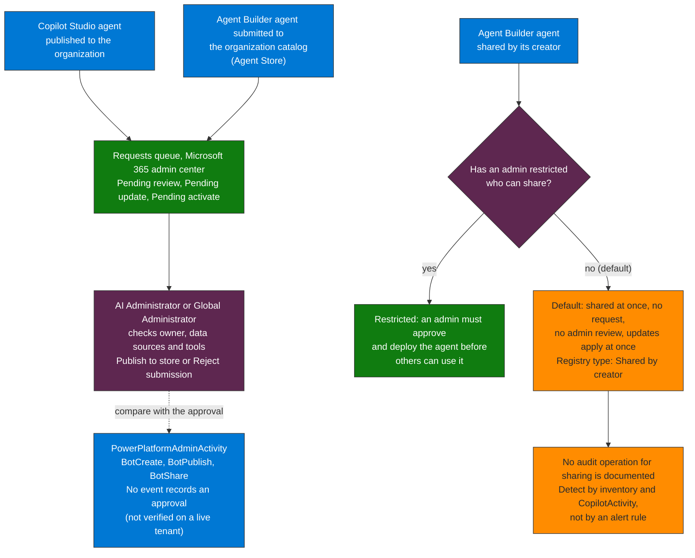

# Module 02 — Govern & Control | Track C

**Duration:** 90 minutes  
**Tables:** `AgentsInfo`, `AuditLogs`, `CloudAppEvents`  
**Portals:** Entra ID, Power Platform admin center, Copilot Studio admin center  
**Minimum role:** Security Admin (scoped to demo tenant)

---

## Learning Objective

At the end of this module, you will be able to configure Entra Agent ID with lifecycle management, create a DLP policy in Power Platform to restrict makers, operate the admin approval queue for published agents, restrict Agent Builder sharing, and write KQL to inventory the Copilot Studio agents published or shared.

---

## Agenda

| Time | Activity | Type |
|------|----------|------|
| 15 min | Entra Agent ID: schema, lifecycle states, difference from service principals | Explanation |
| 10 min | Power Platform DLP: connector classification — Business / Non-business / Blocked | Explanation |
| 55 min | Lab: Agent ID + DLP + approval flow + governance gap KQL | Lab |
| 10 min | Results review + playbook section 2 documentation | Discussion |

---

## Core Content

1. **Agent Builder sharing as a systemic gap:** by default every licensed user can create an Agent Builder agent and share it with the whole organization without a request to an admin; only submission to the organization catalog goes to admin review. This is an open default, not a product limit: an admin can restrict who can share (specific users or groups, or no users) and can block agents (Microsoft Learn, Agent Builder, Oct 2026). No audit operation for sharing is documented, so detection is by inventory (the registry type **Shared by creator**) and by the agent in use in `CopilotActivity`, not by an alert rule.

2. **Identity graph drift:** Agents accumulate OAuth permissions over time without review. The signal is in `AuditLogs` under `Add delegated permission grant` without a corresponding `AgentPermissionApproved` event — that absent join is the drift indicator. Caveat: `AgentPermissionApproved` is not confirmed to exist (see the note in Step 6), so as written every grant appears unapproved.

3. **Applicable Microsoft controls:** Entra Agent ID establishes a manageable identity per agent, separate from generic service principals. Publishing a Copilot Studio agent to the organization requires admin approval in the Microsoft 365 admin center (Agents > All agents > Requests). Foundry RBAC restricts operations in Azure AI. Power Platform DLP classifies and blocks connectors by category (Business / Non-business / Blocked).

4. **MFA policies for users do not cover agents:** Agents cannot complete interactive MFA, and Microsoft Learn documents Block as the only access control for agent identities. A policy for all users does not reach an agent acting as itself, so agents need their own policy (Agents assignment, agent risk condition, Block). Module 03 builds and validates it.

5. **Multi-agent trust boundaries:** In multi-agent architectures, an agent can invoke another (orchestrator → sub-agent). If the orchestrating agent is compromised, it can use its permissions to invoke sub-agents with a larger blast radius. The correct governance principle: every agent-to-agent call must be treated as an untrusted call. Each agent needs its own Entra Agent ID — identities cannot be shared — and permissions are not inherited between agents without explicit user authorization.

6. **Tiered Autonomy as a governance configuration:** Without an explicitly assigned tier, all production agents default to "full automation" — the most common gap. For a SOC engineer this means: (1) *Full automation* → analytics rules can execute automatic containment (isolate host, block IP); (2) *Human approval* → the agent generates the recommendation and waits for portal approval before executing; (3) *Human-led* → the agent only presents evidence, the analyst takes all action. When creating Sentinel analytics rules with Logic Apps, the autonomy tier must be an explicit playbook parameter — not a default value.

---

## Background

### The Agent Builder sharing path: an open-by-default governance gap

Agent Builder (available in M365 Copilot) lets any licensed user create an agent and share it with the whole organization **immediately**, without a request to an admin: the **Requests** queue only receives agents submitted for approval, such as Copilot Studio agents published to the organization and Agent Builder submissions to the organization catalog. The shared agent appears in the agent registry as **Shared by creator**, with its creator as owner, but its identity, data sources and connectors get no formal review. An admin can restrict who can share and can block any agent.

#### Paths to other users at a glance



**How to read it.** Read it as three entry paths. The Copilot Studio publish and the Agent Builder catalog submission both pass through the Requests queue, where an admin approves or rejects. The Agent Builder sharing path does not, unless an admin has restricted who can share, and because no sharing audit operation is documented, the orange box is detected by inventory and not by an alert rule.

### Why MFA is not the control for agents

Agents cannot complete interactive MFA, and Learn documents **Block** as the only access control for agent identities. A user policy that requires MFA does not reach an agent acting as itself, and a policy for the agent identity does not apply to its agent user. Documented in [Microsoft Entra CA for agents](https://learn.microsoft.com/en-us/entra/identity/conditional-access/agent-id).

### Entra Agent ID vs. Service Principal

| Property | Service Principal | Entra Agent ID |
|----------|------------------|----------------|
| `agentType` claim | Not present | Present |
| Lifecycle management | Manual | Managed via Agent 365 |
| Appears in Agent 365 Registry | No | Yes |
| CA policy targeting | Workload identities assignment (`includeServicePrincipals`) | Agents assignment (`includeAgentIdServicePrincipals` in Graph beta) |
| Detectable in KQL via | `AppId` | `EntraAgentID` field in `AgentsInfo` |

---

## Lab

### Step 1 — Create an Entra Agent ID for a demo agent

1. In **Entra ID** → **App registrations** → **New registration**
   - Name: `demo-sales-agent`
   - Account type: Single tenant
   - Click **Register**
2. Note the **Application (client) ID** and **Directory (tenant) ID**
3. Go to **Certificates & secrets** → **New client secret** → add a 6-month secret; copy the value
4. Go to **API permissions** → **Add a permission** → **Microsoft Graph** → **Application permissions**
   - Add only: `Sites.Read.All`
   - Click **Grant admin consent**
5. Under **Manifest**, add the following to mark this as an agent identity:

```json
"tags": ["agent365", "EntraAgentID"]
```

6. Save the manifest

**Verify:** Go to **Agent 365 admin center** (M365 Admin Center → Agents → Registry) and confirm `demo-sales-agent` appears.

---

### Step 2 — Operate the admin approval queue for published agents

1. In the **Microsoft 365 admin center** → **Agents** → **All agents** → **Requests**
2. In **Copilot Studio**, publish a test agent to the **Teams and Microsoft Copilot** channel
3. Refresh **Requests**: the agent appears as a request awaiting review (the states are **Pending review**, **Pending update** and **Pending activate**). Open it and check its description, owner, data sources and tools
4. As an **AI Administrator** or **Global Administrator**, select **Publish to store** (choose the users or groups, a policy template and the permissions) or **Reject submission**

**Test:** Verify the agent is not available to other users until you publish it.

> **Not found in Learn (Oct 2026).** The earlier version of this step enabled "Require admin approval before publishing agents to the organization" under Copilot Studio admin center → Settings → Agent publishing and set approvers. Learn documents the approval as part of publishing to the organization (the request waits in **Requests** for the AI Administrator or Global Administrator roles); it documents no such toggle and no approver list.

**Note the gap:** agents created in **Agent Builder** (M365 Copilot → Copilot → Agent Builder) reach other users by **sharing**, which creates no request. By default every user can share an agent with the whole organization. An admin can restrict who can share (all users by default, specific users or groups, or no users); with sharing restricted, an admin must approve and deploy the agent before others can use it (Microsoft Learn, Agent Builder, Oct 2026). Decide the setting for your tenant and document it.

---

### Step 3 — Create a Power Platform DLP policy

1. In **Power Platform admin center** → **Policies** → **Data policies** → **New policy**
2. Name: `Agentic AI — Restrict External Connectors`
3. In **Prebuilt connectors**, move to **Blocked**:
   - HTTP (generic)
   - HTTP with Azure AD
   - Any connector classified as "Non-business" that your org doesn't approve
4. Keep in **Business** (approved):
   - SharePoint
   - Microsoft Teams
   - Outlook
5. Apply scope: **All environments** (or specific environment if running isolated demo)
6. Save policy

**Verify:** Attempt to add an HTTP connector to a Power Automate flow in the demo environment. The connector should be blocked.

---

### Step 4 — KQL: Detect agents without Entra Agent ID

```kql
AgentsInfo
| where Timestamp > ago(30d)
| where isempty(EntraAgentID)
| extend OwnersStr = tostring(Owners)
| extend OwnerDisplay = iff(OwnersStr == "" or OwnersStr == "[]", "UNASSIGNED", OwnersStr)
| extend IdentityState = iff(isnotempty(EntraBlueprintID), "BlueprintOnly", "NoEntraIdentity")
| distinct AgentId, Name, Platform, OwnerDisplay, IdentityState, LifecycleStatus, PublishedStatus
| extend RiskNote = iff(IdentityState == "NoEntraIdentity",
    "No Entra identity: no agent identity and no blueprint — identity laundering risk",
    "Blueprint only: no agent identity in this tenant — confirm how the agent authenticates")
| sort by IdentityState desc, Platform asc
```

**Expected output:** List of agents with no agent identity — your identity orphan inventory — each marked `NoEntraIdentity` (neither an agent identity nor a blueprint: identity laundering risk) or `BlueprintOnly` (a blueprint exists but no agent identity in this tenant: confirm how it authenticates). Agents that have an `EntraAgentID` are excluded.

---

### Step 5 — KQL: Copilot Studio agents created, published or shared

> **Not verified on a live tenant (Oct 2026).** `PowerPlatformAdminActivity` exists in the validation workspace, with the columns Learn lists, but has no rows (the Power Platform connectors are not ingesting), so the operation names and the keys inside `Properties` were not seen on live events. The earlier version of this step read `AuditLogs` for `AgentPublished`, an operation that does not exist in Entra audit logs.

> **Where the events are (Microsoft Learn).** Copilot Studio authoring events (`BotCreate`, `BotUpdateOperation-BotPublish`, `BotUpdateOperation-BotShare`) are Power Platform administrator activity in the Purview audit log. In Sentinel they arrive through the **Microsoft Power Platform Admin Activity** connector, table `PowerPlatformAdminActivity`, with the operation in `EventOriginalType`. Learn's sample-queries page for that table still shows the old name `PowerPlatformAdministratorActivity`, which does not resolve.

> **Two paths (Microsoft Learn, July 2026).** An Agent Builder agent reaches other users by sharing, which has no admin review and applies updates at once, or by submission to the organization catalog (Agent Store), which an admin reviews and approves in the Microsoft 365 admin center. Sharing limits set by an admin do not restrict who can add the Agent Store version. The gap in this step is the sharing path.

> **What this step cannot see.** No Copilot Studio event records an approval, so "without approval" cannot be read from these events alone: compare each publish or share with your approval record. An admin approval of an org-catalog submission is `DeployedAgent` in the Microsoft 365 admin center agent management activities (Purview audit log). No audit operation for sharing an Agent Builder agent is documented in the Learn pages reviewed (Oct 2026): after sharing one, search the Purview audit log for the maker and the time, and note the operation name. `CopilotActivity` is not a source for this: its `CopilotAgentManagement` record is Security Copilot agent management (it shares its second with a `CopilotForSecurityTrigger` record) and carries no operation.

```kql
PowerPlatformAdminActivity
| where TimeGenerated > ago(30d)
| where EventOriginalType in (
    "BotCreate",
    "BotUpdateOperation-BotPublish",
    "BotUpdateOperation-BotShare")
| where EventResult == "Succeeded"
| project
    TimeGenerated,
    EventOriginalType,
    ActorName,
    ActorUserType,
    EnvironmentId,
    EventResult,
    Properties
| sort by TimeGenerated desc
```

**Expected output:** one row per Copilot Studio agent creation, publish or share, with the maker (`ActorName`) and the environment: the list to check against your approval process.

---

### Step 6 — KQL: Graph drift — permission grants without approval correlation

> **Not verified (Oct 2026).** The grant side (`Add delegated permission grant`, `Add app role assignment to service principal`) uses real Entra operations. The approval side (`AgentPermissionApproved`) is not confirmed to exist, so as written every grant is reported as "without approval". Use this as an inventory of grants, not as proof of a missing approval. The grant side was run on a Sentinel workspace (Oct 2026): in these events `TargetResources[0]` is the resource that receives the grant and `TargetResources[1]` is the client service principal, and the permission is in the property `DelegatedPermissionGrant.Scope` or `AppRole.Value`, not in `modifiedProperties[0]`.

```kql
AuditLogs
| where TimeGenerated > ago(30d)
| where OperationName in (
    "Add delegated permission grant",
    "Add app role assignment to service principal"
)
| extend ResourceName = tostring(TargetResources[0].displayName)
| extend AgentObjectId = tostring(TargetResources[1].id)
| mv-apply MP = TargetResources[0].modifiedProperties on (
    where tostring(MP.displayName) in ("DelegatedPermissionGrant.Scope", "AppRole.Value")
    | summarize NewPermission = take_any(tostring(MP.newValue)))
| extend GrantedBy = coalesce(tostring(InitiatedBy.user.userPrincipalName), tostring(InitiatedBy.app.displayName))
| join kind=leftouter (
    AuditLogs
    | where OperationName == "AgentPermissionApproved"
    | distinct CorrelationId
) on CorrelationId
| where isempty(CorrelationId1)
| project
    TimeGenerated,
    AgentObjectId,
    ResourceName,
    NewPermission,
    GrantedBy,
    RiskNote = "Permission granted without corresponding approval event"
| sort by TimeGenerated desc
```

**Expected output:** Permission grants to agent identities that have no corresponding approval event — the mechanism behind graph drift.

---

## Playbook Section 2 — Document Your Findings

```markdown
## Section 2: Governance Gap Inventory

### Configuration Deployed
- [ ] Entra Agent ID created for demo agent
- [ ] Admin approval queue (Requests) reviewed by AI Administrator or Global Administrator role holders
- [ ] Power Platform DLP policy: Agentic AI — Restrict External Connectors

### Known Gaps Documented
- [ ] Agent Builder sharing: open by default, agents shared without admin review
  - Affected agents: [LIST]
  - Mitigation: [who can share agents restricted in the Microsoft 365 admin center, blocked agents, or a documented decision to leave it open]

### Governance KQL Queries (add to Sentinel)
- [ ] Agents with no Entra identity, and blueprint-only agents reviewed separately (daily)
- [ ] Copilot Studio agents created, published or shared, checked against approvals (daily)
- [ ] Permission grants without approval correlation (weekly)

### Findings
| Agent | Gap | Risk | Owner |
|-------|-----|------|-------|
| | | | |
```

---

## Closing Questions

- What technical difference did you observe between an agent with `EntraAgentID` field populated vs. one where it is empty? What does that mean for a forensic investigation when you try to attribute an action to a specific agent?
- Which audit source would you use to detect an agent shared from Agent Builder? What does Microsoft Learn document for it, and what would you have to confirm in your own tenant before building a rule?

---

## Connection to Module 03

Governance without access control is incomplete. Agents with proper Entra Agent ID still need policies that govern what they can access — and they cannot complete interactive MFA. The next module covers Conditional Access specifically designed for agent identities.

→ [Module 03 — Secure Access](./Module-03-SecureAccess.md)
