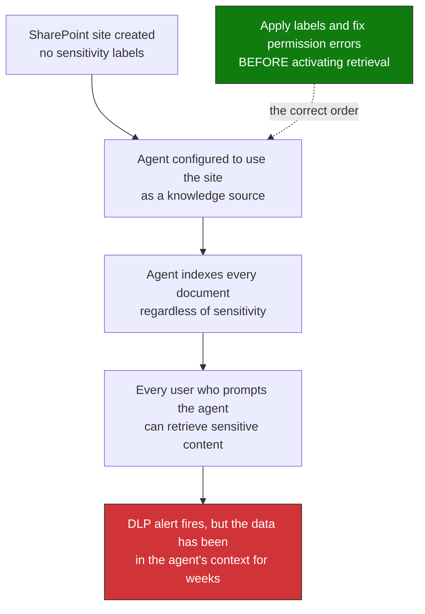

# Module 04 — Protect Data | Track C

**Duration:** 90 minutes  
**Tables:** `CloudAppEvents`, `MicrosoftPurviewInformationProtection`, `OfficeActivity`  
**Portals:** Purview compliance portal, SharePoint admin center  
**Minimum role:** Compliance Administrator (for DLP policy creation)

---

## Learning Objective

At the end of this module, you will be able to configure a Purview DLP policy for AI interactions, write KQL to detect data exfiltration via agent connectors, and validate sensitivity label coverage on SharePoint sites used as agent knowledge sources.

---

## Agenda

| Time | Activity | Type |
|------|----------|------|
| 15 min | Prompt injection mechanics: how agents are manipulated and which tables capture it | Explanation |
| 10 min | API exfiltration as a blind channel: why standard network controls miss it | Explanation |
| 55 min | Lab: Purview DLP for AI + exfiltration KQL + label coverage audit | Lab |
| 10 min | Results review + playbook section 4 documentation | Discussion |

---

## Core content (points the facilitator must cover)

1. **Prompt injection over an unlabeled corpus:** An attacker with write access to SharePoint can insert malicious instructions into documents the agent indexes and trusts. The agent does not validate the source of an instruction — it executes it as if it came from a legitimate user. This vector generates no alert in standard user activity logs, which is why P04 queries look at the access pattern rather than the content.

2. **The oversharing multiplier effect:** An ACL error that exposes a site to all users is a manageable risk for humans — someone has to actively search for it. For an agent with retrieval enabled, that same error is amplified to every user who interacts with the agent: exposure becomes passive and automatic. The agent does not discriminate between sensitive and non-sensitive content; it indexes everything it can read.

3. **Applicable Microsoft controls:** Purview DLP configured over "AI interactions" detects sensitive data in prompts and responses — not only in documents and email. Sensitivity labels applied to SharePoint sites constrain what the agent can index. SharePoint Advanced Management audits and remediates oversharing at site and site-collection level. Insider Risk Management detects exfiltration patterns by volume and data type.

4. **Remediation order as an architectural control:** Enabling retrieval before applying labels and remediating ACLs creates an active exposure window that can last weeks. The correct order is: (1) classify and label every candidate site, (2) audit and remediate ACL errors, (3) enable agent retrieval. Inverting this order is the most common error in agent deployments that touch SharePoint.

5. **Memory/session poisoning vs. corpus poisoning:** These are two distinct vectors. Corpus poisoning lives in SharePoint documents the agent retrieves, and it persists until the document is removed. Memory/session poisoning injects malicious instructions into the agent's persistent memory, which affects every future interaction for every user, and it survives removal of the original document. The detection surfaces differ: corpus poisoning is visible in file access logs, memory poisoning is not. The Copilot audit record carries a `MemoryUpdated` flag that P04-Q5a combines with the platform's jailbreak and XPIA flags, so you can see that memory was written during a flagged interaction but not what was written (Learn: memory actions generate no audit entries, and memory content is reviewed through eDiscovery). The flag is not documented and has never been true on the validation tenant.

6. **Model supply chain vs. poisoned corpus:** Souly et al. document that roughly 250 malicious training documents are enough to backdoor models up to 13B parameters, with persistence through safety training, and critically that the number is near-constant rather than proportional to model size ([arXiv:2510.07192](https://arxiv.org/abs/2510.07192)). This is not detectable with KQL: it requires provider evaluation and post-deployment behavioral drift monitoring (P05-Q6). Corpus poisoning, by contrast, is detectable in your own telemetry.

7. **Multi-agent trust boundaries:** When a compromised agent invokes another agent, it pivots into a second blast radius with that agent's own permissions. The correct architectural design treats every agent-to-agent call as untrusted: verify explicit user authorization and limit permission inheritance between agents. Reference: Anthropic, Zero Trust for AI Agents.

8. **Membership inference — privacy without visible exfiltration:** An attacker can infer whether a specific PII record was in a model's fine-tuning set by systematically querying it and analyzing response patterns, without ever extracting the data directly. The result is a privacy violation that DLP and standard Purview audit cannot see. Controls: do not fine-tune with PII without differential anonymization, restrict who can query models fine-tuned on sensitive data via Foundry RBAC, and monitor inference volume per identity (P03-Q7). Maps to OWASP LLM Top 10 2026, LLM02 — Sensitive Information Disclosure (closest-fit official category; membership inference has no standalone item in the LLM or Agentic Applications Top 10).

---

## Background

### Why connectors are the exfiltration blind spot

Agent connectors in Power Platform use legitimate HTTPS — they are indistinguishable from normal application traffic at the network layer. Without a DLP policy specifically targeting the agent's output channel, data sent by an agent to an external endpoint generates no alert in any standard network security control. The exfiltration is silent.

### The oversharing timeline




**The correct order:** apply sensitivity labels and remediate ACL errors **before** activating any agent retrieval on that SharePoint site. After activation, you are remediating a live exposure.

### What `MicrosoftPurviewInformationProtection` captures

This table is the most complete forensic source for agentic data incidents. It captures:
- Label applied / changed / removed events
- DLP policy match events (including AI interaction workload)
- File access events with label context
- eDiscovery and audit hold events

Retention in the demo tenant: 90 days by default. In production, plan for 1-year minimum for regulated industries.

---

## Lab

### Step 1 — Create a Purview DLP policy for AI interactions

1. In **Microsoft Purview** → **Data loss prevention** → **Policies** → **Create policy**
2. Select template: **Custom** → **Custom policy** → Next
3. Name: `Agentic AI — Sensitive Data in AI Interactions`
4. **Locations:** Select **Microsoft 365 Copilot and other AI apps** (AI interactions workload)
5. **Define policy settings:** Create advanced DLP rule
   - Rule name: `Credit card in agent prompt or response`
   - **Conditions:** Content contains → Sensitive info types → **Credit Card Number**
   - **Actions:** Restrict access → **Block** + **Notify user** + **Generate alert**
   - Alert severity: High
6. Set policy mode: **Test mode with policy tips** (for demo tenant safety)
7. Save and enable

**Verify:** In **DLP Alerts** (Purview → Data loss prevention → Alerts), confirm the policy appears as active.

---

### Step 2 — Audit sensitivity label coverage on agent knowledge sources

1. In **SharePoint admin center** → **Active sites**
2. Filter for sites used as agent knowledge sources (check your Agent 365 registry for linked sites)
3. For each site, check the **Sensitivity** column — sites showing "None" are unlabeled knowledge sources

**Apply a label to a demo site:**

```powershell
# PowerShell — SharePoint Online Management Shell
Connect-SPOService -Url https://<tenant>-admin.sharepoint.com
Set-SPOSite -Identity https://<tenant>.sharepoint.com/sites/demo-knowledge `
    -SensitivityLabel "<label-id>"
```

Get the label ID from Purview → Information protection → Labels → select label → copy GUID.

---

### Step 3 — KQL: DLP policy matches in AI interactions

> **Column names, validated on a Sentinel workspace (October 2026).** `MicrosoftPurviewInformationProtection` has no `Activity`, `UserAgent`, `SiteUrl`, `LabelId` or `PolicyDetails` column: it holds label events (`Operation`, `LabelName`, `SensitivityLabelId`, `ObjectId`, `UserId`, `Workload`). File access is in `OfficeActivity` (`Operation`, `OfficeObjectId`, `Site_Url`, `UserAgent`). **Not verified:** this version runs but returned no rows on the validation tenant, where that table has no DLP events and no `AIInteractions` workload. DLP rule matches that exist there (486 in 30 days) are in `OfficeActivity` (`RecordType` `ComplianceDLPSharePoint` and `ComplianceDLPExchange`, `Operation` `DLPRuleMatch` or `DlpRuleMatch`). Confirm where DLP for AI interactions lands in your tenant.

```kql
MicrosoftPurviewInformationProtection
| where TimeGenerated > ago(7d)
| where Operation == "DLPRuleMatch"
    and Workload == "AIInteractions"
| extend SensitiveTypes = tostring(SensitiveInfoTypeData)
| extend MatchedRule = ExecutionRuleName
| summarize
    MatchCount = count(),
    LastMatch = max(TimeGenerated),
    AffectedUsers = dcount(UserId)
    by SensitiveTypes, PolicyName, MatchedRule
| sort by MatchCount desc
```

**Expected output:** Sensitive information type matches in agent prompts and responses, grouped by type and rule.

---

### Step 4 — KQL: Agents accessing unlabeled documents

> **Column names, validated on a Sentinel workspace (October 2026).** `MicrosoftPurviewInformationProtection` has no `Activity`, `UserAgent`, `SiteUrl`, `LabelId` or `PolicyDetails` column: it holds label events (`Operation`, `LabelName`, `SensitivityLabelId`, `ObjectId`, `UserId`, `Workload`). File access is in `OfficeActivity` (`Operation`, `OfficeObjectId`, `Site_Url`, `UserAgent`). Same logic and limits as Module 01 step 3: agent traffic is guessed from `UserAgent` (no rows on the validation tenant), and label events record changes, not the current label.

```kql
let AgentUserAgents = dynamic(["agent", "copilot", "assistant", "bot", "power-automate"]);
let LabelLookback = 90d;
OfficeActivity
| where TimeGenerated > ago(7d)
| where RecordType == "SharePointFileOperation"
    and Operation in ("FileAccessed", "FileDownloaded")
| where UserAgent has_any (AgentUserAgents)
| join kind=leftouter (
    MicrosoftPurviewInformationProtection
    | where TimeGenerated > ago(LabelLookback)
    | where Operation in ("FileSensitivityLabelApplied", "SensitivityLabelApplied")
    | distinct ObjectId
) on $left.OfficeObjectId == $right.ObjectId
| where isempty(ObjectId)
| summarize
    UnlabeledAccesses = count(),
    DocumentList = make_set(OfficeObjectId, 10),
    LastAccess = max(TimeGenerated)
    by UserId, Site_Url
| sort by UnlabeledAccesses desc
```

**Expected output:** Agent access events on documents with no sensitivity label — your oversharing inventory.

---

### Step 5 — KQL: Copilot reads of unlabeled or sensitive files

Step 4 infers agent traffic from `UserAgent`. For Copilot interactions you do not have to guess: the Copilot audit record lists each file Copilot read to answer a prompt, with its sensitivity label (Microsoft Learn, "Audit logs for Copilot and AI applications"). In Sentinel it is the `CopilotActivity` table (Microsoft Copilot data connector). This is P04-Q6.

1. List your sensitive labels with `Get-Label` in Security & Compliance PowerShell (Learn uses it to map label GUIDs to names) and paste the GUIDs of the sensitive ones into `SensitiveLabelIds`.
2. To generate data, ask Microsoft 365 Copilot a question grounded on one unlabeled file and one file with a sensitive label in SharePoint, and allow time for the audit record to reach the workspace.
3. Run the query.

> **Run on a Sentinel workspace (Oct 2026).** The query runs and returned nothing: the only resources Copilot listed there were 2 web citations, no file. **Not verified** on a real file read, and not confirmed that a file with no label omits `SensitivityLabelId` (rather than the record not reporting it): check against a file you know is unlabeled before treating `Unlabeled` as a finding. The label logic was run on a datatable shaped like Learn's example.

```kql
let SensitiveLabelIds = dynamic([]);   // add the GUIDs of your sensitive labels
CopilotActivity
| where TimeGenerated > ago(1d)
| where RecordType == "CopilotInteraction"
| mv-expand Resource = LLMEventData.AccessedResources
| extend ResourceUrl = tostring(Resource.SiteUrl), LabelId = tostring(Resource.SensitivityLabelId)
| where ResourceUrl has ".sharepoint.com"
| extend LabelState = case(
    isempty(LabelId), "Unlabeled",
    LabelId in (SensitiveLabelIds), "Sensitive",
    "Labeled")
| where LabelState in ("Unlabeled", "Sensitive")
| summarize
    Accesses = count(),
    Users = dcount(ActorUserId),
    FirstAccess = min(TimeGenerated),
    LastAccess = max(TimeGenerated),
    Actions = make_set(tostring(Resource.Action), 5),
    Blocked = countif(isnotempty(tostring(Resource.PolicyDetails))),
    Failures = countif(tostring(Resource.Status) =~ "failure"),
    Apps = make_set(AppIdentity, 5)
    by LabelState, ResourceUrl, LabelId
| sort by LabelState asc, Accesses desc
```

**Expected output:** one row per file and label state. `Unlabeled` files are your oversharing inventory as Copilot sees it; `Sensitive` files show who read them; `Blocked` and `Failures` count the reads that a policy blocked or restricted.

---

### Step 6 — KQL: External connector data egress

```kql
CloudAppEvents
| where TimeGenerated > ago(7d)
| where Application == "Microsoft Power Platform"
    and ActionType == "ConnectorActionExecuted"
| extend ConnectorName = tostring(RawEventData["ConnectorName"])
| extend TargetEndpoint = tostring(RawEventData["TargetUrl"])
| extend PayloadSize = toint(RawEventData["ResponseSizeBytes"])
| where isnotempty(TargetEndpoint)
    and TargetEndpoint !has "microsoft.com"
    and TargetEndpoint !has "azure.com"
| summarize
    EgressEvents = count(),
    TotalPayloadBytes = sum(PayloadSize),
    EndpointList = make_set(TargetEndpoint, 10),
    LastEgress = max(TimeGenerated)
    by ConnectorName, AccountDisplayName
| sort by TotalPayloadBytes desc
| extend TotalPayloadMB = round(toreal(TotalPayloadBytes) / 1048576, 2)
| project ConnectorName, AccountDisplayName, EgressEvents, TotalPayloadMB, EndpointList, LastEgress
```

**Expected output:** Agents sending data to external endpoints — sorted by payload volume. Any entry here with an unrecognized `TargetEndpoint` is a candidate for incident investigation.

---

### Step 7 — KQL: Prompt injection pattern detection

> **Telemetry limit (Microsoft Learn, October 2026).** The ActionType was `AgentInteraction`, which is not a documented value; it is now `InvokeAgent`. Agent 365 observability does not expose prompt text in `CloudAppEvents` (`gen_ai.input.messages` is "not yet surfaced in advanced hunting"), so `RawEventData["UserPrompt"]` has no documented source and this query returns no rows on that telemetry today. Use it as a pattern for a source that carries the prompt, and see P05-Q1 for the platform's own jailbreak signal in `LLMActivity`. The validation tenant had no agent ActionTypes in `CloudAppEvents` (30 days, October 2026).

> **The platform's own flag.** Learn documents `AccessedResources[].XPIADetected` in the Copilot audit record: the platform marks the resource that carried a cross-prompt injection. P05-Q10 reads it from `CopilotActivity` and returns the resource to clean up. It flagged nothing on the validation workspace.

```kql
CloudAppEvents
| where TimeGenerated > ago(7d)
| where Application in ("Microsoft Copilot", "Copilot Studio")
    and ActionType == "InvokeAgent"
| extend PromptText = tostring(RawEventData["UserPrompt"])
| extend HasInjectionPattern = PromptText has_any (
    "ignore previous instructions",
    "disregard your system prompt",
    "you are now",
    "act as if",
    "forget all previous",
    "new instructions:",
    "override:"
)
| where HasInjectionPattern == true
| summarize
    InjectionAttempts = count(),
    FirstAttempt = min(TimeGenerated),
    LastAttempt = max(TimeGenerated),
    PromptSamples = make_set(substring(PromptText, 0, 200), 3)
    by AccountDisplayName, IPAddress
| sort by InjectionAttempts desc
```

**Expected output:** Users or source IPs with repeated prompt injection patterns — these are investigation candidates, not automatic blocks (a single pattern match may be legitimate).

---

## Playbook Section 4 — Document Your Findings

```markdown
## Section 4: Data Protection Configuration

### DLP Policy Deployed
- Policy name: Agentic AI — Sensitive Data in AI Interactions
- Workload: AI interactions
- Rule: Credit card in agent prompt or response
- Action: Block + notify + alert
- Status: Test mode / Enforced

### SharePoint Label Coverage Audit
| Site URL | Used As Agent Knowledge Source | Sensitivity Label | Gap |
|----------|-------------------------------|-------------------|-----|
| | | | |

### Exfiltration Detection KQL Queries (add to Sentinel)
- [ ] DLP matches in AI interactions (daily)
- [ ] Agents accessing unlabeled documents (weekly)
- [ ] Copilot reads of unlabeled or sensitive files (daily)
- [ ] External connector egress by volume (daily)
- [ ] Prompt injection pattern detection (hourly)

### Critical Finding
Remediation order: sensitivity labels and ACL review MUST be completed before
activating agent retrieval on any SharePoint site. Post-activation remediation
addresses a live exposure — not a preventive control.

### Top Exfiltration Risks Found
1.
2.
3.
```

---

## Closing Questions

- Which table — `MicrosoftPurviewInformationProtection` or `CloudAppEvents` — gives more complete forensic context for reconstructing what data an agent accessed during a specific time window? What fields from each table would you join?
- If an agent exfiltrated data via an external connector 10 days ago and the DLP policy wasn't active, what audit log sources could you use to reconstruct the incident? What retention limits apply in your tenant?

---

## Connection to Module 05

Preventive controls reduce risk but don't eliminate it. Agents will still attempt jailbreaks, exhibit anomalous behavior, and produce false negatives in detection-only controls. The final module operationalizes detection and response: Sentinel analytics rules, Logic App enforcement, and building the complete incident response playbook.

→ [Module 05 — Detect & Respond](./Module-05-DetectRespond.md)
