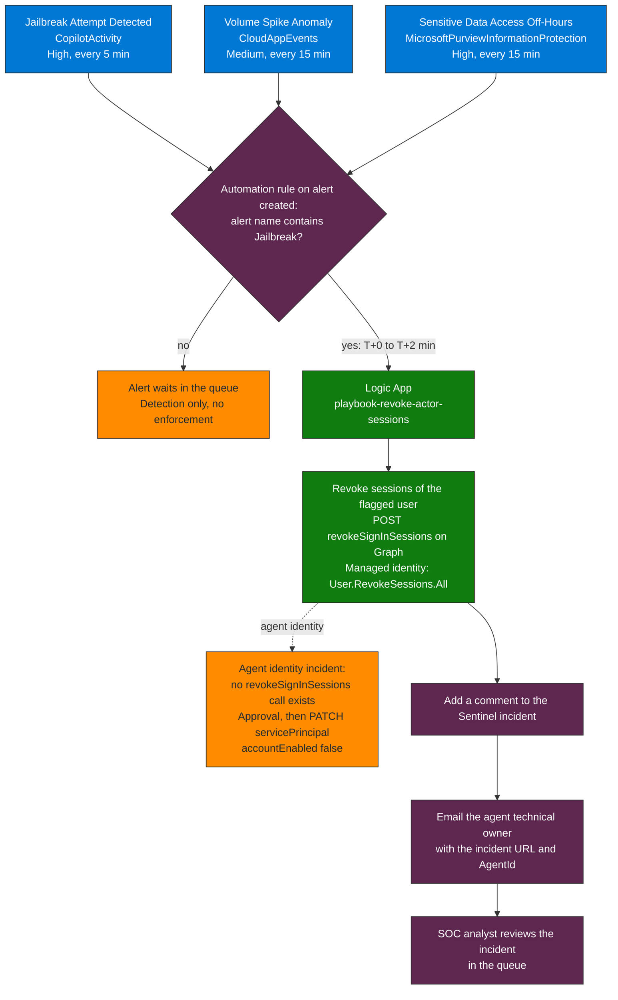

# Module 05 — Detect & Respond | Track C

**Duration:** 90 minutes  
**Tables:** `CloudAppEvents`, `MicrosoftPurviewInformationProtection`, `SecurityIncident`, `AuditLogs`  
**Portals:** Microsoft Sentinel, Logic Apps, Defender XDR  
**Minimum role:** Sentinel Contributor + Logic Apps Contributor

---

## Learning Objective

At the end of this module, you will be able to create Sentinel analytics rules for jailbreak detection and agent behavioral anomalies, build a Logic App playbook that revokes the flagged user's sessions on alert, and complete the agentic incident response playbook with a trigger-to-resolution flow.

---

## Agenda

| Time | Activity | Type |
|------|----------|------|
| 15 min | AISOC architecture: Sentinel as agentic defense platform — tables, MCP server, Security Copilot | Explanation |
| 10 min | Structural false negatives: detection without enforcement is not a control | Explanation |
| 55 min | Lab: Analytics rules + Logic App enforcement + playbook consolidation | Lab |
| 10 min | Final playbook review and peer discussion | Discussion |

---

## Core Content

1. **Jailbreak attempts as an active incident vector:** A successful jailbreak converts the agent into an executor of malicious instructions with legitimate system access. The signal is in the interaction record, not in network behavior, which makes perimeter controls insufficient. The platform itself marks a message as a jailbreak attempt (`JailbreakDetected` in the Copilot audit record, ingested into Sentinel as `CopilotActivity`); prompt text is not queryable in `CloudAppEvents` or in that record, so the detection is built on the platform's flag.

2. **Structural false negatives from human calibration:** Detection rules calibrated for human behavior generate false negatives with agents. An agent making 5,000 calls in an hour may be operating normally. Without a per-agent baseline using `percentile()` or `avg()` over long time windows, any fixed threshold generates either false positives or false negatives.

3. **Applicable Microsoft controls:** Defender XDR integrates agentic behavioral signals with identity context. Microsoft Sentinel with the native MCP server allows querying agent status from within the investigation context. Security Copilot accelerates triage of complex incidents. Purview Audit provides the forensic chain of custody with immutability. Agent 365 correlates incident events with the agent ownership registry.

4. **Automated enforcement as an architectural requirement:** Detection without response automation has MTTR limited by human reaction time. For agents acting in seconds, the target is: automatic detection → automatic containment (Logic App revokes the user's sessions via Graph API) → human review. A "detection without enforcement" posture is not a control — it is an incident log.

---

## Background

### Detection vs. enforcement — the 37% problem

A Sentinel analytics rule that fires an alert is **detection**. The alert sitting in the queue without automated response is not enforcement. The gap between detection and enforcement is where most agentic incidents expand: the jailbreak is detected at T+0, but the user's sessions aren't revoked until T+4h when a human reviews the queue.

The Logic App playbook is the enforcement layer. Without it, Sentinel is a detection-only platform. With it, detection becomes a control.

### Enforcement flow at a glance



**How to read it.** Read it top to bottom: three analytics rules raise alerts, and the only thing that decides whether the playbook runs is the alert name condition of the automation rule. In this module only the Jailbreak rule is wired to it, so alerts from the other two rules wait in the queue for an analyst, which is the gap between detection and enforcement. The dotted branch is the limit of the Graph call: revokeSignInSessions works for users only, so an incident on an agent identity needs a second, approved action.

### Sentinel as both target and platform

Microsoft Sentinel is simultaneously:
- The SIEM that detects attacks **against** agentic systems
- The platform where **security agents** (AISOC) operate to investigate and respond
- A potential attack surface if agents operating within Sentinel are compromised

This dual role is why MCP server native integration in Sentinel matters: it allows security agents to query Sentinel data directly, but also means that a compromised security agent has direct access to your detection logic and alert data.

### Structural false negatives in practice

If the same alert fires for the same agent 3+ times with no remediation action in the incident record, that is a **structural false negative** — your detection is working but your enforcement is not. Query `SecurityIncident` to find these patterns (Step 5 in this module).

### Defender's native agent detections (compare before building custom rules)

Microsoft Defender detects threats to agents managed through Agent 365 (Preview, July 2026): jailbreak attempts, indirect prompt injection (XPIA), malicious content propagation, secret and credential leakage, evasion techniques, LLM reconnaissance, and suspicious user or IP access, as near-real-time alerts and incidents. Real-time protection for Agent 365 tooling servers is generally available and can allow or block tool invocations to Work IQ MCP and customer MCP tools. The telemetry is in `CloudAppEvents` (Agent 365 observability data), `AlertInfo`, `AlertEvidence`, `AgentsInfo`, and `BehaviorInfo` / `BehaviorEntities`.

Prerequisites: onboard the tenant to Agent 365, connect the Microsoft 365 connector with the components Microsoft Entra ID Management events and Microsoft 365 activities, and make sure the agent emits observability data (Copilot Studio, Foundry and Agent Builder agents do by default; Foundry only once published). Copilot Studio real-time protection also needs a Power Platform administrator. Treat the custom rules in this module as the layer for what the native detections do not cover, and measure the overlap before keeping both. For cross-prompt injection (XPIA) on Copilot interactions, P05-Q10 reads the platform's own flag from the Copilot audit record (`CopilotActivity`).

#### What each native layer covers, and what it leaves open

| Native layer | What it detects or does | Where it surfaces | What it does not cover | Custom coverage in this repo |
|---|---|---|---|---|
| **Entra ID Protection for agents** (Preview) | Eight offline detections on agent identities: admin-confirmed compromise, early-life malicious activity, directory reconnaissance, failed access attempt, Microsoft threat intelligence, sign-in spike, suspicious credential usage on a blueprint (a new credential that is then used) and unfamiliar resource access | Risky Agents report, Graph `riskyAgents` and `agentRiskDetections`, and `AADRiskyAgents` and `AADAgentRiskEvents` once the diagnostic categories `RiskyAgents` and `AgentRiskEvents` are exported | Offline only. Learning mode suppresses behavioral alerts for agents with little history, and on-behalf-of activity is attributed to the user, so it covers autonomous agents only. Learn's list has no detection for a new IP or country, an agent creating applications or service principals, a role assigned to an agent, or a consent on a blueprint principal, and the credential detection fires when the credential is used, not when it is added | [detect-agent-identity-abuse](../skills/detect/detect-agent-identity-abuse/SKILL.md) (new IP, spawning, role assigned, more than one country), P03-Q12 (credential, owner and sponsor changes), P03-Q13 (consent and app-role grants on blueprint principals), P03-Q14 (brings the native detections into the SOC queue) |
| **Conditional Access for agents** (prevention) | Blocks token issuance to an agent when Agent risk is High. Block is the only control for agent identities | Sign-in logs: `ConditionalAccessStatus` and `ConditionalAccessPolicies` | The token a blueprint requests to create identities and sign-ins at the `AAD Token Exchange Endpoint: Public` are outside it, and a token already issued stays valid until it expires (Continuous Access Evaluation for workload identities covers Microsoft Graph only) | [secure-ca-policy-agents](../skills/secure/secure-ca-policy-agents/SKILL.md) Query 1 (Conditional Access coverage of agent sign-ins) and the Sign-in behavior tab of the [workbook](../Workbooks/README.md) |
| **Defender threat detection for Agent 365 agents** (Preview) | Near-real-time alerts for jailbreak attempts, indirect prompt injection (XPIA), malicious content propagation, secret and credential leakage, evasion, LLM reconnaissance and suspicious user or IP access. Real-time protection audits or blocks tool invocations to Work IQ MCP and customer MCP tools and records them as behaviors | Defender portal alerts and incidents, `AlertInfo`, `AlertEvidence`, `BehaviorInfo`, `BehaviorEntities` and `CloudAppEvents` (Agent 365 observability) | Only agents managed through Agent 365 that emit observability data, and Foundry agents only once published. Prompt and response text are not surfaced in advanced hunting | The P05 jailbreak queries and [detect-alert-prompt-injection-sentinel](../skills/detect/detect-alert-prompt-injection-sentinel/SKILL.md), for agents outside Agent 365 |
| **Defender for Cloud, AI threat protection** (GA) | Alerts on Azure OpenAI and Azure AI Model Inference deployments: jailbreak attempts (blocked or detected by Prompt Shields), credential theft in model responses and data leakage, among others | Defender for Cloud alerts, Defender XDR and `SecurityAlert`, with names such as `AI.Azure_Jailbreak.ContentFiltering.BlockedAttempt` | Text tokens only (images and audio are not scanned). It protects the model deployment, not the agent identity or what the agent does with its tools | [detect-alert-prompt-injection-sentinel](../skills/detect/detect-alert-prompt-injection-sentinel/SKILL.md); identity and tool behavior are covered by the rest of this module |
| **Defender for Endpoint, runtime protection for local agents** (Preview) | Prompt injection in the prompt, the tool calls and the tool responses of agents that run on endpoints, and it can block the action | Defender for Endpoint. Local agents are onboarded separately from cloud agents | Local agents only | Inventory only: P01-Q3 |
| **Copilot jailbreak and XPIA classifiers** | Platform classifiers flag jailbreak attempts and cross-prompt injection on Copilot interactions | Defender portal and Microsoft Purview audit (the `CopilotActivity` flags) | The flags, not the prompt text | P05-Q10 reads the XPIA flag from `CopilotActivity` |

**What the validation tenant showed (Oct 2026).**

- The two Entra diagnostic settings of the tenant export `RiskyServicePrincipals` and `ServicePrincipalRiskEvents` but not `RiskyAgents` or `AgentRiskEvents`. `AADAgentRiskEvents` and `AADRiskyAgents` exist and are empty, so P03-Q14 returns nothing for a reason that says nothing about agent risk.
- Graph beta `riskyAgents` and `agentRiskDetections` returned 403 with the token used for validation (scopes missing), so the ID Protection data could not be read directly.
- Ninety days of `AlertInfo` held no alert about an AI agent from a native Microsoft layer. `AAD Identity Protection` raised two alerts, both on users (atypical travel and unfamiliar sign-in properties), Defender for Cloud raised only database alerts although its AI plan is on (`Standard`), and `AlertEvidence` holds no agent entity. The only agent-related alerts (eight) came from custom analytics rules in Microsoft Sentinel. The tenant is not onboarded to Agent 365 observability: `CloudAppEvents` holds none of the five Agent 365 ActionTypes. None of the Defender detections for agents was exercised.
- The only alert that touched an agent object came from a Microsoft Sentinel NRT analytics rule, "First access credential added to Application or Service Principal where no credential was present", which fired when the first credential was added to an agent identity blueprint. Its evidence lists the user and the IP, with no entity for the application or the agent, so the alert does not tell the SOC that the target was a blueprint. P03-Q12 does.
- **Not verified:** whether ID Protection detections for agents raise an alert in Defender XDR. Learn does not say, and the tenant has no agent risk events.

**How to measure the overlap before keeping both layers.**

1. Enable the `RiskyAgents` and `AgentRiskEvents` export and onboard the tenant to Agent 365 observability, as in the prerequisites above.
2. List which native sources raise agent alerts. In Advanced Hunting run `AlertInfo | where Timestamp > ago(30d) | summarize Alerts = count() by ServiceSource, DetectionSource, Title | order by Alerts desc` (this query shape ran on the validation tenant, where it showed no agent alert).
3. For each custom rule in this module, compare its hits with the native alerts for the same agent and window. Keep the rule where the native layer raised nothing, for example a new IP, an agent creating applications, a role assigned to an agent or a consent on a blueprint principal. A rule that only ever fires next to a native alert is a candidate to move to hunting.

Sources (Microsoft Learn): [ID Protection for agents](https://learn.microsoft.com/entra/id-protection/concept-risky-agents), [Export risk data](https://learn.microsoft.com/entra/id-protection/howto-export-risk-data), [Detect and investigate threats to AI agents using Microsoft Defender](https://learn.microsoft.com/defender-xdr/security-for-ai/ai-agent-detection-protection), [AI threat protection in Microsoft Defender for Cloud](https://learn.microsoft.com/azure/defender-for-cloud/ai-threat-protection), [AI agent runtime protection with Microsoft Defender for Endpoint](https://learn.microsoft.com/defender-endpoint/ai-agent-runtime-protection-overview).

> **ActionType values and what they expose (Microsoft Learn, Agent 365 observability).** `CloudAppEvents` carries `InvokeAgent`, `InferenceCall`, `ExecuteToolBySDK`, `ExecuteToolByGateway` and `ExecuteToolByMCPServer`, with the per-span fields inside `RawEventData` (for example `TargetAgentId`, `AgentId`, `TargetAgentName`, `ConversationId`, `ToolName`, `ClientIP`, `UserKey`). Prompt and response text, tool arguments and results, and the model name are captured but not yet surfaced in advanced hunting, so rules that score prompt text cannot be built on this table today. Telemetry is dropped unless at least one tenant user holds a Microsoft 365 E7 or Agent 365 license, and a run without an `invoke_agent` root span stays queryable but is invisible in Defender's agent-activity views. **Not verified here:** on the validated tenant (Oct 2026) there were no such events, because it is not onboarded to Agent 365 observability; after onboarding, confirm with `CloudAppEvents | summarize count() by ActionType`.

> **Sentinel data connector (Microsoft Learn, Sentinel data connectors reference).** The Agent 365 connector brings agent telemetry from Agent 365, AI Foundry, and Copilot into the Microsoft Sentinel data lake for hunting, and needs the data lake. Learn's connector page leaves its table list empty, so confirm the table names in your workspace before writing queries against them.

---

## Lab

### Step 1 — Create a jailbreak detection analytics rule

Prerequisite: the **Microsoft Copilot** data connector is enabled in Sentinel, so the `CopilotActivity` table exists and receives the Copilot audit records (check with `CopilotActivity | take 1`).

1. In **Microsoft Sentinel** → **Analytics** → **Create** → **Scheduled query rule**
2. **General tab:**
   - Name: `Agentic AI — Jailbreak Attempt Detected`
   - Description: Raises an alert when the platform flags a Copilot message as a jailbreak attempt (`JailbreakDetected`)
   - Severity: **High**
   - Tactics: Execution, Initial Access
3. **Set rule logic tab — paste this query** (it is P05-Q1 with three extra columns for the entity mapping):

   > **Why the platform's flag and not a phrase score (Microsoft Learn, October 2026).** Agent 365 observability does not expose prompt text in `CloudAppEvents` (`gen_ai.input.messages` is "not yet surfaced in advanced hunting"), and the Copilot audit record does not carry prompt text either (Learn points to Content Search or DSPM for AI), so a rule that scores phrases has nothing to read. The audit record does carry the platform's own verdict: each entry in `Messages` has `Id`, `isPrompt` and `JailbreakDetected`. The table is `CopilotActivity`; Learn's sample-queries page for it still shows the old name `LLMActivity`, which does not resolve in a workspace.
   >
   > **Run on a Sentinel workspace (Oct 2026).** The query runs and flagged nothing: of 155 messages in 90 days, 7 carry the key and none is true. The same projection with `== false` returns those 7 with actor, client IP and app identity, so the entity mapping below has data. **Not verified:** a message actually flagged `true`, and whether Copilot Studio agent interactions reach this table (Learn lists the app identity `Copilot.Studio.<AppId>`; every record on the validation tenant came from Microsoft 365 Copilot). The prompt-injection exercise in Module 06 (step 5) is where you find out.

```kql
CopilotActivity
| where TimeGenerated > ago(1h)
| where RecordType == "CopilotInteraction"
| extend Messages = LLMEventData.Messages
| mv-expand Messages
| where tobool(Messages.JailbreakDetected) == true
| project
    TimeGenerated,
    ActorName,
    ActorUserId,
    AgentName,
    AppIdentity,
    AppHost,
    SrcIpAddr,
    MessageId = tostring(Messages.Id),
    JailbreakDetected = tobool(Messages.JailbreakDetected)
```

4. **Query scheduling:** Run every **5 minutes** | Lookup last **1 hour**
5. **Alert threshold:** Generate alert when number of results is **greater than 0**
6. **Entity mapping:**
   - Account → `ActorName`
   - IP → `SrcIpAddr`
7. Save and enable

---

### Step 2 — Create a behavioral anomaly analytics rule

1. **Create** → **Scheduled query rule**
2. Name: `Agentic AI — Volume Spike Anomaly`
3. Severity: **Medium**
4. **Query:** (the ActionType was `AgentInteraction`, which is not a documented value; it is now `InvokeAgent`, per Microsoft Learn. The count needs no prompt text. Not run against live events: the validation tenant had no agent ActionTypes in `CloudAppEvents`, October 2026.)

```kql
let Baseline = CloudAppEvents
    | where TimeGenerated between (ago(8d) .. ago(1d))
    | where ActionType == "InvokeAgent"
    | extend AgentId = tostring(RawEventData["AgentId"])
    | summarize HourlyCount = count() by AgentId, bin(TimeGenerated, 1h)
    | summarize BaselineAvg = avg(HourlyCount), BaselineStdDev = stdev(HourlyCount) by AgentId;
CloudAppEvents
| where TimeGenerated > ago(1h)
| where ActionType == "InvokeAgent"
| extend AgentId = tostring(RawEventData["AgentId"])
| summarize CurrentCount = count() by AgentId, bin(TimeGenerated, 1h)
| join kind=inner Baseline on AgentId
| extend Deviations = (CurrentCount - BaselineAvg) / max_of(BaselineStdDev, 1.0)
| where Deviations > 3
| project AgentId, CurrentCount, BaselineAvg = round(BaselineAvg, 1), Deviations = round(Deviations, 1)
```

5. **Query scheduling:** Every **15 minutes** | Lookup last **1 hour**
6. **Entity mapping:** Custom entity → `AgentId`
7. Save and enable

---

### Step 3 — Build the enforcement Logic App

1. In **Azure Portal** → **Logic Apps** → **Create** → Consumption plan
   - Name: `playbook-revoke-actor-sessions`
   - Resource group: same as your Sentinel workspace
2. In the Logic App designer, start with trigger: **Microsoft Sentinel — When a response to a Microsoft Sentinel alert is triggered**
3. Add action: **HTTP** (to call Graph API to revoke the sessions of the user who sent the flagged prompt)
   - Method: POST
   - URI: `https://graph.microsoft.com/v1.0/users/<actorUserId>/revokeSignInSessions` (`ActorUserId` of the alert's Account entity, from the P05-Q1 query)
   - Authentication: Managed Identity (assign the `User.RevokeSessions.All` app role to the Logic App's managed identity)
   - `revokeSignInSessions` exists for users only (agent user accounts included): there is no such call for a service principal or an agent identity. For an incident on an agent identity, add a second HTTP action behind an approval: `PATCH https://graph.microsoft.com/v1.0/servicePrincipals/<agentObjectId>` with body `{"accountEnabled": false}` (permission `Application.ReadWrite.All`)
4. Add action: **Microsoft Sentinel — Add comment to incident**
   - Comment: `Automated response: sessions of the flagged user revoked at @{utcNow()} by playbook-revoke-actor-sessions`
5. Add action: **Office 365 Outlook — Send an email**
   - To: agent technical owner (from `Owners` field in `AgentsInfo` or Agent 365 Registry)
   - Subject: `[ALERT] User sessions revoked after a jailbreak alert — review required`
   - Body: include incident URL and AgentId
6. Save the Logic App

**Link the playbook to Sentinel:**
- In Sentinel → **Automation** → **Automation rules** → **Create**
- Trigger: When alert is created
- Condition: Alert name contains "Jailbreak"
- Action: Run playbook → `playbook-revoke-actor-sessions`

---

### Step 4 — Detect sensitive document access outside business hours

> **Column names, validated on a Sentinel workspace (October 2026).** `MicrosoftPurviewInformationProtection` has no `Activity`, `UserAgent`, `SiteUrl`, `LabelId` or `PolicyDetails` column: it holds label events (`Operation`, `LabelName`, `SensitivityLabelId`, `ObjectId`, `UserId`, `Workload`). File access is in `OfficeActivity` (`Operation`, `OfficeObjectId`, `Site_Url`, `UserAgent`). Limits: 413 of the 421 label events on the validation tenant have an empty `LabelName` (the label id is in `SensitivityLabelId`), so put the ids of your sensitive labels in `HighlyConfidentialLabelIds`. It returned no rows there.

```kql
let HighlyConfidentialLabelIds = dynamic([]);   // add the GUIDs of your sensitive labels
OfficeActivity
| where TimeGenerated > ago(1d)
| where RecordType == "SharePointFileOperation"
    and Operation in ("FileAccessed", "FileDownloaded")
| join kind=inner (
    MicrosoftPurviewInformationProtection
    | where TimeGenerated > ago(90d)
    | where Operation in ("FileSensitivityLabelApplied", "SensitivityLabelApplied")
    | where LabelName has_any ("Highly Confidential", "Restricted") or SensitivityLabelId in (HighlyConfidentialLabelIds)
    | summarize arg_max(TimeGenerated, LabelName, SensitivityLabelId) by ObjectId
) on $left.OfficeObjectId == $right.ObjectId
| extend HourOfDay = datetime_part("Hour", TimeGenerated)
| extend IsOffHours = HourOfDay < 7 or HourOfDay > 20
| extend IsWeekend = dayofweek(TimeGenerated) in (0d, 6d)
| extend IsAgentAccess = UserAgent has_any ("agent", "copilot", "assistant", "bot")
| where (IsOffHours or IsWeekend) and IsAgentAccess
| project
    TimeGenerated,
    UserId,
    OfficeObjectId,
    LabelName,
    Operation,
    HourOfDay,
    IsWeekend,
    Site_Url
| sort by TimeGenerated desc
```

Create this as a third analytics rule: `Agentic AI — Sensitive Data Access Off-Hours`

---

### Step 5 — KQL: Structural false negative audit

> **Run on a Sentinel workspace (Oct 2026).** The earlier version read `IncidentProviderName` (the column is `ProviderName`), tested `has` on a dynamic array, and counted table rows: `SecurityIncident` writes a row per change to an incident (839 rows for 105 incidents in 30 days), so `IncidentCount > 3` held for any incident edited a few times. It now keeps the latest row per incident first. No title matched the filter on that workspace, so it returned nothing.

```kql
SecurityIncident
| where TimeGenerated > ago(30d)
| summarize arg_max(TimeGenerated, *) by IncidentNumber
| where Title has_any ("agent", "copilot", "AI interaction", "jailbreak")
| summarize
    IncidentCount = count(),
    FirstIncident = min(CreatedTime),
    LastIncident = max(CreatedTime),
    ClosedCount = countif(Status == "Closed"),
    StatusHistory = make_set(Status)
    by Title, ProviderName
| extend NeverClosed = ClosedCount == 0
| extend IsRepeat = IncidentCount > 3
| where NeverClosed or IsRepeat
| project
    Title,
    IncidentCount,
    FirstIncident,
    LastIncident,
    StatusHistory,
    RiskNote = case(
        NeverClosed and IsRepeat, "Recurring — never closed. No enforcement action confirmed.",
        NeverClosed, "Never closed — verify enforcement is in place",
        "High repeat rate — review enforcement effectiveness"
    )
| sort by IncidentCount desc
```

**Expected output:** Alerts that fire repeatedly with no resolution — your structural false negative inventory.

---

### Step 6 — Consolidate the incident response playbook

Using the [Playbook Template](./Templates/Incident-Response-Playbook-Template.md), complete the final section:

```markdown
## Section 5: Detection and Response

### Analytics Rules Deployed
| Rule Name | Severity | Frequency | Table | Status |
|-----------|----------|-----------|-------|--------|
| Agentic AI — Jailbreak Attempt Detected | High | 5 min | CopilotActivity | Enabled |
| Agentic AI — Volume Spike Anomaly | Medium | 15 min | CloudAppEvents | Enabled |
| Agentic AI — Sensitive Data Access Off-Hours | High | 15 min | MicrosoftPurviewInformationProtection | Enabled |

### Automation Rule
- Trigger: Alert name contains "Jailbreak"
- Action: Run playbook-revoke-actor-sessions
- Status: Enabled

### Enforcement Flow
Jailbreak alert fires (T+0)
    → Automation rule triggers Logic App (T+0 to T+2 min)
    → User sessions revoked via Graph API
    → Incident comment added in Sentinel
    → Email notification sent to agent technical owner
    → SOC analyst reviews incident in queue

### Structural False Negatives Found
| Alert | Fire Count | Never Closed | Action Required |
|-------|-----------|--------------|-----------------|
| | | | |
```

---

## Closing Questions

- In the enforcement playbook, where exactly is the boundary between **detection** (Sentinel rule fires) and **enforcement** (action taken)? What component closes that gap?
- If Security Copilot were configured as an investigative agent operating within this Sentinel workspace, what access would it need, and what risk does that create given the content of Module 03?

---

## Connection to Module 06

The detection rules you built in this module are exactly the rules you will test in Module 06. The enforcement playbook you built here is the containment mechanism you will verify still fires after an actual attack. Module 06 closes the loop — it surfaces the detection gaps that this module's rules don't cover.

→ [Module 06 — Red Team Perspective](./Module-06-RedTeamPerspective.md)
