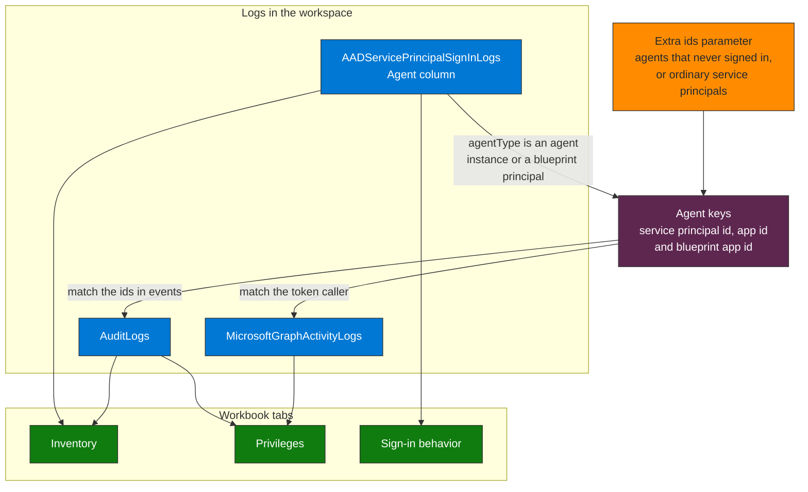

# Workbooks

## Agent inventory and privileges

A Microsoft Sentinel (Azure Monitor) workbook that answers three questions from the Entra logs already in the workspace: which agents exist, what they can do, and how they sign in. It only reads. File: [agent-inventory-and-privileges.workbook.json](./agent-inventory-and-privileges.workbook.json).

**How to read it.** An agent is a service principal whose sign-ins carry an agent type in the `Agent` column. The ids of those agents are the keys the workbook uses to find them in `AuditLogs` and `MicrosoftGraphActivityLogs`. An agent that never signs in has no keys, so it must be added by hand in the **Extra ids** parameter.

### What each tab shows

| Tab | Panel | Source | Question it answers |
|---|---|---|---|
| Inventory | Agents by type, sign-ins per day | Sign-in logs | How many agent identities and blueprint principals are active, and when |
| Inventory | Agent identities and blueprint principals that signed in | Sign-in logs | Per agent: blueprint app id, first and last sign-in, IPs, countries, resources, Conditional Access outcome |
| Inventory | Agents with no sign-in in the selected range | Sign-in logs | Which agents seen in the last 90 days went quiet |
| Inventory | Objects created by an agent blueprint | `AuditLogs` | Which agent identities a blueprint created, and when |
| Privileges | Roles and scopes the agent tokens carried on Microsoft Graph | `MicrosoftGraphActivityLogs` | What each agent token could do and what it called, including permissions inherited from the blueprint, which only appear in the token claims at runtime |
| Privileges | Role assignments, app roles and consents involving agent objects | `AuditLogs` | Which roles, app roles, delegated scopes and consents were granted, and by whom |
| Privileges | Credential, owner and sponsor changes on agent objects | `AuditLogs` | Who changed credentials, owners or sponsors on an agent object |
| Privileges | Agent identities creating applications or service principals | `AuditLogs` | Agent spawning: an agent identity creating other identities |
| Sign-in behavior | IP addresses an agent used for the first time | Sign-in logs | A new IP for an agent that had signed in before, or an agent with no history |
| Sign-in behavior | Agents that signed in from more than one country | Sign-in logs | Candidates for impossible travel |
| Sign-in behavior | Conditional Access outcome by resource | Sign-in logs | Which agent sign-ins Conditional Access evaluated |

The panels follow the same logic as the detections in [detect-agent-identity-abuse](../skills/detect/detect-agent-identity-abuse/SKILL.md) (new IP, spawning, more than one country), [secure-ca-policy-agents](../skills/secure/secure-ca-policy-agents/SKILL.md) (Conditional Access outcome) and Q12 and Q13 of [P03-Access-Anomalies.kql](../KQL-Library/P03-Access-Anomalies.kql) (credential, owner, sponsor, consent and app-role changes). The difference is the source of the agent list: those queries join `AgentsInfo`, which is empty in a workspace without the Defender XDR connector, and the workbook uses the ids of agents that signed in.

### Requirements

- The workspace receives `AADServicePrincipalSignInLogs` and `AuditLogs` from Entra diagnostic settings. The Privileges tab also needs `MicrosoftGraphActivityLogs`, a high-volume table: check the ingestion cost before enabling it (the validation workspace held about 1.9 million rows in 90 days).
- Read access to the workspace to view it, and a role that can save workbooks (for example Workbook Contributor) to keep a copy.

### Import it

1. Open the workspace in Microsoft Sentinel (or Azure Monitor) and go to **Workbooks**, then **Add workbook** (New).
2. Select **Edit**, then the **Advanced Editor** (`</>`), and the **Gallery Template** tab.
3. Replace the content with the JSON file and select **Apply**, then **Save**, choosing the subscription, resource group and location.
4. Check the **Log Analytics workspace** (it defaults to **Any one**, so pick the right one if you have several), choose a **Time range** (7 to 90 days) and, if you have agents that do not appear in the sign-in logs, type their ids in **Extra ids** (comma separated). The default value is a placeholder that matches nothing.

### Limits

- Only agents that signed in during the last 90 days are listed (and within the retention of the workspace). An agent that never signed in, or that is an ordinary service principal, appears only if you type its id in **Extra ids**.
- A blueprint principal is not an agent: it holds the credentials and creates agent identities. It is listed with its own type.
- The Conditional Access panel is expected to show `notApplied` for sign-ins at the `AAD Token Exchange Endpoint: Public` and for the token a blueprint requests to create identities, because Conditional Access does not apply to them. Judge the policy on sign-ins to a real resource. For agent identities the only control is Block.
- The panels are for review. For alerting use the analytics rules in the skills above.

### Validation

Every query was run against a Sentinel workspace in October 2026 (90 days of data: 1 agent identity, 1 blueprint principal, 9 sign-ins, 1 Microsoft Graph call by the blueprint principal, 32 audit events that reference an agent). Each query ran without errors with the default parameters, with a 7-day range, and with an unrelated service principal in **Extra ids**, and both branches of the first-IP panel (a new IP for an agent with earlier sign-ins, and an agent with no history) returned rows. The workbook was then deployed as a test copy (a `Microsoft.Insights/workbooks` resource with the workspace as its source) and opened in the Azure portal: the three tabs, the parameters and all 12 panels rendered with the same rows as the queries, and the panels without results (dormant agents, more than one country, agent spawning) showed their no-data message. The first version left the workspace parameter unset, so every panel asked for a workspace; it now defaults to **Any one**.
