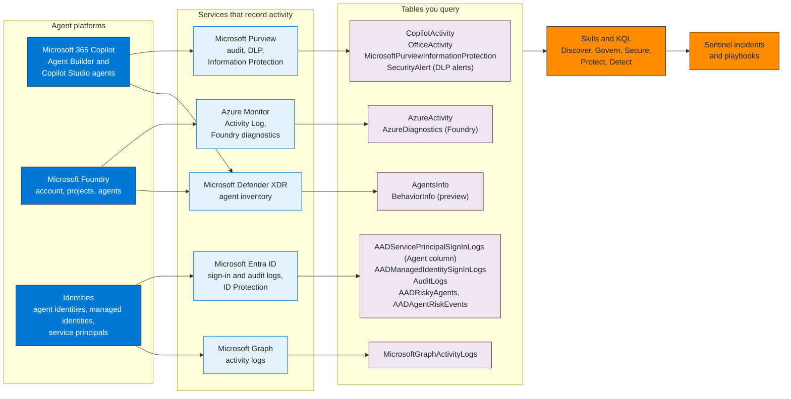
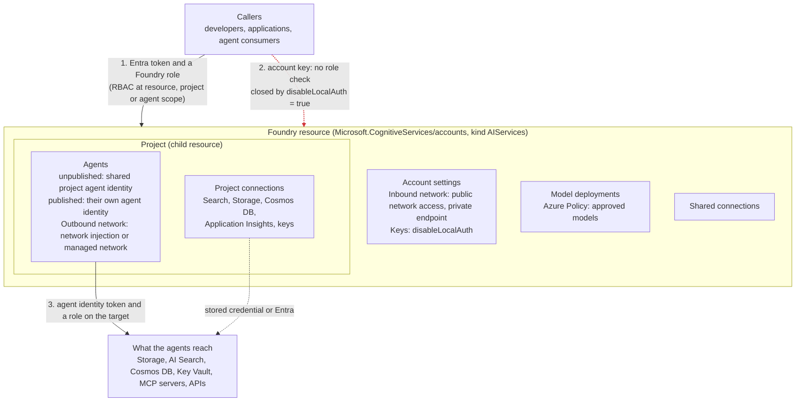
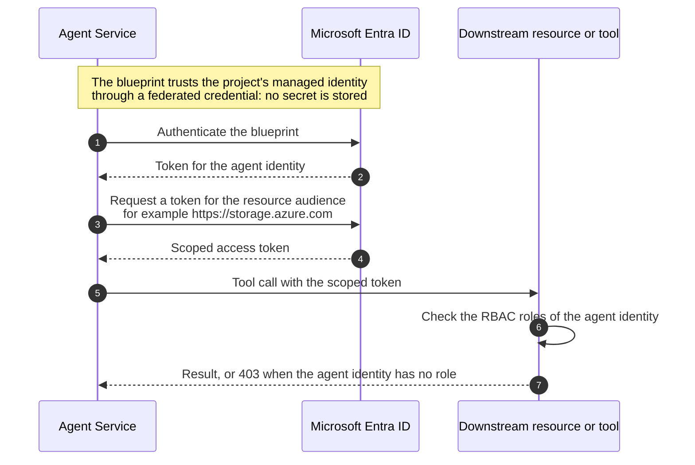

# Reference architecture

Three diagrams that the rest of the repository assumes. Each one is followed by what it shows, what it leaves out, and which skills build on it.

- [1. Where the evidence comes from](#1-where-the-evidence-comes-from): which service records what, and which table you query
- [2. Anatomy of a Foundry resource](#2-anatomy-of-a-foundry-resource-and-its-control-points): the objects, the identities and the places where a control can be applied
- [3. The identity chain of an agent](#3-the-identity-chain-of-an-agent): blueprint, agent identity, token exchange and where RBAC goes

The pillar-level flows live next to the skills they explain: [how the five pillars hand over](../skills/README.md), plus a diagram in each pillar README and in the skills where a picture explains the mechanism.

---

## 1. Where the evidence comes from

**How to read it.** Left to right: an agent platform produces activity, a Microsoft service records it, the record lands in a table, and the skills and queries in this repository read that table.
Two surfaces matter: the **Log Analytics workspace** behind Microsoft Sentinel and **Defender Advanced Hunting**. Some tables exist in only one of them (`AgentsInfo` is the clearest case), which is why a few queries
are labeled with the surface they run on.

**What it leaves out.** Prompt and response text. The Copilot audit record carries flags and counts (`JailbreakDetected` per message, `XPIADetected` per resource), not the words, and the Foundry diagnostic records carry operation, caller address
and sizes, not content. Detections in this repository are therefore built on flags, identities, volumes and sequences, never on matching prompt text.

What each table returned in the validation tenant (October 2026), so you know what to expect before you build on it:

| Table | In the validation tenant | Note |
|---|---|---|
| `CopilotActivity` | Data | Security Copilot, third-party AI apps and a few Microsoft 365 Copilot interactions; no `AgentId` or prompt text |
| `OfficeActivity` | Data | Applications appear with `UserType` Application; DLP matches join the mail `Send` event on the message ID |
| `AADServicePrincipalSignInLogs` | Data | The `Agent` column holds JSON with `agentType` (see diagram 3) |
| `AADManagedIdentitySignInLogs`, `AuditLogs`, `MicrosoftGraphActivityLogs` | Data | Graph activity logs are the largest source (about 1.9 million rows in 30 days) |
| `AzureActivity` | Data | Key listing, role assignments, NSG and Foundry management operations |
| `AzureDiagnostics` (Foundry) | Data | Management calls only, about 600 records in 30 days; no prompts, tokens or content |
| `MicrosoftPurviewInformationProtection`, `SecurityAlert` | Data | Label events; Data Loss Prevention alerts |
| `AgentsInfo` | Advanced Hunting only | Empty in the workspace |
| `AADRiskyAgents`, `AADAgentRiskEvents`, `BehaviorInfo`, `AppEvents`, `AppDependencies` | Table exists, no rows | The queries that read them are marked NOT VERIFIED. For the two agent risk tables the cause is known: the tenant's Entra diagnostic settings do not export the `RiskyAgents` and `AgentRiskEvents` categories |
| Power Platform tables (`PowerPlatformAdminActivity` and others) | Table exists, no rows | |
| `FoundryAgents_CL`, `CopilotStudio_CL`, `PurviewAuditLog` | Do not exist | Older versions of some skills read them; they were rewritten |

---

## 2. Anatomy of a Foundry resource and its control points

**How to read it.** The numbered lines are the three ways something gets in or out: a caller with an Entra token and a Foundry role (1), a caller with an account key (2, in red), and an agent reaching a target with its own identity (3). Each control point is written inside the box it applies to.
Path 2 is the one that skips the role check, so closing it comes first: a Foundry role does not bind anyone who holds a key.

| Control point | What it does | Skill |
|---|---|---|
| Foundry RBAC | Who can build, who can call, who can deploy, at resource, project or agent scope | [`govern-foundry-rbac`](../skills/govern/govern-foundry-rbac/SKILL.md) |
| `disableLocalAuth` | Turns account keys off, so every call needs an Entra token | [`secure-managed-identity-foundry`](../skills/secure/secure-managed-identity-foundry/SKILL.md) |
| Inbound network | Private endpoint and public access off | [`secure-network-isolation-agent`](../skills/secure/secure-network-isolation-agent/SKILL.md) |
| Outbound network | Where agent traffic leaves: injected subnet or managed network. Decided when the resource is created | [`secure-network-isolation-agent`](../skills/secure/secure-network-isolation-agent/SKILL.md) |
| Azure Policy on deployments | Which models and deployment types can be created | [`govern-foundry-rbac`](../skills/govern/govern-foundry-rbac/SKILL.md) |
| Inventory | Which accounts, projects and agents exist | [`discover-enumerate-foundry-agents`](../skills/discover/discover-enumerate-foundry-agents/SKILL.md) |

**What it leaves out.** Hub-based projects, the older model built on Azure Machine Learning, use different roles and different commands. Everything here is the model where projects live under a Foundry resource.

---

## 3. The identity chain of an agent

An agent that uses Microsoft Entra Agent ID is not one object but a chain. The chain explains why disabling one object stops many, and why a role assigned to the wrong object has no effect.

| Object | What it is | Holds | In `AADServicePrincipalSignInLogs` |
|---|---|---|---|
| Agent identity blueprint | An application | The credentials: client secret, certificate or federated credential. It authenticates and impersonates its agent identities. It cannot hold Azure RBAC roles | none (an application, not a sign-in principal) |
| Blueprint principal | The service principal of the blueprint | The principal through which the blueprint authenticates, for example to create or update agent identities | `agentType` = `agentIdentityBlueprintPrincipal` |
| Agent identity | A service principal | The permissions: Azure RBAC roles, Microsoft Graph application or delegated permissions. It is the identity that appears in audit logs | `agentType` = `agenticAppInstance` |
| Agent user | A user account paired 1:1 with an agent identity | A user-style identity for agents that need one (sessions can be revoked) | not a service principal sign-in |

**How to read it.** Steps 1 and 2 prove that Agent Service may act for the blueprint; steps 3 and 4 turn that into a token for one resource; steps 5 to 7 are the call and the resource's own decision. The role lives on the **agent identity**, not on the managed identity and not on the blueprint.

Consequences that the skills rely on:

- **One blueprint, many identities.** The blueprint holds the credentials, so a compromise of its credentials affects every agent identity under it. Disabling the blueprint principal stops all of them. Blueprint count is a security boundary decision ([`govern-entra-agent-id`](../skills/govern/govern-entra-agent-id/SKILL.md)).
- **Publishing changes the identity.** Unpublished agents of a project share the project's agent identity; a published agent has its own, so its role assignments have to be made again ([`secure-managed-identity-foundry`](../skills/secure/secure-managed-identity-foundry/SKILL.md)).
- **Containment follows the chain.** Disable the identity or the blueprint to stop authentication; revoke sessions only works on the agent user, not on a service principal ([`detect-respond-playbook-agent-containment`](../skills/detect/detect-respond-playbook-agent-containment/SKILL.md)).
- **Detection reads the `Agent` column.** The two `agentType` values above are how `detect-agent-identity-abuse` and `detect-anomalous-agent-behavior` tell agent identities apart from ordinary service principals.
