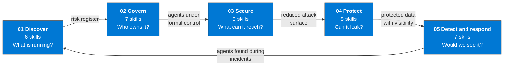

# Agent skills

30 skills in five pillars. Each pillar answers one question about an agent and hands a named artifact to the next one.

**How to read it.** The arrows are artifacts, not just order. The risk register from Discover is the list every later pillar works from: an agent that is not in it gets no owner, no Conditional Access policy, no data controls and no detection rule. The loop closes at the right: an agent found during an incident goes back into the register and receives the controls of the pillars it skipped.

| Pillar | Folder | Takes | Produces | Platform focus |
|---|---|---|---|---|
| 01 Discover | [`discover/`](./discover/) | The tenant as it is | AI agent risk register | Microsoft 365 admin center, Power Platform, Foundry, Entra |
| 02 Govern | [`govern/`](./govern/) | The risk register | Agents with an owner, a policy and a lifecycle | Agent 365, Entra, Conditional Access, PIM, Foundry RBAC |
| 03 Secure | [`secure/`](./secure/) | Agents under formal control | Agents with least privilege, no static secrets and a reduced network surface | Entra, Key Vault, Foundry, Azure networking |
| 04 Protect | [`protect/`](./protect/) | Agents with a reduced surface | Data classified, monitored and guarded | Purview (DSPM for AI, labels, DLP, Information Barriers) |
| 05 Detect and respond | [`detect/`](./detect/) | Protected data with active visibility | An operational AI security operations capability | Sentinel, Defender, Logic Apps |

Each pillar README opens with the order of its skills as a flow and, where a picture explains a mechanism better than a list, adds a second diagram. Diagrams that cut across pillars (the telemetry map, the anatomy of a Foundry resource and the identity chain of an agent) are in [`docs/architecture.md`](../docs/architecture.md).

## Files

| File | What it is |
|---|---|
| [`SCHEMA.md`](./SCHEMA.md) | The format every skill follows: frontmatter, workflow, queries, verification |
| [`references/frameworks.md`](./references/frameworks.md) | Cross-reference of MITRE ATLAS, D3FEND, NIST AI RMF and NIST CSF to the skills |
