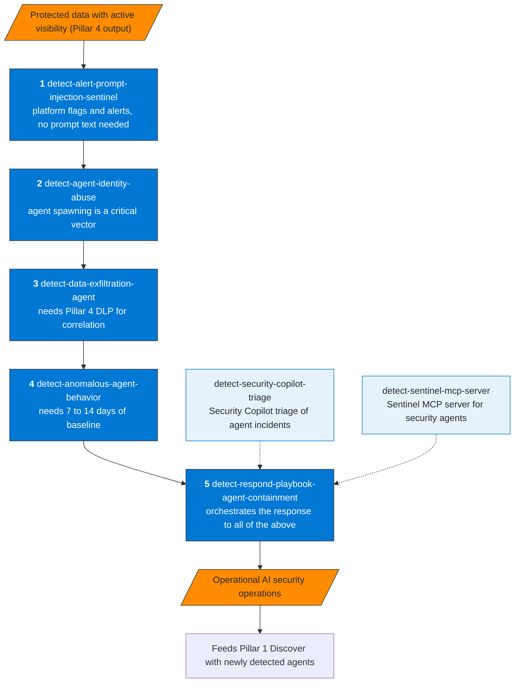
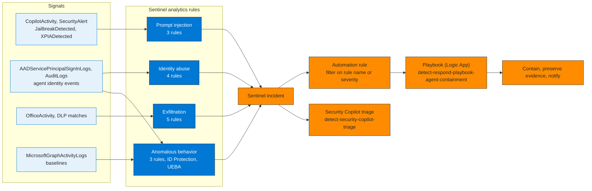
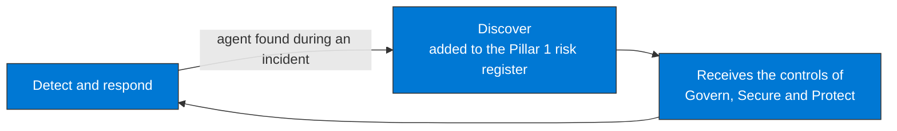

# Pillar 5 — Detect & Respond

Objective: detect active threats against AI agents in real time and contain
compromised agents before the damage becomes irreversible.

## Implementation sequence (by ROI and dependencies)

**How to read it.** The order follows return on effort and dependencies: platform flags need no baseline, agent identity abuse is the next critical vector, exfiltration needs the Pillar 4 DLP signal to correlate with, and behavioral anomalies need a baseline of 7 to 14 days. The playbook comes last because it responds to everything before it.

## How a detection becomes a response

**How to read it.** Left to right is the path of one detection. Rules are built on flags, identities, volumes and sequences, never on prompt text, because the audit record does not carry it. An incident does not trigger a playbook by itself: an automation rule decides which playbook runs, filtering on the analytics rule name or the severity (Sentinel incident tactics are MITRE ATT&CK tactics, so a MITRE ATLAS technique ID cannot be used as the filter).

## Skills

| Skill | Detection type | Sentinel rules | KQL |
|---|---|---|---|
| `detect-alert-prompt-injection-sentinel` | Platform signals | 3 scheduled rules | sentinel-prompt-injection.kql |
| `detect-anomalous-agent-behavior` | Behavioral/baseline | 3 rules + ID Protection + UEBA | sentinel-agent-baseline.kql |
| `detect-data-exfiltration-agent` | Volumetric correlation | 5 rules | sentinel-exfiltration.kql |
| `detect-agent-identity-abuse` | Signature + identity anomaly | 4 rules | sentinel-identity-abuse.kql |
| `detect-respond-playbook-agent-containment` | Response (Logic App) | 1 playbook | sentinel-ir-hunting.kql |
| `detect-security-copilot-triage` | Triage (Security Copilot) | none | No |
| `detect-sentinel-mcp-server` | Platform integration (Sentinel MCP server) | none | No |

## MITRE ATLAS coverage

| ATLAS technique | Skill that covers it |
|---|---|
| AML.T0040 — AI Model Inference API Access | `detect-agent-identity-abuse`, `detect-anomalous-agent-behavior` |
| AML.T0051 — LLM Prompt Injection | `detect-alert-prompt-injection-sentinel`, `detect-respond-playbook-agent-containment`, `detect-security-copilot-triage` |
| AML.T0054 — LLM Jailbreak | `detect-alert-prompt-injection-sentinel`, `detect-security-copilot-triage`, `detect-sentinel-mcp-server` |
| AML.T0057 — LLM Data Leakage | `detect-data-exfiltration-agent` |
| AML.T0084 — Discover AI Agent Configuration | `detect-agent-identity-abuse`, `detect-anomalous-agent-behavior` |
| AML.T0086 — Exfiltration via AI Agent Tool Invocation | `detect-anomalous-agent-behavior`, `detect-data-exfiltration-agent`, `detect-respond-playbook-agent-containment` |
| AML.T0091.000 — Use Alternate Authentication Material: Application Access Token | `detect-agent-identity-abuse`, `detect-respond-playbook-agent-containment` |
| AML.T0103 — Deploy AI Agent | `detect-agent-identity-abuse` |

## Known constraints

| Constraint | Impact |
|---|---|
| Sentinel validates the tables a rule references at creation time | Fails if the table does not exist — verify BEFORE. `CopilotStudio_CL` and `FoundryAgents_CL` do not exist in the validation workspace: use `CopilotActivity`, `OfficeActivity`, `AADServicePrincipalSignInLogs` and `MicrosoftGraphActivityLogs` |
| UEBA requires explicit activation | `BehaviorAnalytics` is not available by default |
| `InitiatedBy.app` in AuditLogs is not always populated | Agent spawning may have false negatives |
| Baseline requires a minimum of 7 days of data | Anomaly rules are not effective before that |
| The Power Platform quarantine API takes a user access token (Global, AI or Power Platform administrator) | A Logic App managed identity cannot call it; not available via Lokka-Microsoft MCP |
| `revokeSignInSessions` exists for users only | No session-revocation call for service principals or agent identities: disable, confirm compromised, remove credentials |
| Native layers cover part of the agent threats | Compare them before building custom rules: the table in [Track C Module 05](../../Track-C-SOC-Engineer/Module-05-DetectRespond.md#what-each-native-layer-covers-and-what-it-leaves-open) lists what each one covers and leaves open |

## Closing the framework cycle

The full cycle across the five pillars is in [`skills/README.md`](../README.md).
