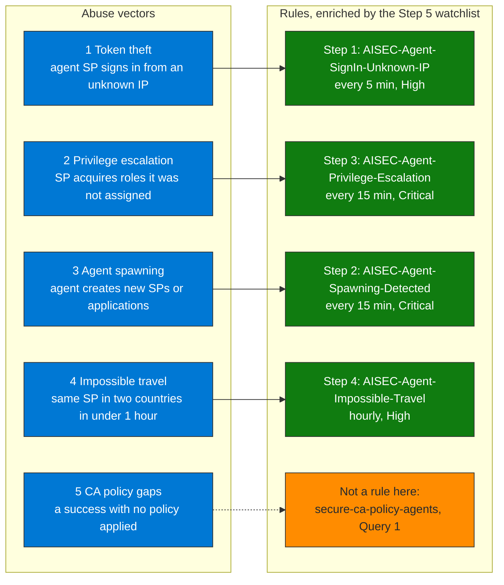

## When to use

- After implementing CA policies (Pillar 2): they reduce the abuse but do not detect it
- When the `AADServicePrincipalSignInLogs` logs are active in Sentinel
- To cover the compromised-agent vector that escalates privileges or spawns sub-agents

## Abuse vectors

1. **Token theft**: an agent SP authenticating from an unknown IP (stolen token)
2. **Privilege escalation**: an SP acquiring roles it was not originally assigned
3. **Agent spawning**: an agent creating new SPs or applications (sub-agents)
4. **Impossible travel**: the same SP authenticating from two countries in < 1 hour
5. **CA policy gaps**: a successful sign-in with no Conditional Access policy applied. This skill has no rule for it: read it with `secure-ca-policy-agents` (`queries/sentinel-ca-agents.kql`, Query 1). A report-only result is not a bypass, it only shows what the policy would have blocked



**How to read it.** Each abuse vector on the left is covered by one analytics rule on the right, and the rules enrich their incidents with the watchlist of known agent service principals from Step 5. The two Critical rules are privilege escalation and agent spawning, and spawning is the highest-risk vector because a compromised agent can create persistent sub-agents with inherited permissions. The fifth vector, CA policy gaps, has no rule in this workflow: the Verification section counts four rules, and the Conditional Access coverage of agent sign-ins is read with Query 1 of `secure-ca-policy-agents`.

## Workflow

### Step 1 — Create rule: SP sign-in from a non-corporate IP

```kql
// See queries/sentinel-identity-abuse.kql — Query 1
// Correlates AADServicePrincipalSignInLogs with CA Named Locations
```

Configuration:
- **Name**: `AISEC-Agent-SignIn-Unknown-IP`
- **Frequency**: every 5 minutes
- **Severity**: High

### Step 2 — Create rule: agent spawning (agent creates new apps/SPs)

```kql
// See queries/sentinel-identity-abuse.kql — Query 2
// Detects when the principal initiating an SP creation is another SP (not a human)
```

Configuration:
- **Name**: `AISEC-Agent-Spawning-Detected`
- **Frequency**: every 15 minutes
- **Severity**: Critical — highest-risk vector

### Step 3 — Create rule: agent privilege escalation

```kql
// See queries/sentinel-identity-abuse.kql — Query 3
```

Configuration:
- **Name**: `AISEC-Agent-Privilege-Escalation`
- **Frequency**: every 15 minutes
- **Severity**: Critical

### Step 4 — Create rule: impossible travel for service principals

```kql
// See queries/sentinel-identity-abuse.kql — Query 4
// Two successful authentications of the same SP from different countries in < 60 min
```

Configuration:
- **Name**: `AISEC-Agent-Impossible-Travel`
- **Frequency**: hourly
- **Severity**: High

### Step 5 — Link to a watchlist of known agent SPs

Create a watchlist in Sentinel with the registered agent SPs:

```
Sentinel → Watchlists → New → Upload CSV
Columns: AgentName, ServicePrincipalId, AppId, RiskLevel, Owner
```

Use the watchlist in the rules to enrich incidents with
context from the Pillar 1 risk register.

## Verification

- [ ] `AADServicePrincipalSignInLogs` has data in the workspace
- [ ] The 4 analytics rules created and in Enabled state
- [ ] Agent SP watchlist loaded
- [ ] Test incident: authenticate an SP from an external IP and verify the alert
- [ ] Agent spawning: manually create an SP from an SP context and verify detection

## Implementation notes

- `AADServicePrincipalSignInLogs` requires Entra ID P2 or the Entra ID data connector active in Sentinel
- For impossible travel on service principals: agent SPs in Azure rarely have variable IPs — any IP geolocation change is suspicious
- Agent spawning is the highest-risk vector in multi-agent architectures: a compromised agent can create persistent sub-agents with inherited permissions
- Correlate with `AuditLogs` in Sentinel to detect new SP creation in the same interval as the compromised agent
