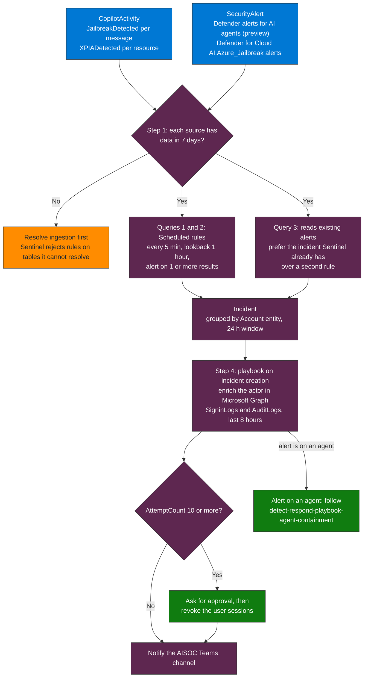

## When to use

- The Microsoft Copilot connector (`CopilotActivity`) and/or Defender alerts for AI agents and Defender for Cloud AI threat
  protection alerts flow into your Sentinel workspace
- As the first analytics rule in the AISOC: the signals come from the platform classifiers, so the rule needs no prompt text
- Covers MITRE ATLAS AML.T0051 (LLM Prompt Injection) and AML.T0054 (LLM Jailbreak)

## Critical constraint

Sentinel rejects analytics rules that reference a table it cannot resolve. Verify the sources before creating a rule:

```kql
union isfuzzy=true withsource=SourceTable CopilotActivity, SecurityAlert, AppEvents
| where TimeGenerated > ago(7d)
| summarize LastEvent = max(TimeGenerated), Events = count() by SourceTable
```

A source that does not appear in the result has no data in the last 7 days: resolve ingestion before building the rule that
reads it. On the validation workspace `CopilotActivity` and `SecurityAlert` returned rows and `AppEvents` returned none.

## What the platform detects

Learn is explicit that the audit record for Copilot and AI applications does not carry the prompt or response text. It carries
a flag, so this skill reads the flags and the alerts, not the words.

| Signal | Where it lives | What it covers |
|---|---|---|
| `JailbreakDetected` per message | `CopilotActivity`, `LLMEventData.Messages[]` | A user prompt the Microsoft classifier flagged as a jailbreak attempt |
| `XPIADetected` per resource | `CopilotActivity`, `LLMEventData.AccessedResources[]` | A resource Copilot read, flagged as a cross-prompt (indirect) injection source |
| Defender alerts for AI agents (preview) | Defender portal, `AlertInfo`, and `SecurityAlert` in Sentinel when the Defender XDR connector sends them | Agents managed with Agent 365 (Copilot Studio, published Foundry agents, Agent Builder): jailbreak, XPIA, LLM reconnaissance |
| Real-time protection behaviors (preview) | `BehaviorInfo` in Advanced Hunting | Audit and block events of Defender real-time protection rules, including Prompt Shields blocks for Foundry and Agent Builder |
| `AI.Azure_Jailbreak.ContentFiltering.*` alerts | `SecurityAlert` (Defender for Cloud) | Jailbreak attempts on Azure OpenAI and Foundry model deployments, blocked or only detected by Prompt Shields |

To read the actual prompt text during an investigation, use Content Search or the AI interaction events in DSPM for AI (Learn).



**How to read it.** Read it top to bottom: check that the sources have data, run the rules on the platform flags and alerts, then let the incident drive the playbook. Query 4 (BehaviorInfo) runs only in Advanced Hunting, so it is not on this path. The one thing to take from it is that the rules read flags and alerts, never prompt text, and a source with no data blocks its rule until ingestion is fixed.

## Workflow

### Step 1 — Verify the sources (mandatory)

Run the query in "Critical constraint" and keep the table of which source has data.

### Step 2 — Validate the base queries before creating a rule

```kql
// See queries/sentinel-prompt-injection.kql — Queries 1 to 3
// Run each one manually: it must return rows or "No results" without a table or column error
```

### Step 3 — Create the Scheduled Analytics Rule in Sentinel

Parameters (Query 1; create one rule per query you keep):
- **Name**: `AISEC-Prompt-Injection-Detection`
- **Frequency**: every 5 minutes
- **Lookback**: last 1 hour (the query window; a longer lookback re-alerts on the same events at every run)
- **Threshold**: >= 1 result
- **Severity**: dynamic from the `Severity` column (High/Medium/Low)
- **MITRE tactics**: Initial Access and Execution. Sentinel rules take MITRE ATT&CK tactics and techniques, not ATLAS IDs:
  carry `AML.T0051` as a custom detail instead
- **Entity mapping**: `ActorUserId` to the Account entity (`AadUserId`)
- **Incident grouping**: by Account entity, 24h window

Via ARM (`2022-12-01-preview`):

```json
{
  "kind": "Scheduled",
  "properties": {
    "displayName": "AISEC-Prompt-Injection-Detection",
    "enabled": true,
    "query": "<KQL from queries/sentinel-prompt-injection.kql, Query 1>",
    "queryFrequency": "PT5M",
    "queryPeriod": "PT1H",
    "triggerOperator": "GreaterThan",
    "triggerThreshold": 0,
    "severity": "Medium",
    "tactics": ["InitialAccess", "Execution"],
    "alertDetailsOverride": { "alertSeverityColumnName": "Severity" },
    "customDetails": { "AtlasTechnique": "AtlasTechnique" },
    "entityMappings": [
      { "entityType": "Account", "fieldMappings": [ { "identifier": "AadUserId", "columnName": "ActorUserId" } ] }
    ],
    "incidentConfiguration": {
      "createIncident": true,
      "groupingConfiguration": {
        "enabled": true,
        "groupByEntities": ["Account"],
        "lookbackDuration": "PT24H",
        "matchingMethod": "Selected"
      }
    }
  }
}
```

Query 2 (XPIA) uses the same parameters with severity High. Query 3 reads alerts that already exist: if the Defender
or Defender for Cloud connector creates incidents from them, prefer the incident Sentinel already has over a second rule.

### Step 4 — Create an enrichment playbook (Logic App)

On incident creation (trigger: **Microsoft Sentinel incident**):
1. Enrich the actor: `GET /users/{id}` in Microsoft Graph
2. Query the actor's recent sign-ins and directory changes in `SigninLogs` and `AuditLogs` (last 8h) with the Azure Monitor Logs action
3. If `AttemptCount >= 10`: ask for approval and revoke the user's sessions (`POST /users/{id}/revokeSignInSessions`, permission
   `User.RevokeSessions.All`). For an alert on an agent, follow `detect-respond-playbook-agent-containment`
4. Notify the AISOC Teams channel with a summary

### Step 5 — Test the rule logic

`CopilotActivity` is filled by the Microsoft Copilot connector, so there is no supported way to inject a synthetic event
into it. Test the rule logic by replacing the source with a `datatable` that has the same columns and a message with
`JailbreakDetected` set to true (the pattern used for P04-Q5a), and run a known jailbreak test prompt from a test user in a
non-production tenant to see whether the platform flags it.

## Verification

- [ ] Source check lists every source with data, or you documented which one is missing
- [ ] Queries 1 to 3 return rows or "No results" without a table or column error
- [ ] Rule in Enabled state in Sentinel Analytics
- [ ] The rule logic fires on a `datatable` test with the flag set to true
- [ ] Playbook runs with no errors in test mode
- [ ] Time to detect < 10 minutes from the event (the connector ingestion delay counts)

## Implementation notes

- Query 1 and Query 2 return no rows on the validation workspace: of the 7 messages that carry `JailbreakDetected` in 90 days none is
  true, and the `XPIADetected` key on the 2 listed resources is false. They were run with `== false` to confirm the columns
- Query 4 (`BehaviorInfo`) runs in Advanced Hunting only. In the Sentinel workspace the same table has another schema (no `Title`, no `Timestamp`)
- Query 5 is a phrase heuristic for agent telemetry you own (Application Insights with "Log conversation details" on). It is low fidelity and
  was not run against data
- Recommended Sentinel API version: `2022-12-01-preview` for SecurityInsights resources
- Incident grouping by the Account entity reduces noise in environments with several users testing
- Tune the `AttemptCount` severity thresholds against the false positive rate you see in the first 30 days
- Removed in this version, because Microsoft Learn (Oct 2026) does not support them: phrase matching on prompt text in
  `CopilotStudio_CL` and `FoundryAgents_CL` (custom tables that do not exist in the validation workspace), the indirect-injection
  heuristic on agent response text, the session-velocity query, a `JailbreakScore` threshold (the flag is a Boolean), and ATLAS IDs as rule tactics
