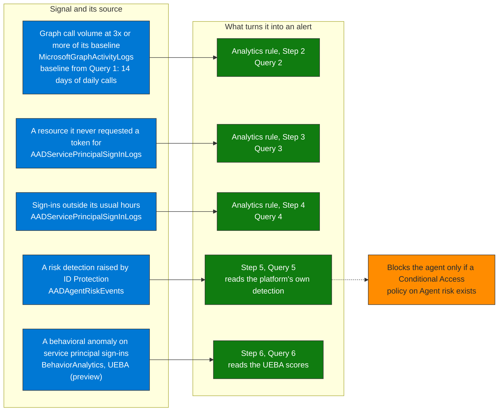

## When to use

- Post-deployment of basic rules (prompt injection) — adds behavioral detection
- When the agent identities have enough history (minimum 14 days) to establish a baseline
- To detect compromised agents that do not use known injection techniques

## Detection logic

A compromised or misconfigured agent identity manifests as:
- Microsoft Graph call volume 3x+ over its daily baseline
- Access to a resource (the service a token is requested for) it had never used before
- Sign-ins outside the hours in which it normally runs
- A risk detection that Entra ID Protection already raised for the agent (unfamiliar resource access, sign-in spike, failed access attempts)

How to tell agent identities from other service principals: `AADServicePrincipalSignInLogs` has an `Agent` column, a JSON string with
`agentType` (`agenticAppInstance`, `agentIdentityBlueprintPrincipal`, or `notAgentic` for everything else). Queries 1 to 4 filter on it.



**How to read it.** Each row is one signal, where it is read, and the step that turns it into a rule or a query. Only Query 5 reads a detection the platform already computed, and a risk level blocks the agent only if a Conditional Access policy on Agent risk exists.

## Prerequisites

Microsoft Entra diagnostic settings sending these categories to the Sentinel workspace: `ServicePrincipalSignInLogs`,
`MicrosoftGraphActivityLogs`, and, for Query 5, `RiskyAgents` and `AgentRiskEvents`.

## Workflow

### Step 1 — Establish a per-agent baseline (minimum 14 days)

```kql
// See queries/sentinel-agent-baseline.kql — Query 1
// Run first to verify there is enough history
```

If an agent identity has fewer than 7 days of data: document it and wait before activating the baseline-based rules.

### Step 2 — Create rule: anomalous Graph call volume

```kql
// See queries/sentinel-agent-baseline.kql — Query 2
// Threshold: > 3x daily baseline
```

Sentinel rule configuration:
- **Name**: `AISEC-Agent-Anomalous-Volume`
- **Frequency**: hourly
- **Lookback**: last 24 hours
- **Severity**: Medium (escalate to High if the agent has High-risk connectors)

### Step 3 — Create rule: access to new resources

```kql
// See queries/sentinel-agent-baseline.kql — Query 3
// Resources the identity requested a token for during the last day and not in the previous 30 days
```

Configuration:
- **Name**: `AISEC-Agent-New-Resource-Access`
- **Frequency**: every 15 minutes
- **Lookback**: last 24 hours
- **Severity**: High (if the resource is Microsoft Graph and the agent has file or mail permissions)

### Step 4 — Create rule: off-hours operation

```kql
// See queries/sentinel-agent-baseline.kql — Query 4
```

Configuration:
- **Name**: `AISEC-Agent-Off-Hours-Operation`
- **Frequency**: hourly
- **Lookback**: last 24 hours (the baseline needs 20 sign-ins before it judges an hour)
- **Severity**: Medium

### Step 5 — Read the agent risk Entra ID Protection computes

```kql
// See queries/sentinel-agent-baseline.kql — Query 5
```

ID Protection for agents flags unfamiliar resource access, sign-in spikes and failed access attempts, among other detections, and they
are offline detections. It needs the `AgentRiskEvents` diagnostic category exported to the workspace. It requires an Entra ID P2 license during the
preview, and Learn says it will require a Microsoft Agent 365 license. A risk level only blocks the agent if a Conditional Access policy on Agent risk exists.

### Step 6 — Enable UEBA and read its scores for service principals

```
Defender portal → System → Settings → Microsoft Sentinel → SIEM workspaces → [workspace] → Anomalies → Detect Anomalies = On
(or the UEBA tab: Entity behavior configuration)
```

UEBA generates the `BehaviorAnalytics` table. Learn lists `AADServicePrincipalSignInLogs` and `AADManagedIdentitySignInLogs` as UEBA sources (preview):

```kql
// See queries/sentinel-agent-baseline.kql — Query 6
```

## Verification

- [ ] Baseline computed with a minimum of 7 days of data (14 recommended) for the agent identities in scope
- [ ] The three analytics rules created and in Enabled state
- [ ] `AgentRiskEvents` exported to the workspace, and the agent risk Conditional Access policy exists, if you rely on Query 5
- [ ] UEBA enabled and `BehaviorAnalytics` holds rows with `NativeTableName` equal to `AADServicePrincipalSignInLogs`
- [ ] Test: artificially raise the Graph call volume of a test agent and verify it generates an incident

## Implementation notes

- On the validation tenant only 2 agent identities signed in during 30 days, with almost no Graph calls, so Queries 1 to 4 return no
  rows for agents there. Their logic was exercised on all service principals: Query 2 returned one service at 3.03x its baseline
  and Query 4 returned two with off-hours sign-ins. Replace the agent filter by your own list of service principal object IDs to apply the same logic to
  agents that run on service principals without an Entra agent identity
- Queries 5 and 6 returned no rows: `AADAgentRiskEvents` exists and is empty, and `BehaviorAnalytics` holds no rows from service principal sign-ins. Both are NOT VERIFIED
- UEBA needs the Entra Security Administrator role plus Microsoft Sentinel Contributor and Log Analytics Contributor (least privileged), and it adds data
  storage charges. `BehaviorAnalytics` is not available until it is enabled (Learn)
- `ActivityInsights` holds True or False indicators such as `FirstTimeUserAccessedResource`, not text
- Anomaly rules have a higher false positive rate than signature rules — tune thresholds against observed behavior
- Start with one agent platform (for example Copilot Studio agents with Entra agent identities) to validate the baseline before extending to all agents
- Removed in this version, because the source does not exist or Learn does not support it: baselines on `CopilotStudio_CL` and `FoundryAgents_CL` (custom
  tables that do not exist in the validation workspace), the UEBA match on agent-like names and on the text "Anomalous", and the "latency" signal (no table in this skill measures it)
