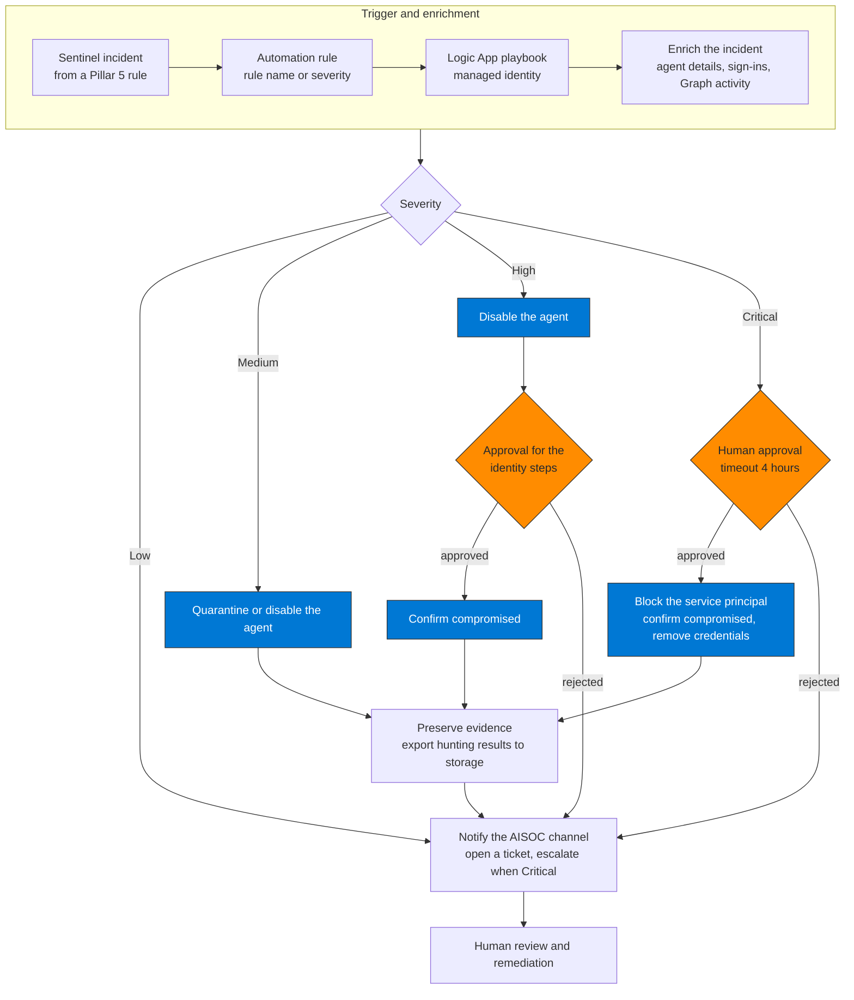
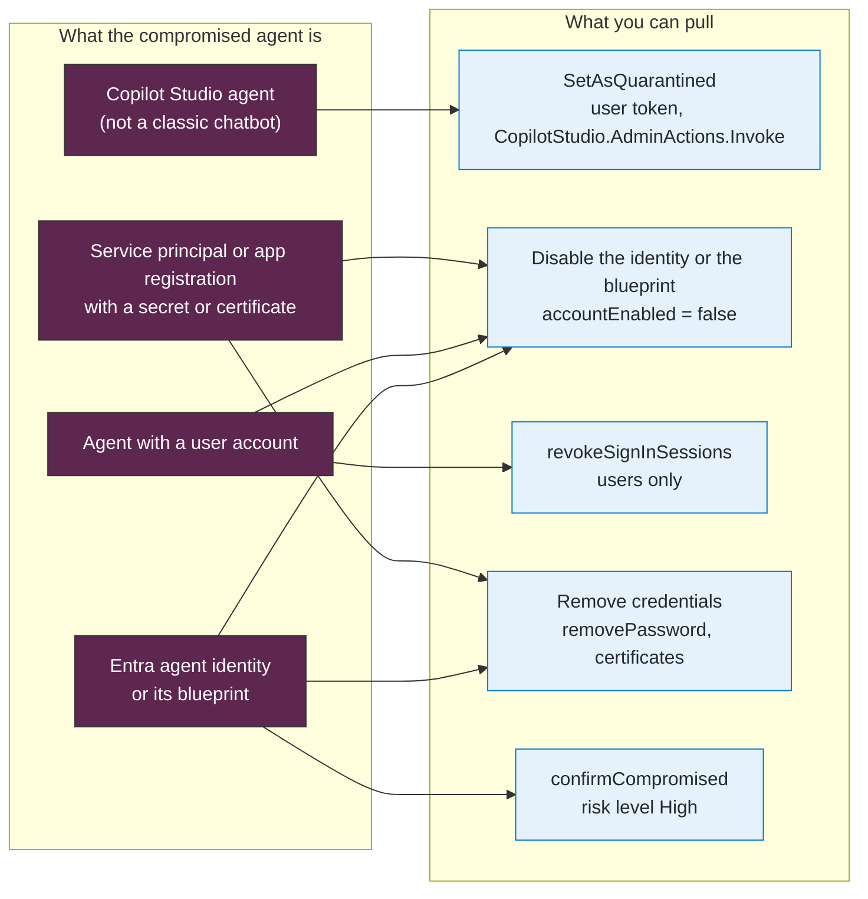

## When to use

- As a playbook attached to any Pillar 5 analytics rule
- Trigger manually when a compromised agent is confirmed
- Automate for High and Critical severity incidents

## Playbook phases

```
Detection → Triage → Containment → Preservation → Notification → Remediation
```

This skill covers the first four phases (automatable).
Remediation requires human review.

## Playbook flow



**How to read it.** Severity decides how far automation goes without a person. Low only notifies, Medium acts at once, High and Critical stop at an approval gate before the identity-level steps (confirm compromised, block the service principal). If the approver rejects, the playbook notifies and does not block. Evidence is preserved after containment and before any deletion, because deleting an agent or its identity removes the objects the evidence points to. Remediation is always human.

## Containment actions by severity

| Severity | Automatic action | Requires approval |
|---|---|---|
| Low | Enrich incident + notify | No |
| Medium | Quarantine or disable the agent + notify + open ticket | No |
| High | Disable the agent + confirm it compromised + notify | Yes (for steps 5+) |
| Critical | Block the SP + confirm compromised + remove credentials + notify + escalate | Yes |

## What each action does and does not do

| Action | What Learn documents | Limit |
|---|---|---|
| Quarantine a Copilot Studio agent | Power Platform API `SetAsQuarantined`: the agent stays visible, makers can test it, and it cannot be used in other channels | Takes a user token; not supported for classic chatbots (405) |
| Confirm the agent compromised | ID Protection `confirmCompromised`: risk level to High | Blocks only if a Conditional Access policy on Agent risk exists |
| Disable the service principal or agent identity | `accountEnabled` = false: new token requests fail with AADSTS7000112 | A token already issued stays valid until it expires (60 to 90 minutes by default); Continuous Access Evaluation for workload identities revokes it, for Microsoft Graph only, single-tenant apps only, not managed identities |
| Revoke sign-in sessions | `POST /users/{id}/revokeSignInSessions` | Exists for users only (agent user accounts included); there is no such call for a service principal or an agent identity |

## Which lever for which agent



**How to read it.** Pick the lever by what the agent is, not by habit. Session revocation reaches only user accounts, so it is the right lever for an agent user and the wrong one for a service principal or an agent identity, which you stop by disabling and by removing what they authenticate with. `confirmCompromised` raises the risk level but blocks only where a Conditional Access policy on agent risk exists. A token already issued stays valid until it expires (60 to 90 minutes by default), so disabling stops new tokens, not the ones in flight.

## Workflow

### Step 1 — Create the Logic App in Azure

```bash
# Requires the logic extension: az extension add --name logic
az logic workflow create \
  --resource-group {resource-group} \
  --location centralus \
  --name "la-aisoc-agent-containment" \
  --definition @containment-definition.json
```

Turn on the system-assigned managed identity of the Logic App: Steps 3 to 6 use it.

### Step 2 — Trigger: Microsoft Sentinel incident

Use the **Microsoft Sentinel incident** trigger and attach the playbook through an automation rule filtered on the analytics rule
name or on severity. Sentinel incident tactics are MITRE ATT&CK tactics: an ATLAS ID such as `AML.T0051` is not a tactic you can filter on.

### Step 3 — Action 1: Enrich the incident with agent data

```http
# Get the involved agent's service principal details
GET https://graph.microsoft.com/v1.0/servicePrincipals/{sp-id}
  ?$select=displayName,appId,createdDateTime,tags&$expand=owners
```

Then run the sign-in and Graph activity queries (`queries/sentinel-ir-hunting.kql`, Queries 1 and 2) with the **Azure Monitor Logs: Run query and list
results** action, and add the result as a comment on the Sentinel incident (the Logic App identity needs Microsoft Sentinel Responder on the workspace).

### Step 4 — Action 2: Quarantine the agent in Copilot Studio (if applicable)

```http
POST https://api.powerplatform.com/copilotstudio/environments/{environment-id}/bots/{bot-id}/api/botQuarantine/SetAsQuarantined?api-version=1
Authorization: Bearer {user-access-token}
```

The token is a **user** access token (Global administrator, AI administrator or Power Platform administrator), acquired with an app registration that has the
`CopilotStudio.AdminActions.Invoke` scope under the Power Platform API. A managed identity cannot call it: run this step from the on-call administrator's session or
from a connection that signs in as that administrator. `GET .../api/botQuarantine` returns `isBotQuarantined`; `SetAsUnquarantined` reverses it.

For a Microsoft Entra agent identity, disable it in the Entra admin center (Entra ID → Agents → Agent identities → Disable, role Agent ID Administrator), or disable
its blueprint to stop every identity derived from it.

### Step 5 — Action 3: Mark the agent compromised and remove what it can authenticate with

```http
POST https://graph.microsoft.com/beta/identityProtection/riskyAgents/confirmCompromised
{ "agentIds": ["{agent-object-id}"] }
```

Permission `IdentityRiskyAgent.ReadWrite.All`; Security Administrator is the least privileged role. It sets the risk level to High and blocks only where a
Conditional Access policy on Agent risk exists (template `aka.ms/CreateAgentRiskPolicy`).

Remove the credentials the agent can use: client secrets and certificates on its service principal or application, or on the blueprint for an agent identity
(`POST /servicePrincipals/{sp-id}/removePassword` removes a secret). If the agent has a user account, revoke its sessions:

```http
POST https://graph.microsoft.com/v1.0/users/{agent-user-id}/revokeSignInSessions
```

### Step 6 — Action 4: Block the SP in Entra ID (Critical only)

```http
PATCH https://graph.microsoft.com/v1.0/servicePrincipals/{sp-id}
{
  "accountEnabled": false
}
```

Permission `Application.ReadWrite.All`. New sign-ins then fail with `AADSTS7000112` (Application is disabled), which is `ResultType` 7000112 in the logs; verify it with
Query 5 of `queries/sentinel-ir-hunting.kql`.

### Step 7 — Action 5: Preserve forensic evidence

Run Queries 1 to 4 and 6 of `queries/sentinel-ir-hunting.kql` for the agent and export the results to a Storage Account (the Log Analytics Export option or a Logic App
Azure Monitor Logs action that writes to Blob Storage), under a retention policy that meets your case requirements. Do it before the destructive steps
(deleting the agent or its identity), because they remove the objects the evidence refers to.

### Step 8 — Action 6: Notification

```
Teams webhook → AISOC-Alerts channel:
"🚨 COMPROMISED AGENT CONTAINED
Agent: {agent-name}
Incident: {incident-id} | Severity: {severity}
Actions taken: {actions-taken}
Requires human review: [link]"
```

### Step 9 — Configure human approval for Critical

For Critical incidents, insert an approval action before `accountEnabled: false`:

```
Logic App → Add action → Approvals → Start and wait for an approval
→ Approvers: security-team@{tenant}
→ Timeout: 4 hours
→ On reject: notify only, do not block the SP
```

## Verification

- [ ] Logic App deployed and in Running state
- [ ] Trigger correctly connected to Sentinel
- [ ] Test: create a manual incident and verify the Logic App runs
- [ ] Enrichment appears as a comment on the Sentinel incident
- [ ] The Graph calls return success (204 for `confirmCompromised`, 204 for the `PATCH`) in the Logic App run history
- [ ] Query 5 shows `ResultType` 7000112 for sign-ins after containment, and no `ResultType` 0 once the issued tokens expire
- [ ] Notification reaches the Teams AISOC-Alerts channel
- [ ] Containment action log available in the Logic App run history

## Implementation notes

- The Logic App's managed identity needs these Microsoft Graph application permissions, granted as app role assignments: `Application.ReadWrite.All` (disable the
  service principal, remove credentials), `IdentityRiskyAgent.ReadWrite.All` (confirm compromised), and `User.RevokeSessions.All` (agent user accounts). It also needs
  Microsoft Sentinel Responder on the workspace and Log Analytics Reader for the queries
- The Power Platform API takes a user access token, so a managed identity cannot call it
- `disabledByMicrosoftStatus` is set by Microsoft (`NotDisabled` or `DisabledDueToViolationOfServicesAgreement`): an admin cannot set it to disable an application
- For the notification channel: create a dedicated Teams channel for AISOC alerts before deploying the playbook
- Queries 1 to 6 ran on the validation workspace with real values; the agent-specific rows (Copilot Studio `AgentName`, agent sign-ins) were absent there
- Removed in this version, because Microsoft Learn (Oct 2026) does not document them: a Power Platform `.../appmanagement/.../bots/{bot-id}/disable` call, a PATCH of
  `disabledByMicrosoftStatus` to `DisabledDueToViolation`, `POST /servicePrincipals/{id}/revokeSignInSessions` (the action exists for users only), the ATLAS IDs as an
  incident trigger filter, `$select=owners` (owners is a navigation property: `$expand`), and the `CopilotStudio_CL`, `FoundryAgents_CL` and `PurviewAuditLog` tables in the evidence query
