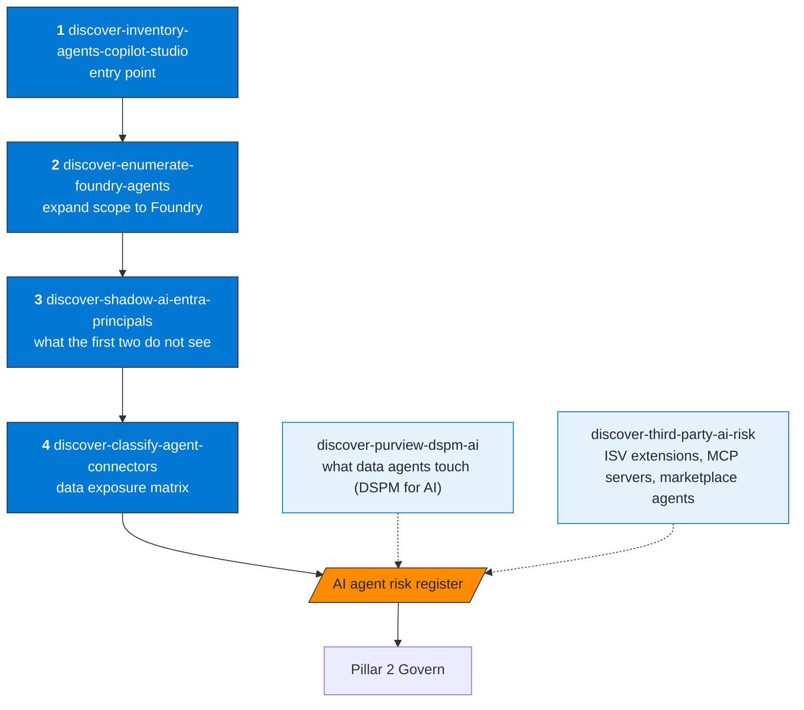
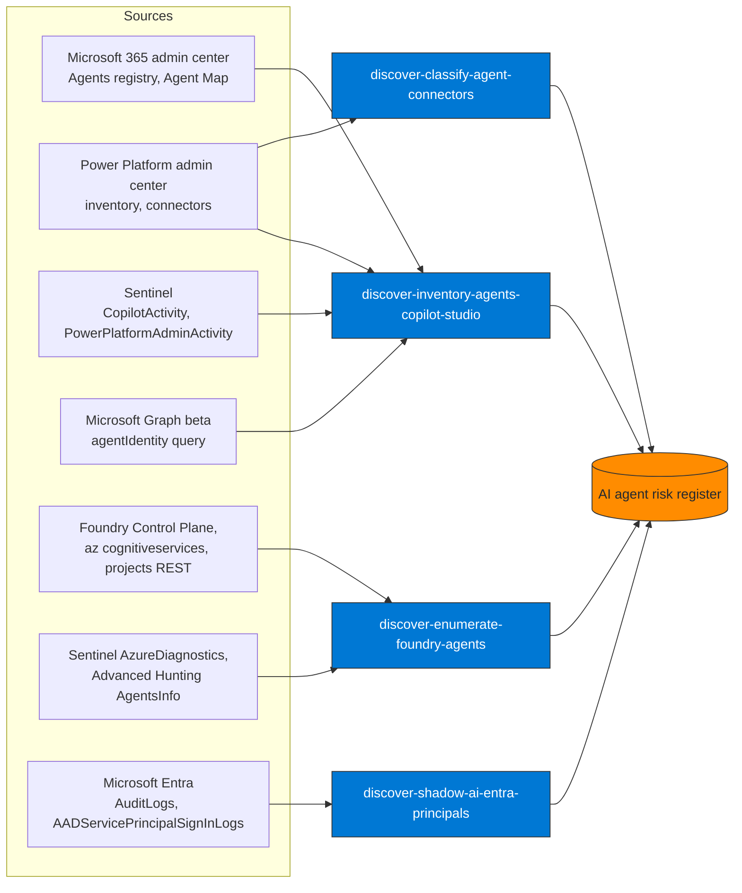

# Pillar 1 — Discover & Prioritize

Objective: know which AI agents exist, who created them, what data they touch, and what their risk level is.

## Recommended sequence

**How to read it.** The solid path is the order to run. Skill 1 is the entry point because the Microsoft 365 admin center registry and the Power Platform inventory are the two official lists; each later skill covers what the earlier ones cannot see. The two dotted skills feed the same register from the side: they are not steps of the sequence.

## Where the inventory comes from

**How to read it.** Each skill reads different sources and none is complete alone. The overlap is intended: an agent that shows up in the registry but has no identity in Entra, or an identity with no registry entry, is exactly what the register has to flag.

## Skills

| Skill | MS product | Sentinel connectors | KQL |
|---|---|---|---|
| `discover-inventory-agents-copilot-studio` | M365 admin center registry, Power Platform inventory, Graph | PowerPlatformAdminActivity, CopilotActivity | sentinel-inventory.kql |
| `discover-enumerate-foundry-agents` | Microsoft Foundry (Control Plane), Azure CLI | AzureDiagnostics, AgentsInfo | sentinel-foundry.kql |
| `discover-shadow-ai-entra-principals` | Entra ID, Graph API | AuditLogs, AADServicePrincipalSignInLogs | sentinel-shadow-principals.kql |
| `discover-classify-agent-connectors` | Power Platform Admin Center | — | — |
| `discover-purview-dspm-ai` | Purview DSPM for AI | — | — |
| `discover-third-party-ai-risk` | Microsoft 365 admin center, Entra ID | — | — |

## Expected pillar output

Risk register with, at minimum, these columns:

| AgentName | Source | CreatedBy | ApprovalStatus | Connectors | DataCategories | RiskLevel |
|---|---|---|---|---|---|---|

This register is the direct input for:
- `govern-ca-policy-workload-identity` (Pillar 2)
- `protect-purview-ai-hub-monitoring` (Pillar 4, DSPM for AI)
- `detect-alert-prompt-injection-sentinel` (Pillar 5)
