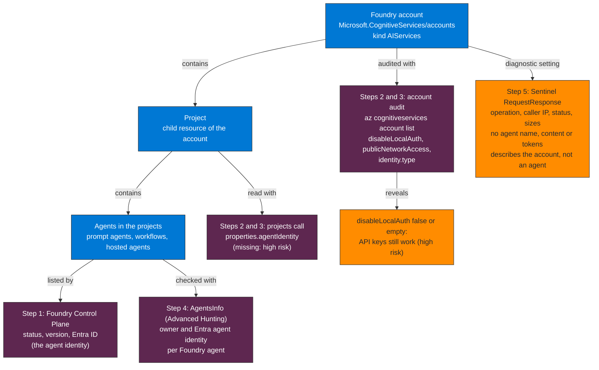

## When to use

- Complement to `discover-inventory-agents-copilot-studio` to cover the Azure stack
- Before implementing Entra Workload ID controls over Foundry agents
- Authentication and identity audit of the Foundry accounts across the subscription

## Prerequisites

- Azure CLI authenticated to subscription `{subscription-id}`
- Reader role at subscription or resource group scope (Reader can view the agent inventory and traces; Contributor can also start, stop and block agents)
- For Step 4: the Defender AI agent inventory (the `AgentsInfo` table in Advanced Hunting)
- For Step 5: the Foundry account's diagnostic setting sending `Audit` and `RequestResponse` to the Sentinel workspace



**How to read it.** Read top to bottom: the account contains projects, and projects contain the agents. Each source sits at the level it can speak about: the account audit and the diagnostic logs describe the account, while Foundry Control Plane and AgentsInfo describe individual agents. Take away that RequestResponse records cannot tell you which agent called, so the owner and identity per agent come from Step 1 and Step 4.

## Workflow

### Step 1 — List the agents in Foundry Control Plane

```
Microsoft Foundry portal → Operate → Assets → Agents
```

Foundry Control Plane discovers, across the projects in the subscription, Foundry agents (prompt agents, workflows and hosted agents), Azure SRE Agent,
Azure Logic Apps agent loops and custom agents. Per agent it shows the status (Running, Stopped, Blocked, Unknown), the version, whether it is published as an agent
application and the **Entra ID** (the agent identity). Classic agents and Azure OpenAI assistants are not supported. The same Foundry agents appear in the
Microsoft 365 admin center under Agents → All agents, where an admin with the **Azure AI Owner** role can start or stop them.

### Step 2 — Audit the Foundry accounts and projects

A Foundry resource is a `Microsoft.CognitiveServices/accounts` account of kind `AIServices`, and its projects are child resources:

```bash
az cognitiveservices account list \
  --subscription {subscription-id} \
  --query "[?kind=='AIServices'].{Name:name, RG:resourceGroup, KeyAuthDisabled:properties.disableLocalAuth, PublicNetwork:properties.publicNetworkAccess, Identity:identity.type}" \
  --output table

az rest --method get \
  --url "https://management.azure.com/subscriptions/{subscription-id}/resourceGroups/{resource-group}/providers/Microsoft.CognitiveServices/accounts/{account}/projects?api-version=2025-06-01"
```

`KeyAuthDisabled` = `false` (or empty) means API keys still work. Disabling local authentication makes Microsoft Entra ID the only authorization method (Microsoft Learn,
"Enable Microsoft Entra ID authentication"). Each project resource carries `properties.agentIdentity` (`agentIdentityId` and the blueprint ids) when it has an Entra agent identity.

### Step 3 — Read the account risk

| Property | High risk | Better |
|---|---|---|
| `disableLocalAuth` | `false`: keys can be used by anyone who holds one | `true`: Entra ID only |
| `identity.type` | Missing | System-assigned or user-assigned managed identity |
| `publicNetworkAccess` | `Enabled` with no network rules | Private endpoint or restricted networks |
| Project `agentIdentity` | Missing | Present, with an owner (sponsor) |

### Step 4 — Check ownership and identity per agent (Advanced Hunting)

```kql
// See queries/sentinel-foundry.kql — Query 4 (AgentsInfo, Platform = "Microsoft Foundry")
```

### Step 5 — Correlate with Sentinel (diagnostic logs)

Run Queries 1 to 3 of `queries/sentinel-foundry.kql`. The `RequestResponse` records have the operation, the caller IP, the status and the request and response sizes. They
do not carry an agent name, content or tokens, so they describe the account, not an individual agent.

## Verification

- [ ] Complete list of Foundry accounts and projects in the subscription
- [ ] `disableLocalAuth`, identity and network access documented per account
- [ ] Accounts with key authentication enabled flagged for remediation
- [ ] Each Foundry agent has a real owner and an Entra agent identity (Query 4)

## Implementation notes

- On the validation tenant, Query 4 listed 6 Foundry agents, each with an owner and an Entra agent identity. The one Foundry account has key authentication enabled
  (`disableLocalAuth` false), a system-assigned identity and public network access. 598 `RequestResponse` records in 30 days came from management operations such as listing vector stores
- Query 2 counts the records with no `callerObjectId`: all 598 on the validation account. It is a hint, not proof of key use. `disableLocalAuth` is the control that decides
- If there are no Foundry projects in the tenant: create a test project with a prompt agent to validate the steps before an assessment
- Foundry projects inherit permissions from the resource group: review role assignments at the resource group level as well as on the project
- Removed in this version, because it describes a different product: `az ml workspace list` and `az ml online-endpoint list` (Azure Machine Learning hubs and managed online
  endpoints, which are model endpoints and not Foundry agents), an `auth_mode` of `key` or `aad_token` that belongs to those endpoints, and the `Foundry_Agents` connector and the
  `FoundryAgents_CL` table (they do not exist in the validation workspace)
