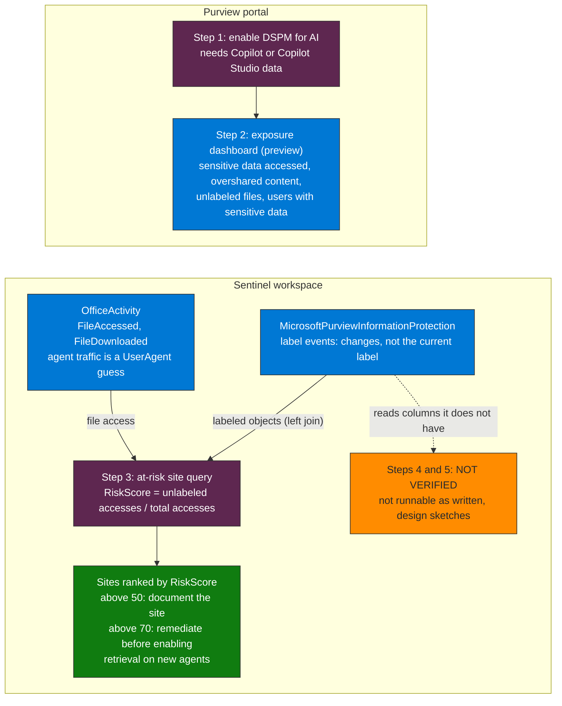

## When to use

- As a first step before enabling SharePoint retrieval on any agent
- When oversharing is suspected in existing agent knowledge sources
- In periodic audits of data exposure accessed by agents
- After deploying a new agent, to validate it does not index unexpected sensitive data

## Prerequisites

- Active M365 E5 or M365 E5 Compliance license in the tenant
- Compliance Administrator role
- At least one active Copilot Studio or Azure AI Foundry agent in the tenant
- Access to the Microsoft Purview portal: purview.microsoft.com



**How to read it.** The Purview portal group holds the dashboard, and the Sentinel group holds the KQL queries. Only Step 3 is a working query: it joins file access in OfficeActivity with label events and ranks the sites by RiskScore. Steps 4 and 5 are marked NOT VERIFIED because they read columns that the table does not have, so confirm your tenant before relying on them.

## Workflow

### Step 1 — Activate DSPM for AI in Purview

1. Go to **Microsoft Purview** → **Data Security Posture Management** → **AI**
2. Enable AI interaction scanning (requires the tenant to have M365 Copilot or Copilot Studio data)
3. Wait for initial ingestion (can take up to 24h for tenants with extensive history)

### Step 2 — Review the exposure dashboard

In the DSPM for AI dashboard, identify:

| Metric | What it indicates |
|---------|------------|
| Sensitive data accessed by AI | Volume of sensitive data the agents have retrieved |
| Overshared content | Files accessible to agents that should be restricted |
| Unlabeled files in AI scope | Files without a sensitivity label in the agent corpus |
| Users interacting with sensitive data via AI | People accessing sensitive data through prompts |

### Step 3 — Export the at-risk site inventory

> **Column names, validated on a Sentinel workspace (October 2026).** `MicrosoftPurviewInformationProtection` has no `Activity`, `UserAgent`, `SiteUrl` or `LabelId` column: it holds label events. File access is in `OfficeActivity` (`Operation`, `OfficeObjectId`, `Site_Url`, `UserAgent`). Agent traffic is guessed from `UserAgent` (no rows on the validation tenant) and label events record changes, not the current label.

```kql
let LabelLookback = 90d;
let LabeledObjects = MicrosoftPurviewInformationProtection
    | where TimeGenerated > ago(LabelLookback)
    | where Operation in ("FileSensitivityLabelApplied", "SensitivityLabelApplied")
    | distinct ObjectId;
OfficeActivity
| where TimeGenerated > ago(30d)
| where RecordType == "SharePointFileOperation"
    and Operation in ("FileAccessed", "FileDownloaded")
| where UserAgent has_any ("copilot", "agent", "assistant", "bot")
| join kind=leftouter LabeledObjects on $left.OfficeObjectId == $right.ObjectId
| summarize
    TotalAccesses = count(),
    UnlabeledAccesses = countif(isempty(ObjectId)),
    LastAccess = max(TimeGenerated)
    by Site_Url, OfficeObjectId
| extend RiskScore = round(toreal(UnlabeledAccesses) / TotalAccesses * 100, 1)
| sort by RiskScore desc
| project Site_Url, TotalAccesses, UnlabeledAccesses, RiskScore, LastAccess
```

### Step 4 — Identify the most frequent sensitive data types

> **Not verified, and not runnable as written.** `MicrosoftPurviewInformationProtection` has no `Activity` or `ApplicationId` column (validated on a Sentinel workspace, October 2026), and that table held no DLP events and no `AIInteractions` workload there. DLP rule matches that exist are in `OfficeActivity` (`ComplianceDLP*`). Confirm where DLP for AI interactions lands in your tenant before using this query.

```kql
MicrosoftPurviewInformationProtection
| where TimeGenerated > ago(30d)
| where Activity == "DLPRuleMatch"
    and Workload == "AIInteractions"
| extend SensitiveType = tostring(SensitiveInfoTypeData[0].SensitiveInfoTypeName)
| summarize
    Matches = count(),
    AffectedUsers = dcount(UserId),
    AffectedAgents = dcount(tostring(ApplicationId))
    by SensitiveType
| sort by Matches desc
```

### Step 5 — Correlate with the agent inventory

> **Not verified, and not runnable as written.** It reads `Activity`, `LabelId` and `ApplicationId` from `MicrosoftPurviewInformationProtection`, which has none of them (validated on a Sentinel workspace, October 2026), and `AgentsInfo` has no rows in that workspace. It also needs an agent id that the Purview table does not carry. Treat it as a design sketch.

```kql
AgentsInfo
| where TimeGenerated > ago(30d)
| join kind=leftouter (
    MicrosoftPurviewInformationProtection
    | where TimeGenerated > ago(30d)
    | where Activity == "FileAccessed"
    | where isempty(LabelId)
    | summarize UnlabeledAccessCount = count() by AgentId = tostring(ApplicationId)
) on AgentId
| project Name, Platform, LifecycleStatus, UnlabeledAccessCount
| extend DataRisk = case(
    UnlabeledAccessCount > 1000, "Critical",
    UnlabeledAccessCount > 100, "High",
    UnlabeledAccessCount > 0, "Medium",
    "Low"
)
| sort by UnlabeledAccessCount desc
```

## Verification

- [ ] DSPM for AI enabled and showing data in the dashboard
- [ ] List of SharePoint sites with risk > 50% (RiskScore) documented
- [ ] Top 5 sensitive data types accessed by agents identified
- [ ] Agents with `DataRisk == "Critical"` or "High" escalated for remediation
- [ ] Result incorporated into the Discover pillar's agent inventory

## Implementation notes

- DSPM for AI requires that Copilot or agent interactions have already occurred — it does not generate retroactive data; the first results appear 24-48h after activation
- The DSPM dashboard is in preview — functionality may vary between tenants depending on rollout phase
- Combine with `discover-inventory-agents-copilot-studio` to correlate data exposure against the agent inventory
- Prioritize remediating sites with `RiskScore > 70` before enabling retrieval on new agents
