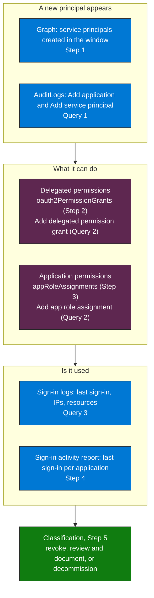

## When to use

- After the Copilot Studio and Foundry inventory, to detect surface not covered by it
- When there are reports of unrecognized OAuth applications in sign-in logs
- Periodic audit of Graph API permissions in the tenant

## Prerequisites

- Microsoft Graph access (Lokka-Microsoft MCP or Graph Explorer) with `Application.Read.All` and, for Step 4, `AuditLog.Read.All`
- Application Administrator role or higher to read applications, and a role that reads the sign-in activity report (Reports Reader, Security Reader or Security Administrator, Learn)
- Entra ID P1 for access to full sign-in logs
- For the KQL: the Entra `AuditLogs` and `ServicePrincipalSignInLogs` categories exported to the Sentinel workspace

## What the skill looks at



**How to read it.** Top to bottom: find what is new, find what it was allowed to do, find whether it is used, then classify it. The graph and log branches in each column are two views of the same thing: Graph shows the state now, the logs show who did what and when.

## Workflow

### Step 1 — Recently created service principals

```http
GET https://graph.microsoft.com/v1.0/servicePrincipals
  ?$filter=createdDateTime ge {30d-ago-date} and servicePrincipalType ne 'ManagedIdentity'
  &$select=id,displayName,appId,appOwnerOrganizationId,verifiedPublisher,servicePrincipalType,createdDateTime,tags
  &$orderby=createdDateTime desc
  &$count=true
ConsistencyLevel: eventual
```

`$filter` on `createdDateTime` with `$orderby` needs the advanced query headers (`ConsistencyLevel: eventual` and `$count=true`): without them Graph answers "Sorting not supported for current query". Read `appOwnerOrganizationId`: an app owned by another tenant is a multitenant app you consented to, while an app owned by your own tenant is one that someone registered. An empty `verifiedPublisher` means the publisher is not verified. The tag `WindowsAzureActiveDirectoryIntegratedApp` appears on enterprise apps added from the gallery and is not a signal of AI.

Agent identities are listed separately, on the beta endpoint, with the same query headers: `GET https://graph.microsoft.com/beta/servicePrincipals/microsoft.graph.agentIdentity?$filter=createdDateTime ge {30d-ago-date}&$count=true`.

### Step 2 — Delegated permissions with sensitive access

```http
GET https://graph.microsoft.com/v1.0/servicePrincipals/{id}/oauth2PermissionGrants
```

High-risk permissions to look for:
- `Mail.ReadWrite`, `Mail.Send`: email access
- `Files.ReadWrite.All`: SharePoint and OneDrive access
- `Calendars.ReadWrite`: calendar access
- `Directory.ReadWrite.All`: directory access

### Step 3 — App role assignments (application permissions)

```http
GET https://graph.microsoft.com/v1.0/servicePrincipals/{id}/appRoleAssignments
  ?$select=appRoleId,resourceDisplayName,creationTimestamp
```

This lists the application permissions the principal holds on other resources. `appRoleId` is a GUID: resolve it against the `appRoles` of the resource service principal (for Microsoft Graph, `servicePrincipals(appId='00000003-0000-0000-c000-000000000000')/appRoles`). Application permissions are more dangerous than delegated ones: the agent acts on its own, with no user present.

### Step 4 — Cross-reference with the logs

```kql
// See queries/sentinel-shadow-principals.kql
```

Query 1 lists creations (the creator, and whether it was a person or an app). Query 2 lists the grants of both kinds with their risk. Query 3 shows what signed in. A principal that never signs in does not appear in Query 3, so find the inactive ones with the sign-in activity report (beta, `AuditLog.Read.All`; it reports the last sign-in per application, as client or resource, delegated or app-only):

```http
GET https://graph.microsoft.com/beta/reports/servicePrincipalSignInActivities
```

### Step 5 — Classify by risk level

| Condition | Recommended action |
|---|---|
| SP with `Mail.ReadWrite` + created by a non-IT user | Revoke immediately |
| SP with `Files.ReadWrite.All` and no documented owner | Review and document |
| SP with no sign-in in 30 days (`lastSignInActivity`) and active permissions | Decommission candidate |

## Verification

- [ ] List of SPs created in the last 30/60/90 days, without managed identities
- [ ] Sensitive permissions identified per SP, delegated and application
- [ ] Application owners documented
- [ ] SPs with no recent sign-in flagged for review

## Implementation notes

- Use Graph Explorer (graph.microsoft.com) or an application with `Application.Read.All` to run the API calls in this workflow
- The Entra ID AuditLogs connector must be active in Sentinel to correlate service principal creation events
- SP sign-in logs are available in `AADServicePrincipalSignInLogs` in Sentinel: use it to detect anomalous activity post-inventory
- Validated on the validation tenant (October 2026): 70 applications and service principals created in 90 days, excluding 15 managed identities, each with its app id recoverable; 24 delegated grants and 7 application grants in the same window; the sign-in activity report answers on the beta endpoint
- Removed in this version, because it does not match the logs of the validation workspace: the app id read at `modifiedProperties[0]` (its position changes; read it by the property name `AppId` or `AppPrincipalId`), the permissions read from `AdditionalDetails` (the scopes are in `DelegatedPermissionGrant.Scope` and the application roles in `AppRole.Value`), and an "inactive" status that could never be reached, because the window and the threshold were both 30 days
