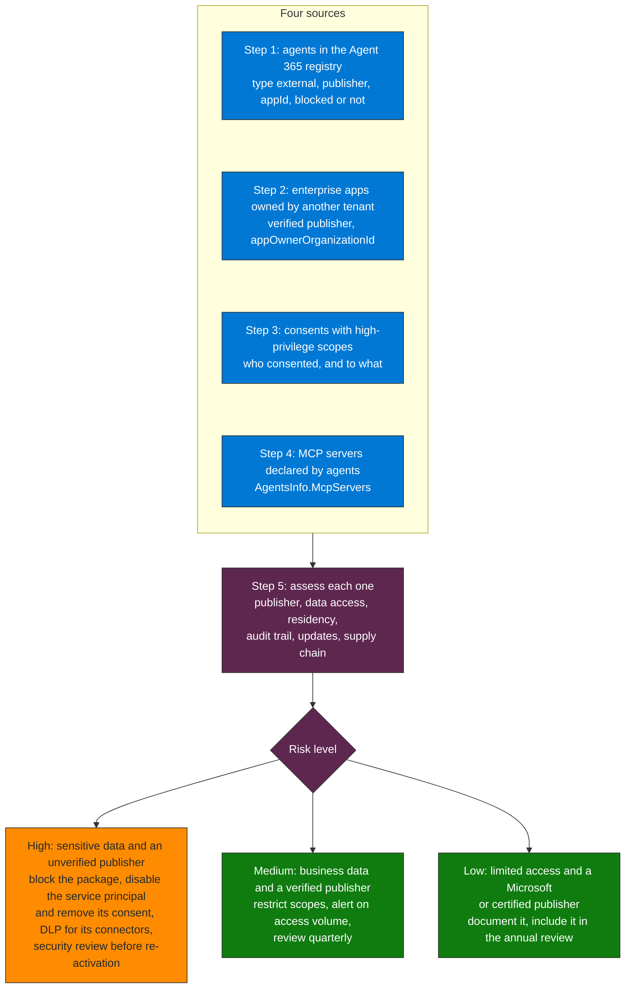

## Objective

Identify and evaluate every active third-party AI agent in the tenant, whether it is an agent built by a partner and listed in the Agent 365 registry, an enterprise app owned by another tenant, or an external MCP server an agent calls, and assign each a risk level before it accesses organizational data.

## Why it matters

First-party agents (built by the internal team) go through Entra Agent ID and Copilot Studio governance. Third-party agents are typically installed from the marketplace or connected directly, bypassing that same review.

The reference framework is the OWASP Top 10 for Agentic Applications (2026), ASI04 (Agentic Supply Chain Vulnerabilities), and MITRE ATLAS AML.T0010 (AI Supply Chain Compromise).



**How to read it.** Four sources feed one assessment, and the assessment decides the control. The controls in the orange box are the ones that exist for a third-party app: a Conditional Access policy for workload identities does not cover multitenant or third-party SaaS apps (Learn), so blocking relies on the package block, the service principal and its consents.

## Workflow

### Step 1 — Inventory the agents in the Agent 365 registry

> **Not verified (Oct 2026).** The earlier version called `admin/microsoft365Apps/installations`, a segment that does not exist (Graph answers "Resource not found for the segment"). The Microsoft Learn inventory API is the Package Management API below. On the validation tenant it returned 403, so the call is untested: it needs `CopilotPackages.Read.All`, a Microsoft Agent 365 license and an AI Administrator or Global Administrator.

```powershell
# Microsoft Graph PowerShell: CopilotPackages.Read.All, AI Administrator or Global Administrator
$uri = "https://graph.microsoft.com/v1.0/copilot/admin/catalog/packages?`$filter=supportedHosts/any(h:h eq 'Copilot')"
$packages = @()
do {
    $response = Invoke-MgGraphRequest -Uri $uri -Method GET
    $packages += $response.value
    $uri = $response.'@odata.nextLink'
} while ($uri)

$packages | Where-Object { $_.type -eq 'external' } |
    Select-Object displayName, publisher, appId, agentIdentityId, governanceMetadata, availableTo, deployedTo, isBlocked, createdDateTime |
    Sort-Object publisher
```

`type` is `microsoft`, `external` (built by partners), `shared` (shared in your organization) or `custom` (built by your organization), and it is filtered on the client because the list call filters on host, element type, date and request status. `governanceMetadata` is the agentic classification (`PromptAgent`, `HostedAgent`, `WorkflowAgent`, `ManagedAgent`, `Unmanaged`, `AIApp`). The same list is in the Microsoft 365 admin center, Agents > All agents, where viewing needs no license (AI Reader or AI Administrator).

### Step 2 — Find the enterprise apps owned by another tenant

```http
GET https://graph.microsoft.com/v1.0/servicePrincipals
  ?$filter=servicePrincipalType eq 'Application'
  &$select=id,displayName,appId,appOwnerOrganizationId,verifiedPublisher,createdDateTime
  &$count=true
ConsistencyLevel: eventual
```

An app whose `appOwnerOrganizationId` is neither your tenant nor the Microsoft tenant is a third-party app you consented to. Microsoft first-party apps show the Microsoft services tenant id there (seen on the validation tenant). An empty `verifiedPublisher.displayName` means the publisher is not verified. Validated on the validation tenant (Oct 2026): both properties are returned.

### Step 3 — Audit the consents with high-privilege scopes

> Run on a Sentinel workspace (Oct 2026): the earlier version read `modifiedProperties[0]`, which holds `IsAdminConsent`, so no scope could match. The scopes are in the property `ConsentAction.Permissions`. The query lists every high-privilege consent, not only third-party ones: review the publisher of each app against Step 2.

```kql
// Entra consents with high-privilege delegated scopes
AuditLogs
| where TimeGenerated > ago(30d)
| where OperationName == "Consent to application"
| extend AppName = tostring(TargetResources[0].displayName)
| extend ConsentedBy = tostring(InitiatedBy.user.userPrincipalName)
| mv-apply MP = TargetResources[0].modifiedProperties on (
    where tostring(MP.displayName) == "ConsentAction.Permissions"
    | summarize ScopesGranted = take_any(tostring(MP.newValue)))
| extend IsHighPrivilege = ScopesGranted has_any (
    "Files.ReadWrite.All",
    "Mail.ReadWrite",
    "Sites.ReadWrite.All",
    "Directory.ReadWrite.All",
    "User.ReadWrite.All",
    "Calendars.ReadWrite"
)
| where IsHighPrivilege == true
| project TimeGenerated, AppName, ScopesGranted, ConsentedBy, IsHighPrivilege
| sort by TimeGenerated desc
```

Application permissions are granted by an app role assignment, which this query does not read: the app role branch of P02 Q4 lists those, and `discover-shadow-ai-entra-principals` (Query 2) reads both kinds.

### Step 4 — Detect external MCP servers connected to agents

> **Not verified (Oct 2026).** The earlier version read `ConnectorActionExecuted`, `ExternalToolInvoked` and `MCPServerConnected` from `CloudAppEvents`; none of them is documented, and the validation tenant has no agent events there. Microsoft Learn documents `ExecuteToolByMCPServer` (alongside `InvokeAgent`, `InferenceCall`, `ExecuteToolBySDK` and `ExecuteToolByGateway`) for Agent 365 observability, but the tool endpoint is not surfaced in Advanced Hunting. The inventory of declared MCP servers does exist: `AgentsInfo.McpServers` is populated for local agents (1 agent on the validation tenant). Start from that, and use the ActionType below only once your tenant emits it.

```kql
// 1. Declared MCP servers per agent (AgentsInfo, Advanced Hunting)
AgentsInfo
| where Timestamp > ago(7d)
| summarize arg_max(Timestamp, *) by AgentId
| where isnotempty(McpServers) and tostring(McpServers) != "[]"
| project AgentId, Name, Platform, McpServers
| sort by Name asc

// 2. MCP tool executions (CloudAppEvents, once the ActionType is emitted in the tenant)
CloudAppEvents
| where Timestamp > ago(7d)
| where ActionType == "ExecuteToolByMCPServer"
| summarize InvocationCount = count(), LastSeen = max(Timestamp) by AccountDisplayName, Application
| sort by InvocationCount desc
```

### Step 5 — Assess the risk of each third-party agent

For each identified agent, complete the following table:

| Field | Key questions |
|-------|----------------|
| **Publisher verification** | Is the publisher verified in Entra (`verifiedPublisher`)? Is the app in the official Microsoft marketplace? Is it certified? |
| **Data access scope** | What Graph API permissions does it hold? Does it access mail, calendar, SharePoint? |
| **Data residency** | Are prompts and responses processed outside the Microsoft tenant? |
| **Audit trail** | Do the third-party agent's actions appear in Purview audit? |
| **Update mechanism** | Is the agent code updated automatically without re-approval? |
| **Supply chain** | Does the agent depend on third-party models (not Azure OpenAI)? |

### Step 6 — Apply controls by risk level

**High risk** (sensitive data access + unverified publisher):
- For an agent in the registry, block the package: the Package Management API and the admin center can block, unblock and reassign ownership of packages (`isBlocked`)
- For an enterprise app, set `accountEnabled` to `false` on its service principal, delete its delegated grants (`DELETE /oauth2PermissionGrants/{id}`) and its app role assignments, and restrict who can consent in the future (admin consent workflow and permission grant policies)
- Block its connectors with Power Platform DLP
- Require a security review before re-activation

A Conditional Access policy for workload identities does not cover multitenant or third-party SaaS apps (Learn), so it is not a control for this list. For delegated access, a policy written for users can target the app as a resource.

**Medium risk** (business data access + verified publisher):
- Restrict scopes to Read-only where possible
- Configure a Sentinel alert on anomalous access volume
- Review quarterly

**Low risk** (limited access + Microsoft or certified publisher):
- Document in the inventory
- Include in the annual app registration review cycle

## Verification

- [ ] Third-party agent and enterprise app inventory completed with publisher, scopes, and creation date
- [ ] Every third-party agent with access to highly sensitive data is blocked, disabled, restricted or covered by a DLP policy for its connectors
- [ ] P03 Query Q3 executed and high-privilege permissions reviewed
- [ ] External MCP servers identified and evaluated against the allowlist policy
- [ ] Third-party records added to the Gap Assessment Template (Domain 1 — Discover)

## Implementation notes

- Plugins installed from the Microsoft 365 App Store go through Microsoft's certification process, but they are not immune to post-certification compromise: treat certification as a starting point, not a guarantee
- External MCP servers are the highest-risk vector: a compromised MCP server can inject malicious instructions into any agent that invokes it, with the agent's own permissions
- Power Platform DLP can block external connectors at the environment level, which is the most effective control for unauthorized MCP servers
- The `CloudAppEvents` agent ActionTypes (`InvokeAgent`, `ExecuteToolByMCPServer`, ...) depend on the Defender and Agent 365 configuration and were absent on the validation tenant: validate availability first
- Removed in this version, because it does not match Microsoft Learn or the tenant: the `admin/microsoft365Apps/installations` call, "block with a CA policy on the App ID" (workload identity policies do not cover multitenant or SaaS apps), and the framework mappings `GOVERN-1.2`, `MAP-3.5`, `ID.SC-2` and `ID.RA-6` (NIST AI RMF GOVERN 1.2 is about integrating trustworthy AI characteristics into policies and MAP 3.5 about human oversight, and `ID.SC` does not exist in CSF 2.0, where supply chain risk is `GV.SC`); `D3-SFA` is System File Analysis and `D3-AC` is not a D3FEND id
