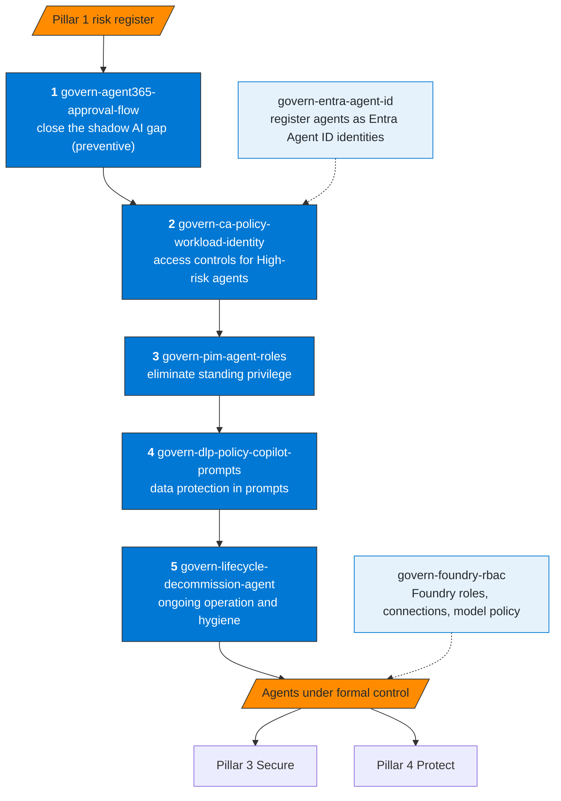

# Pillar 2 — Govern & Control

Objective: establish controls over which agents may exist, how they access resources,
and what happens to them across their lifecycle.

## Recommended sequence

**How to read it.** The solid path is the order to run, from prevention (nothing gets in unreviewed) to hygiene (nothing stays after it is needed). The dotted skills depend on the platform: `govern-entra-agent-id` comes before the Conditional Access step when agents use Entra Agent ID, because the policy targets those identities; `govern-foundry-rbac` applies when the agents run on Microsoft Foundry.

## Skills

| Skill | MS product | KQL available |
|---|---|---|
| `govern-agent365-approval-flow` | Agent 365, Power Platform | No |
| `govern-ca-policy-workload-identity` | Entra ID, Graph API | sentinel-ca-monitoring.kql |
| `govern-pim-agent-roles` | Entra PIM | sentinel-pim-activations.kql |
| `govern-dlp-policy-copilot-prompts` | Purview DLP for Microsoft 365 Copilot | sentinel-dlp-agents.kql |
| `govern-lifecycle-decommission-agent` | M365 admin center, Power Platform, Graph API | sentinel-inactive-agents.kql |
| `govern-entra-agent-id` | Entra Agent ID, Graph API | No |
| `govern-foundry-rbac` | Microsoft Foundry, Azure RBAC, Azure Policy | sentinel-foundry-rbac.kql |

## Known constraints in the Microsoft stack

| Constraint | Impact | Workaround |
|---|---|---|
| `grantControls: mfa` invalid in CA for workload identities | CA policy fails on creation | Use `block` only |
| `continuousAccessEvaluation` + `reportOnly` are incompatible | Error when creating the policy | Use `disabled` or `enabled` |
| PIM for SPs requires Workload ID Premium | Without the license, unavailable for SPs | Use role assignments with expiration |
| Purview auto-labeling via API is limited | Some policies cannot be created via ARM | Use the Compliance Portal |
| Agent Builder sharing creates no request (open by default) | Agents shared with the whole organization without admin review | Restrict who can share and block agents in the Microsoft 365 admin center; Power Platform DLP for Copilot Studio connectors |
