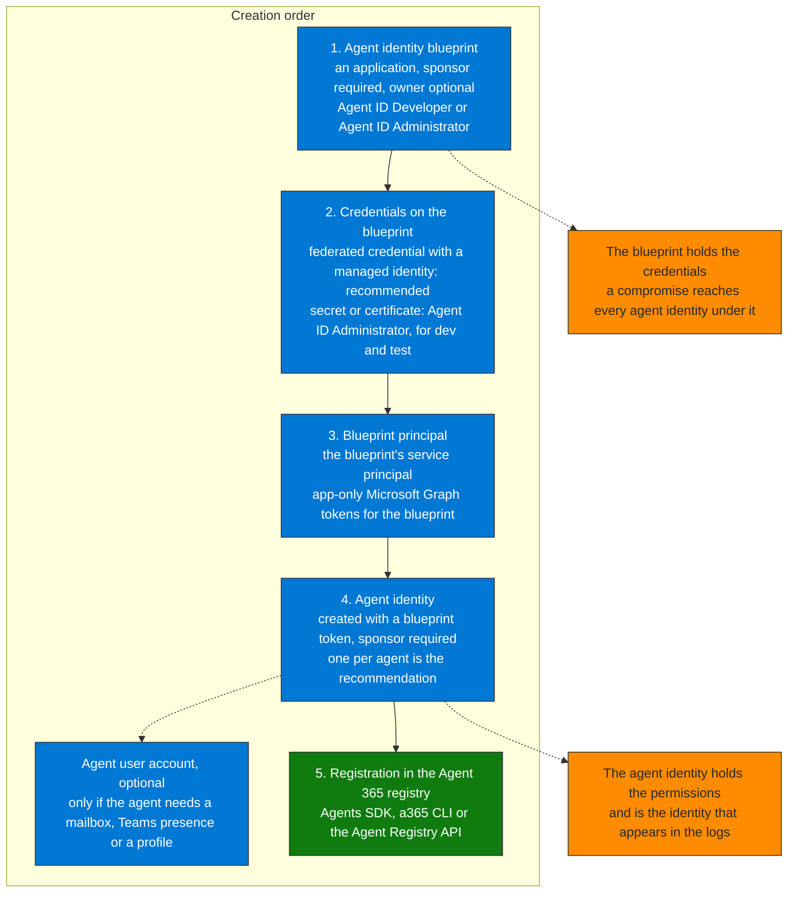

## When to use

- When deploying any new agent in the tenant, before assigning it permissions
- When agents are found running as a plain app registration or service principal, under a user's delegated identity, or with an API key: Learn says they do not get the Conditional Access, centralized audit and lifecycle management that Agent ID provides
- During governance audits, to validate that every agent has an agent identity and a sponsor
- As a prerequisite for the agent Conditional Access policies of `secure-ca-policy-agents`

## Prerequisites

- Microsoft Entra Agent ID is available to all Microsoft Entra customers. Extending Entra security features to agents (Conditional Access, ID Protection, governance) requires Microsoft Agent 365, which is included in Microsoft 365 E7. Viewing the agent inventory in the Microsoft 365 admin center needs no license, only the AI Reader or AI Administrator role (Learn)
- Roles: Agent ID Developer or Agent ID Administrator create blueprints and blueprint principals. Agent ID Developer can configure federated identity credentials, and **Agent ID Administrator is required to add a secret or certificate**. Privileged Role Administrator grants Microsoft Graph application permissions, Cloud Application Administrator or Application Administrator grant delegated ones
- A client authorized with `AgentIdentityBlueprint.Create`, `AgentIdentityBlueprint.AddRemoveCreds.All`, `AgentIdentityBlueprint.UpdateAuthProperties.All` and `AgentIdentityBlueprintPrincipal.Create`
- A sponsor for the blueprint and for every agent identity: a user, a dynamic membership group or a Microsoft 365 group. Security groups and role-assignable groups are not supported as sponsors, and groups cannot be owners
- Decisions to take first (Learn): how many blueprints (one per credential boundary), application or delegated permissions, whether the agent needs a user account (only for a mailbox, Teams presence or a directory profile), and who the sponsors are

## Order of creation



**How to read it.** Follow the numbers. The blueprint is created first and holds the credentials; the agent identity is created last, with a token the blueprint requests, and holds the permissions. That split is why the number of blueprints is a security decision: Learn describes a compromise of the blueprint's credentials as affecting every agent identity under it, so use one blueprint per credential boundary.

## Workflow

### Step 1 — Create the blueprint

```http
POST https://graph.microsoft.com/v1.0/applications/
OData-Version: 4.0
Content-Type: application/json

{
  "@odata.type": "Microsoft.Graph.AgentIdentityBlueprint",
  "displayName": "{agent-name} blueprint",
  "sponsors@odata.bind": ["https://graph.microsoft.com/v1.0/users/{sponsor-user-id}"],
  "owners@odata.bind": ["https://graph.microsoft.com/v1.0/users/{owner-user-id}"]
}
```

Record the `appId` from the response. A sponsor is required, an owner is optional. The creator becomes owner of the blueprint and of its principal automatically (Learn). The admin center wizard (Entra ID > Agents > Agent blueprints) creates the blueprint and its principal in one step.

### Step 2 — Add a credential to the blueprint

The recommended production credential is a federated identity credential that trusts a managed identity, so no secret is stored:

```http
POST https://graph.microsoft.com/v1.0/applications/{blueprint-id}/federatedIdentityCredentials
OData-Version: 4.0
Content-Type: application/json

{
  "name": "{managed-identity-name}",
  "issuer": "https://login.microsoftonline.com/{tenant-id}/v2.0",
  "subject": "{managed-identity-principal-id}",
  "audiences": ["api://AzureADTokenExchange"]
}
```

Learn uses the `appId` recorded in Step 1 as the blueprint id here. Client secrets and certificates (`addPassword`, `addKey`) are supported but not recommended for production, and adding one requires the Agent ID Administrator role. If agents built from the blueprint act on behalf of a user, also expose an identifier URI and an OAuth scope on the blueprint (Learn, "Configure identifier URI and scope").

### Step 3 — Create the blueprint principal

```http
POST https://graph.microsoft.com/v1.0/serviceprincipals/microsoft.graph.agentIdentityBlueprintPrincipal
OData-Version: 4.0
Content-Type: application/json

{ "appId": "{blueprint-app-id}" }
```

### Step 4 — Create the agent identity

Request a token for Microsoft Graph with the blueprint credential (the managed identity token as `client_assertion`, or a client secret in local development), then create the agent identity with it. Learn publishes this call on the beta endpoint:

```http
POST https://graph.microsoft.com/beta/serviceprincipals/Microsoft.Graph.AgentIdentity
OData-Version: 4.0
Content-Type: application/json

{
  "displayName": "{agent-name}",
  "agentIdentityBlueprintId": "{blueprint-app-id}",
  "sponsors@odata.bind": ["https://graph.microsoft.com/v1.0/users/{sponsor-user-id}"]
}
```

Create one agent identity per agent. The agent identity is a single-tenant service principal with an agent subtype; on the validation tenant Graph returns it with `servicePrincipalType` = `ServiceIdentity`.

### Step 5 — Register the agent in the Agent 365 registry

A blueprint created through Microsoft Graph does not appear in the registry by itself. Learn gives three ways to register it, in this order of preference: the Microsoft 365 Agents SDK (it creates the agent identity and registers it with no extra code), the Agent 365 CLI (`a365 setup all`), or an explicit call to the Agent Registry API after the Graph call, written to be retry-safe. Verify in the Microsoft 365 admin center > Agents > All agents (AI Reader is enough).

### Step 6 — Assign minimal permissions

Permissions can be assigned to the agent identity directly or inherited from the blueprint (for delegated permissions, `InheritDelegatedPermissions`). Use inherited permissions only for a shared baseline and direct assignment for role-specific access, and review what the blueprint makes inheritable: one consent on a blueprint principal reaches every agent identity under it (Track B Module 03, point 14).

```http
POST https://graph.microsoft.com/v1.0/servicePrincipals/{agent-identity-id}/appRoleAssignments
Content-Type: application/json

{
  "principalId": "{agent-identity-id}",
  "resourceId": "{microsoft-graph-service-principal-id}",
  "appRoleId": "883ea226-0bf2-4a8f-9f9d-92c9162a727d"
}
```

`883ea226-0bf2-4a8f-9f9d-92c9162a727d` is `Sites.Selected` on the Microsoft Graph service principal. It grants no site by itself: add a per-site grant afterwards, and prefer it to `Sites.Read.All`. Not executed on the validation tenant (the call writes). Learn blocks some assignments for agent identities: Global Administrator, Privileged Role Administrator and User Administrator cannot be assigned to them, and a role that is not labeled privileged can still be assigned, so read the actions of any role first (`secure-least-privilege-agent-identity`).

### Step 7 — KQL: find agents without an Entra Agent ID

Run in Advanced Hunting (the `AgentsInfo` table has data there; the Sentinel copy was empty on the validation workspace). The first query shows coverage by platform, the second lists the agents to review:

```kql
// 1. Coverage by platform
AgentsInfo
| where Timestamp > ago(30d)
| summarize arg_max(Timestamp, *) by AgentId
| summarize Agents = count(),
            WithoutEntraAgentId = countif(isempty(EntraAgentID)),
            WithoutBothIds = countif(isempty(EntraAgentID) and isempty(EntraBlueprintID))
  by Platform
| order by WithoutEntraAgentId desc

// 2. Agents with no Entra Agent ID
AgentsInfo
| where Timestamp > ago(30d)
| summarize arg_max(Timestamp, *) by AgentId
| where isempty(EntraAgentID)
| project AgentId, Name, Platform, LifecycleStatus, Owners, CreatedDateTime
| sort by Platform asc, Name asc
```

An empty `EntraAgentID` means no agent identity is recorded for the agent. It does not say which identity the agent uses instead: check whether it runs as a standard service principal, with a user's delegated identity or with an API key.

## Verification

- [ ] The blueprint exists with at least one sponsor, and its credential is a federated identity credential (no secret in production)
- [ ] The blueprint principal exists
- [ ] The agent identity exists as an agent identity (`microsoft.graph.agentIdentity`), linked to the blueprint by `agentIdentityBlueprintId`, with a sponsor
- [ ] The agent is listed in Microsoft 365 admin center > Agents > All agents
- [ ] The permissions follow least privilege and the blueprint's inheritable permissions were reviewed
- [ ] The Step 7 query no longer lists the agent

## Implementation notes

- Agents built on app registrations or service principals can be migrated: create a blueprint and an agent identity, update the code, and decommission the old identity (Learn, migrate custom app registrations to Agent ID). Copilot Studio agents created before 2026-03-18, or before the tenant opted in to Agent ID, use legacy service principals and are recreated (Learn)
- How to tell an agent identity from a standard service principal: the Graph type `microsoft.graph.agentIdentity`, the `Agent` column of `AADServicePrincipalSignInLogs` (`agentType` is `agenticAppInstance` for an agent identity and `agentIdentityBlueprintPrincipal` for the principal), and the **All agent identities** list in Entra, which also shows the agents that still use standard service principals
- Deleting a blueprint deletes its agent identities and agent user accounts, so decommission through the blueprint (`govern-lifecycle-decommission-agent`)
- On the validation tenant (Advanced Hunting, 30 days) all 6 Microsoft Foundry agents carry both ids, 2 of 3 Copilot Studio agents have no `EntraAgentID`, all 12 local agents have neither id, and 329 of 334 agents on the platform `Other` have neither. The value `Inherited` never appears
- Removed in this version, because it does not match Microsoft Learn or the tenant: registering an agent as a plain app registration with `agent365` and `EntraAgentID` tags (the blueprints and agent identities of the tenant carry no such tags), the `agentType` "field in the token" as the difference from a service principal, the app registration `notes` field as the place for ownership metadata (sponsors and owners are the supported relationships), and the `EntraAgentID == "Inherited"` filter
