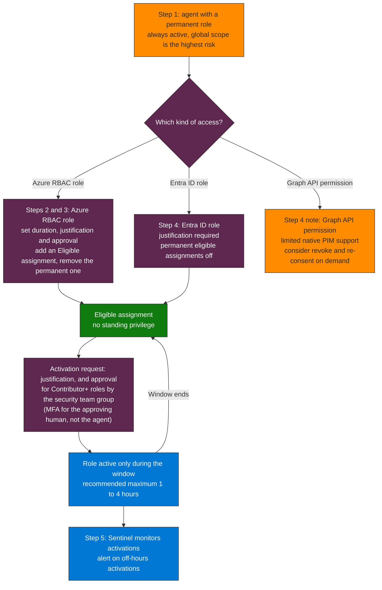

## When to use

- Agents with high-privilege Azure RBAC roles (Contributor, Owner, User Access Administrator)
- Agents with sensitive Graph API permissions that do not need continuous access
- When the Pillar 1 risk register identifies agents with excessive permanent access

## License constraint

PIM for workload identities (service principals) requires **Entra Workload ID Premium**.
PIM for users and groups: Entra ID P2.
Verify licensing before starting.

## From permanent role to just-in-time access



**How to read it.** Follow the permanent role down to what replaces it: an eligible assignment that is active only for the activation window. The branch depends on the kind of access, and Graph API permissions are the weak spot because native PIM support is limited. The loop between the eligible state and the active window is what removes standing privilege, and Sentinel watches each activation.

## Workflow

### Step 1 — Identify agents' permanent roles

```http
GET https://graph.microsoft.com/v1.0/roleManagement/directory/roleAssignments
  ?$filter=principalId eq '{service-principal-object-id}'
  &$expand=roleDefinition
```

Look for assignments with `directoryScopeId: "/"` (global scope) — highest risk.

Also review Azure RBAC:
```bash
az role assignment list \
  --assignee {service-principal-app-id} \
  --include-inherited \
  --query "[].{Role:roleDefinitionName, Scope:scope}"
```

### Step 2 — Configure PIM for Azure resources (agents with RBAC roles)

```
Entra ID → Privileged Identity Management → Azure resources
→ [Target subscription / RG]
→ Roles → [Agent's role]
→ Settings → Edit
```

Recommended configuration for AI agents:
- **Activation maximum duration**: 1-4 hours (not 8h)
- **Require justification on activation**: Yes
- **Require approval**: Yes (for Contributor+ roles)
- **Approvers**: Security team group
- **On activation require**: MFA (for the approving human, not the agent)

### Step 3 — Convert the permanent assignment to eligible

```
PIM → Azure resources → Assignments → [Role] → Add assignments
→ Assignment type: Eligible (not Active)
→ Principal: [Agent's Service Principal]
→ Duration: No expiration (or 6-12 months with renewal)
```

Remove the existing permanent assignment after creating the eligible one.

### Step 4 — For Entra ID roles (Graph API permissions)

PIM for Entra roles with service principals:
```
PIM → Entra roles → Settings → [Role]
→ Enable "Allow permanent eligible assignments" = No
→ Require justification: Yes
```

**Note**: PIM for Graph API app roles (OAuth permissions) has limited support.
For critical Graph permissions, consider revoke-and-re-consent on demand
as an alternative to native PIM.

### Step 5 — Monitor activations in Sentinel

```kql
// See queries/sentinel-pim-activations.kql
```

## Verification

- [ ] Agents' permanent roles converted to eligible
- [ ] PIM settings configured (duration, justification, approval)
- [ ] Original permanent assignment removed
- [ ] Sentinel alert configured for off-hours activations
- [ ] Activation test performed successfully

## Implementation notes

- PIM for workload identities (Workload ID Premium) requires a separate license from Entra ID P2 — verify availability in the tenant before designing the JIT flow
- Eligible PIM assignments for service principals use the `/roleManagement/directory/roleEligibilityScheduleRequests` endpoint — different from the permanent assignment endpoint
- To demo JIT value: show the difference between an agent with a permanent role (always active) vs. an agent with an eligible role (active only during the window)
