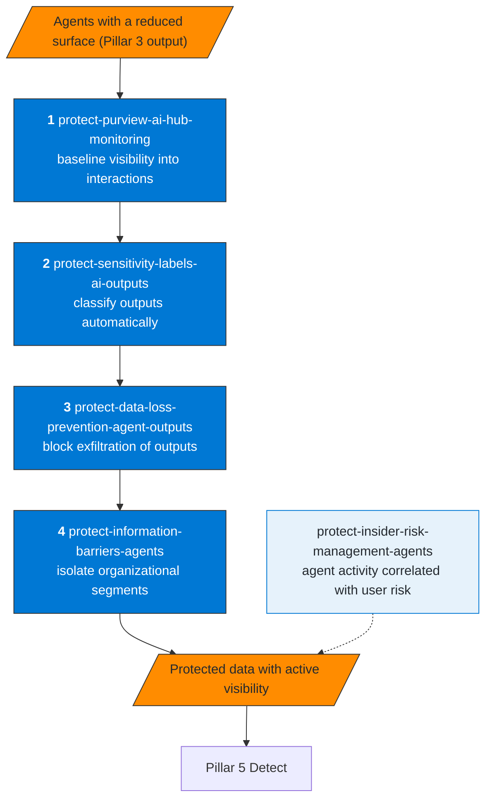
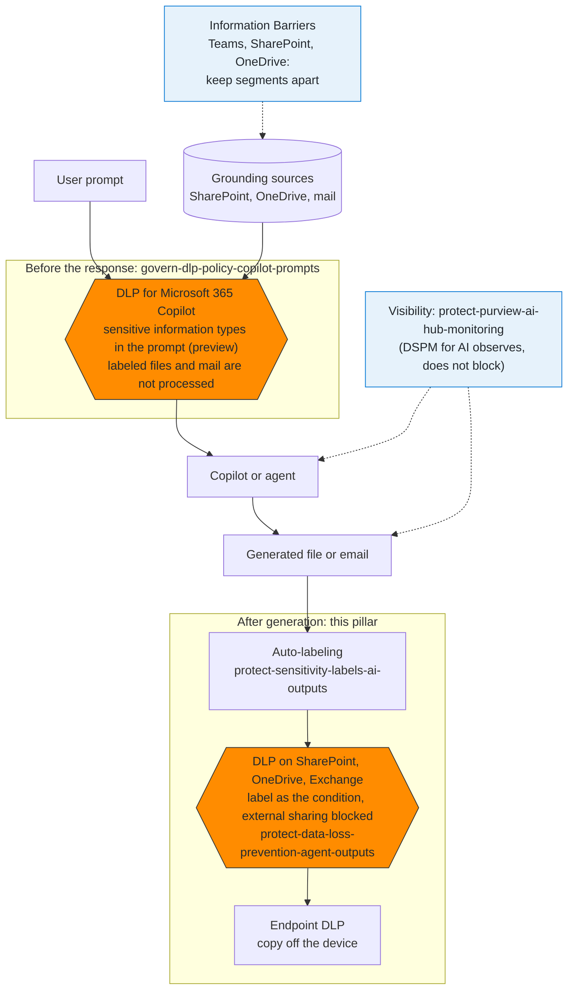

# Pillar 4 — Protect Data

Objective: ensure that the data AI agents access, process, and generate
is classified, protected, and cannot be exfiltrated to unauthorized destinations.

## Recommended sequence

**How to read it.** Visibility first (you cannot protect what you cannot see), then classification, then the controls that act on the classification, then segmentation. Labels come before DLP because the DLP rules in this pillar use the label as their condition.

## Skills

| Skill | MS product | Minimum license | KQL available |
|---|---|---|---|
| `protect-purview-ai-hub-monitoring` | Purview DSPM for AI | Purview E3 | sentinel-ai-hub-activity.kql |
| `protect-sensitivity-labels-ai-outputs` | Purview, AIP | Purview E3 + AIP P2 | sentinel-label-coverage.kql |
| `protect-data-loss-prevention-agent-outputs` | Purview DLP | Purview E3 | sentinel-dlp-outputs.kql |
| `protect-information-barriers-agents` | Purview IB | M365 E5 Compliance | sentinel-information-barriers.kql |
| `protect-insider-risk-management-agents` | Purview Insider Risk Management | M365 E5 Insider Risk Management | No |

## Where each control sits in the data path

**How to read it.** The two DLP policies do not overlap: the first acts on what Copilot receives and on the files and mail it would use, before any response exists; the second acts on what the agent generates, once it is a file or an email. DLP for Microsoft 365 Copilot does not evaluate the response text, so the output has to be caught afterwards by its label. Information Barriers limit which people and which content can reach each other. DSPM for AI observes the interactions and does not block anything.

## Distinction: DLP on prompts vs. DLP on outputs

| Skill | What it protects | Where the control sits |
|---|---|---|
| `govern-dlp-policy-copilot-prompts` (P2) | Sensitive data in Copilot prompts, and labeled files and emails Copilot would use | In Microsoft 365 Copilot and Copilot Chat, before the response |
| `protect-data-loss-prevention-agent-outputs` (P4) | Files and content the agent generates | In SharePoint / OneDrive / Exchange, post-generation |

Both skills are complementary — they cover different vectors.

## Known constraints

| Constraint | Impact | Workaround |
|---|---|---|
| Purview labels and auto-labeling policies are configured in the portal or Security & Compliance PowerShell | No Graph configuration path in the pages reviewed | Use the Microsoft Purview portal |
| Graph `assignSensitivityLabel` is a protected, metered API | Needs metered APIs enabled | Use it for agents that write files |
| IB: requires Security & Compliance PowerShell | Not accessible via Lokka-Microsoft MCP | Run PowerShell directly |
| IB SharePoint: about 1 hour after enabling, and up to 24 hours after a user's segment changes (OneDrive) | The control is not immediate | Plan the implementation window |
| DSPM for AI (classic) and the new DSPM coexist, with preview parts | May change without notice | Validate against MS Learn before documenting |
| IB segments are built from user and group attributes (not `DisplayName`) and do not cover email | A service principal cannot be a segment member | Control apps with Entra permissions and Conditional Access; list them with Query 3 |
