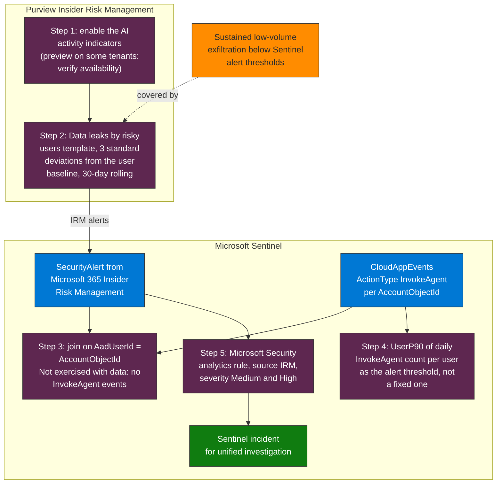

## When to use

- When KQL-based exfiltration detection generates too many false positives for manual review
- To cover the sustained low-volume exfiltration vector (below Sentinel alert thresholds)
- In organizations with acceptable use policies that include AI agents
- As a complement to `detect-data-exfiltration-agent` for slow-vector coverage

## Prerequisites

- M365 E5 or Microsoft 365 E5 Insider Risk Management
- Insider Risk Management role (a standalone role, not included in Compliance Admin by default)
- Purview Audit enabled with retention configured (minimum 90 days)
- Microsoft 365 Copilot or Copilot Studio active in the tenant to generate agent activity signals

## Flow at a glance



**How to read it.** Read it from the Purview group to the Sentinel group: IRM raises the alert from the AI activity indicators and the baseline, and Sentinel joins those alerts to InvokeAgent activity per user and turns Medium and High alerts into incidents. The point is the division of labor: IRM covers the sustained low-volume vector that fixed Sentinel thresholds miss, and Sentinel supplies the agent context. The Step 3 join has not been exercised with data, because the validation workspace had no InvokeAgent events.

## Workflow

### Step 1 — Enable AI activity indicators in IRM

1. **Microsoft Purview** → **Insider Risk Management** → **Settings** → **Policy indicators**
2. In the **AI activity indicators** section, enable:
   - `Sensitive info types accessed by AI`
   - `AI interactions with high volume`
   - `Files accessed by AI without sensitivity label`
3. Save

### Step 2 — Create a policy to detect exfiltration via agents

1. **Insider Risk Management** → **Policies** → **Create policy**
2. Select the template: **Data leaks by risky users**
3. Tune with AI indicators:
   - Include: the AI activity indicators from Step 1
   - Detection threshold: 3 standard deviations from the user's baseline
   - Window: 30-day rolling

### Step 3 — Correlate IRM signals with agent activity in Sentinel

> **Run on 2026-10-05 (Sentinel workspace and Advanced Hunting).** The earlier version indexed `Entities` as an array (it is a string, so the query failed), grouped `CloudAppEvents` by `UserId` (the table has no such column; it has `AccountObjectId`) and, in Step 4, nested aggregates (`avg(count())`), which is invalid. The IRM alert's account entity carries `AadUserId`, which matches `CloudAppEvents.AccountObjectId`. The workspace had 3 IRM alerts in 30 days and no `InvokeAgent` events, so the join returns nothing; the join itself was not exercised with data.

```kql
// Correlate IRM alerts with agent activity in the same period
let IRMAlerts = SecurityAlert
    | where TimeGenerated > ago(30d)
    | where ProductName == "Microsoft 365 Insider Risk Management"
    | mv-expand Entity = parse_json(Entities)
    | where tostring(Entity.Type) == "account"
    | project AlertTime = TimeGenerated, AffectedUserId = tolower(tostring(Entity.AadUserId)), AlertName;
// ActionType was "AgentInteraction" (not documented); InvokeAgent is the documented value (Microsoft Learn, Agent 365 observability). Not run against live events.
let AgentActivity = CloudAppEvents
    | where TimeGenerated > ago(30d)
    | where ActionType == "InvokeAgent"
    | extend AccountObjectId = tolower(AccountObjectId)
    | summarize AgentCalls = count(), UniqueAgents = dcount(tostring(RawEventData["AgentId"]))
        by AccountObjectId, bin(TimeGenerated, 1h);
IRMAlerts
| join kind=inner (AgentActivity) on $left.AffectedUserId == $right.AccountObjectId
| project AlertTime, AffectedUserId, AlertName, AgentCalls, UniqueAgents
| sort by AgentCalls desc
```

### Step 4 — Configure adaptive volume thresholds

```kql
// Establish a baseline of normal interactions per user
CloudAppEvents
| where TimeGenerated between (ago(30d) .. ago(1d))
| where ActionType == "InvokeAgent"
| summarize DailyCount = count() by AccountObjectId, bin(TimeGenerated, 1d)
| summarize
    UserBaseline = avg(DailyCount),
    UserP90 = percentile(DailyCount, 90)
    by AccountObjectId
| where UserP90 > 0
| sort by UserP90 desc
```

Use `UserP90` as the alert threshold instead of a fixed threshold.

### Step 5 — Integrate IRM cases with Sentinel incidents

1. In **Sentinel** → **Analytics** → create a **Microsoft Security** rule
2. Source: **Microsoft 365 Insider Risk Management**
3. Severity filter: **Medium** and **High**
4. This automatically creates Sentinel incidents from IRM alerts for unified investigation

## Verification

- [ ] AI activity indicators enabled in IRM Settings
- [ ] Detection policy created and in Active state
- [ ] At least one IRM case generated (may require real or synthetic data)
- [ ] KQL correlation between IRM alerts and agent activity validated
- [ ] Sentinel integration configured for unified investigation

## Implementation notes

- IRM requires Purview Audit enabled with a minimum of 90 days retention — configure before enabling IRM
- The AI activity indicators in IRM are in preview on some tenants — verify availability in IRM Settings
- IRM generates sustained-behavior alerts that Sentinel does not detect well (slow exfiltration below volume thresholds) — this is the complement
- IRM cases are confidential by design — only the Insider Risk Management role can view them, not even Security Admin has access
