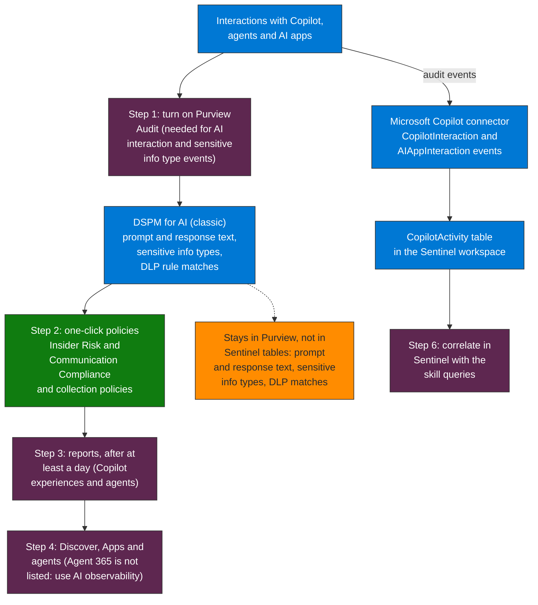

## When to use

- As the first visibility control before implementing DLP or sensitivity labels
- When there is no auditing of AI agent interactions in the tenant
- Prerequisite for correlation with Sentinel: the Copilot audit events reach the workspace
  through the Microsoft Copilot connector (`CopilotActivity`)

## About the name

This skill was written for "Purview AI Hub". Microsoft Learn (Oct 2026) documents the capability as **Data Security Posture Management (DSPM) for AI**, shown in the Microsoft Purview
portal as *DSPM for AI (classic)* next to the newer *Data Security Posture Management*; no page documents a product called AI Hub. The directory name stays so the links keep working.

## What DSPM for AI shows (Microsoft Learn)

- **AI interaction** events in the activity explorer, with the prompt and the response for Microsoft 365 Copilot, Microsoft 365 Copilot Chat and agents. The prompt text needs the
  Content Explorer Content Viewer role. For Copilot in Fabric, Security Copilot and non-Copilot AI apps the prompts and responses need a collection policy with content capture
- **Sensitive info types** found in interactions, **DLP rule match** events during interactions (including DLP for Microsoft 365 Copilot), and **AI website visit** events
- Reports (total interactions, sensitive interactions per AI app, insider risk severity) and one-click policies
- Copilot Studio agents published to non-Microsoft channels need pay-as-you-go billing for these controls

## Flow at a glance



**How to read it.** The same interactions feed two places. The Purview branch holds the content signals and the policies, and the Sentinel branch receives only the audit events through the Microsoft Copilot connector. The thing to take from it: prompt and response text, sensitive info types and DLP matches never reach a Sentinel table, so Sentinel queries work with users, apps and the sensitivity label ids of the resources Copilot read, and content review happens in the Purview activity explorer.

## Workflow

### Step 1 — Turn on Audit

```
Microsoft Purview portal → Solutions → DSPM for AI (classic) → Overview → Get Started
→ Activate Microsoft Purview Audit (if auditing is not on)
```

The AI interaction and the sensitive info type events for Microsoft 365 Copilot require auditing to be on.

### Step 2 — Create the one-click policies

```
DSPM for AI (classic) → Recommendations → View all recommendations
```

Take action on the recommendations that are **Not Started**:
- **Detect risky interactions in AI apps** → Insider Risk Management policy *DSPM for AI - Detect risky AI usage*
- **Detect unethical behavior in AI apps** → Communication Compliance policy *DSPM for AI - Unethical behavior in AI apps*
- **Secure interactions in Microsoft Copilot experiences** → collection policy that captures prompts and responses for Copilot in Fabric and Security Copilot
- **Secure interactions from enterprise apps** → collection policy for Entra-registered AI apps, ChatGPT Enterprise and Foundry apps
- **Extend insights into sensitive data in AI app interactions** → *DSPM for AI - Detect sensitive info shared with AI via network* (needs a SASE or SSE integration; edit the policy to capture content)

### Step 3 — Review the reports

Wait at least a day, then open **Reports** and filter on **Copilot experiences & agents**. Select **View details** to open the activity explorer.

```
DSPM for AI (classic) → Reports → Copilot experiences & agents → View details
```

### Step 4 — Review apps and agents

In the current Data Security Posture Management, **Discover → Apps and agents** lists the AI apps and agents used in the last 30 days. It does not include Agent 365: use the
**AI observability** page for those.

### Step 5 — Connect to Sentinel

The Copilot audit events (`CopilotInteraction` and `AIAppInteraction`) reach Sentinel through the Microsoft Copilot connector in the `CopilotActivity` table. The prompt and response
text, the sensitive info types and the DLP matches stay in Purview: they are not Sentinel tables.

```kql
// Verify event flow
CopilotActivity
| where TimeGenerated > ago(24h)
| summarize count() by RecordType, Workload
```

### Step 6 — Correlate in Sentinel

```kql
// See queries/sentinel-ai-hub-activity.kql
```

## Verification

- [ ] Purview Audit on, and visible as active in DSPM for AI
- [ ] One-click policies created (risky AI usage and unethical behavior at least)
- [ ] Reports show interactions from the last 7 days
- [ ] The people who review prompts hold the Content Explorer Content Viewer role
- [ ] Events visible in Sentinel (`CopilotActivity` has recent rows)

## Implementation notes

- Verify the Microsoft Copilot connector is active in Sentinel: without it `CopilotActivity` has no data for the monitoring queries
- The Queries compile and ran on the validation workspace (245 rows in `CopilotActivity`: Security Copilot, Microsoft 365 Copilot and a third-party AI app recorded as `AIAppInteraction`).
  Query 3 lists sensitivity label ids per resource that Copilot read; the audit record has no sensitive info type detections, which only DSPM for AI shows
- Several DSPM for AI capabilities are preview or classic experiences: validate against Microsoft Learn before writing them into production runbooks
- Removed in this version, because Microsoft Learn (Oct 2026) does not support them: the "AI Hub" menu and its "Data capture" settings, a policy type list of "Sensitive data", "Prompt injection indicators"
  and "Restricted topics", the claim that autonomous agents are not captured, and the `PurviewAuditLog` and `MicrosoftDataLossPrevention` tables (they do not exist in the validation workspace)
