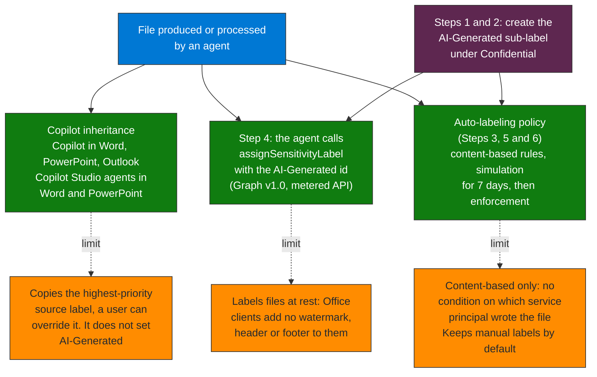

## When to use

- Agents that generate documents, reports, or files as output
- Agents with access to already-classified data that could copy or transform content
- When agent outputs need to inherit the classification of the source data

## How Copilot treats labels (Microsoft Learn)

- Copilot and agents recognize the labels: a chat response shows the highest-priority label of the data it used
- When a label applies encryption, Copilot returns the data only if the user has the EXTRACT usage right (and VIEW)
- Copilot in Word, PowerPoint and Outlook, and Copilot Studio agents when they create content in Word and PowerPoint, give new content the highest-priority label of its sources.
  Microsoft 365 Copilot also applies the highest label found in the source data to generated files (release notes, July 2026). A user can override an inherited label
- Enable sensitivity labels for SharePoint and OneDrive: without it the encrypted files that Copilot and agents can reach are limited to data in use from Office apps on Windows
- Inheritance copies the label of the source. It does not set an "AI-Generated" label: that marker is your organization's design (see below)

## Implementation constraint

Creating sensitivity labels and auto-labeling policies is done in the **Microsoft Purview portal** (or Security & Compliance PowerShell). It is the reliable path for initial configuration.
An agent that writes a file can label it itself with Microsoft Graph `POST /drives/{drive-id}/items/{item-id}/assignSensitivityLabel` (v1.0; a protected, metered API;
`assignmentMethod`, `justificationText` and, in application context, `appliedByUser`).

## Recommended label hierarchy for AI outputs

```
Public
  └── Internal Use Only
        └── Confidential
              ├── Confidential \ AI-Generated        ← agent outputs
              └── Confidential \ Customer Data
                    └── Highly Confidential
                          └── Highly Confidential \ AI-Generated
```

The `AI-Generated` sub-label identifies which content was produced or
processed by an agent, independent of the sensitivity level. Copilot does not set it by itself:
apply it from the agent with `assignSensitivityLabel`, or with an auto-labeling rule on the content.

## Flow at a glance



**How to read it.** An agent output can get a label by three routes: Copilot inheritance from a labeled source, a direct assignSensitivityLabel call from the agent, or a content-based auto-labeling policy; each orange box is the limit of the route above it. The AI-Generated sub-label comes only from the last two, so create it first and do not expect Copilot to apply it. Auto-labeling looks at content, not at which service principal wrote the file, so labeling by author means calling the API from the agent.

## Workflow

### Step 1 — Audit existing sensitivity labels in the tenant

```
Microsoft Purview portal → Information Protection → Sensitivity labels
```

If no label structure exists: create the base hierarchy before continuing.
If one already exists: assess whether it needs sub-labels for AI-generated content.

### Step 2 — Create the AI-Generated sub-label

```
Information Protection → Sensitivity labels → [Confidential] → Add sub-label
```

Sub-label configuration:
- **Name**: `AI-Generated`
- **Display name**: `Confidential / AI-Generated`
- **Description**: "Content generated or processed by an AI agent"
- **Encryption**: inherit from the parent label or configure specifically
- **Content marking**: add the watermark "AI Generated - Review before sharing"
- **Auto-labeling**: No (configured in a separate policy)

### Step 3 — Create the auto-labeling policy for agent outputs

```
Information Protection → Auto-labeling policies → Create policy
```

Configuration:
- **Name**: `AutoLabel-AI-Agent-Outputs`
- **Locations**: SharePoint sites where agents deposit outputs,
  OneDrive of users who use agents, Exchange if applicable
- **Rules**: content contains sensitive info types [tenant-relevant types] or a trainable classifier. Auto-labeling conditions are content-based: the pages reviewed
  list no condition on which service principal created or modified the file
- **Label to apply**: `Confidential / AI-Generated`
- **Mode**: Simulation first (7 days), then enforcement

By default an auto-labeling policy does not replace a label that was applied manually, and it replaces an automatic label only with a higher-priority one (Learn).

### Step 4 — Label what the agent writes

For agents that write files: call `assignSensitivityLabel` with the `AI-Generated` label id (and the source label when the output is derived from labeled data), or rely on Copilot's
inheritance when the content is created from a labeled source in Word, PowerPoint or Outlook.

### Step 5 — Validate in simulation mode

```
Auto-labeling policies → [PolicyName] → Simulation results
```

Review which files would be labeled. Tune rules to eliminate
false positives before activating enforcement.

### Step 6 — Activate and monitor

```
Auto-labeling policies → [PolicyName] → Turn on policy
```

Monitor in Sentinel with `MicrosoftPurviewInformationProtection` and `OfficeActivity`.

```kql
// See queries/sentinel-label-coverage.kql
```

## Verification

- [ ] `AI-Generated` sub-label created under `Confidential`
- [ ] Auto-labeling policy in simulation mode returns the expected matches
- [ ] False positives reviewed and rules tuned
- [ ] Policy in active enforcement
- [ ] Agent output documents show the applied label
- [ ] Watermark visible on labeled documents

## Implementation notes

- `assignSensitivityLabel` applies labels to files at rest: Office clients do not add watermarks, headers or footers to those files. It is a metered API: enable metered APIs in Microsoft Graph before using it
- Auto-labeling can take up to 24 hours to process existing files in SharePoint — do not assume immediate coverage on activation
- To validate auto-labeling: create a test document with synthetic credit-card-type data and confirm the label is applied
- Prioritize manual labeling of SharePoint sites used as agent knowledge sources before enabling retrieval
- The Queries read `MicrosoftPurviewInformationProtection` (label events) and `OfficeActivity` (the label of each file touched, `SensitivityLabelId`); an application shows as `UserType` `Application`.
  On the validation workspace 367 of 23,805 SharePoint and OneDrive events in 30 days carried a label, 339 of them from one application. The label name is only present on some Purview events, so most ids stay as GUIDs
- Removed in this version, because Microsoft Learn (Oct 2026) does not support them: the `/beta/informationProtection/policy/labels` endpoint, an "Inheritance" settings page for labels from
  attachments and documents, an auto-labeling rule on content "created or modified by" a service principal, and the `PurviewAuditLog` and `MicrosoftDataLossPrevention` tables (they do not exist in the validation workspace)
