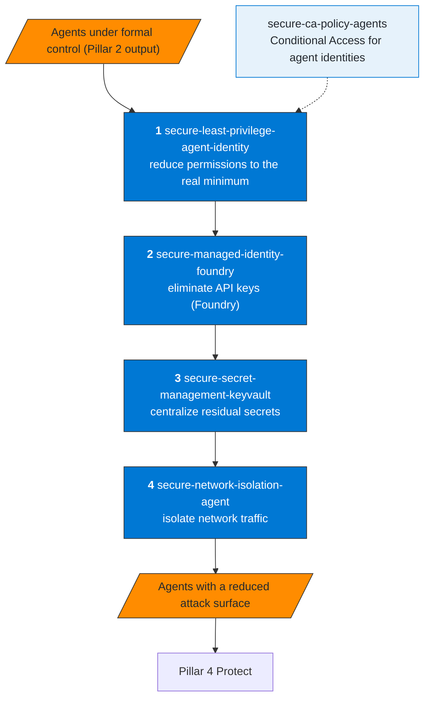
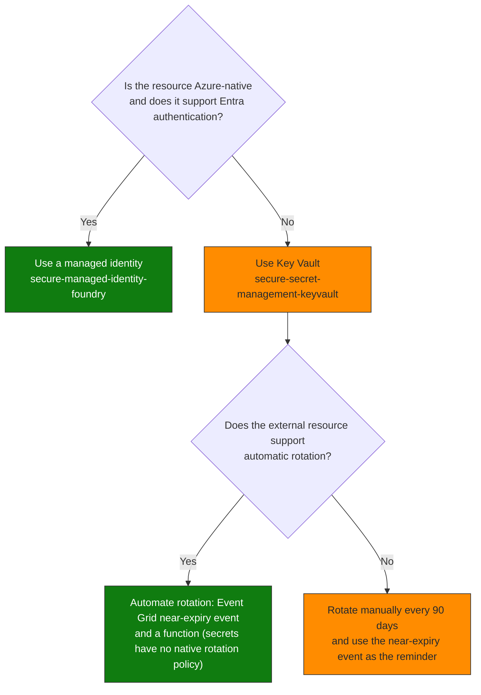

# Pillar 3 — Secure Access

Objective: secure how AI agents authenticate and what network surface they expose,
eliminating static credentials and restricting connectivity to the minimum necessary.

## Recommended sequence

**How to read it.** The order goes from who the agent is (permissions, then credentials) to where it can connect. Least privilege comes first because every later control is easier to reason about once the permissions are small. `secure-ca-policy-agents` sits beside the sequence: the Conditional Access policy for agent identities comes right after an agent is registered with Entra Agent ID.

## Skills

| Skill | MS product | KQL available |
|---|---|---|
| `secure-least-privilege-agent-identity` | Entra ID, Graph API | sentinel-permission-usage.kql |
| `secure-managed-identity-foundry` | Microsoft Foundry, Entra ID, Azure CLI | sentinel-managed-identity.kql |
| `secure-secret-management-keyvault` | Azure Key Vault | sentinel-keyvault-audit.kql |
| `secure-network-isolation-agent` | Azure Networking, Microsoft Foundry, Power Platform | sentinel-network-isolation.kql |
| `secure-ca-policy-agents` | Entra ID Conditional Access, Graph API | No |

## Decision: managed identity vs Key Vault

## API versions validated against a live Sentinel workspace

| Resource | API Version |
|---|---|
| Role Assignments (ARM) | `2022-04-01` |
| Key Vault (ARM) | `2023-07-01` |
| Storage (ARM) | `2023-01-01` |
| SecurityInsights (Sentinel) | `2022-12-01-preview` |

## Known constraints

| Constraint | Impact |
|---|---|
| `Sites.Selected` requires an explicit site grant | Assigning the app role is not enough — an extra step is required |
| Managed Identity creation: not available via Lokka-Microsoft MCP | Use Azure CLI |
| Copilot Studio network controls need a Managed Environment | Virtual Network support (outbound) and the IP firewall (inbound, preview) both require it; the IP firewall is not enforced on the Teams and Microsoft Copilot channels |
| Private Endpoint DNS: requires a private DNS zone | Without the DNS zone, the endpoint does not resolve from inside the VNet. A Foundry resource uses three zones: `privatelink.cognitiveservices.azure.com`, `privatelink.openai.azure.com` and `privatelink.services.ai.azure.com` |
| Foundry outbound isolation is decided when the resource is created | Network injection and the managed network cannot be added to an existing Foundry resource or changed later: redeploy |
| Foundry key access is the account property `disableLocalAuth` | The change can take up to several hours to be enforced: verify with an HTTP 401 on the old key |
