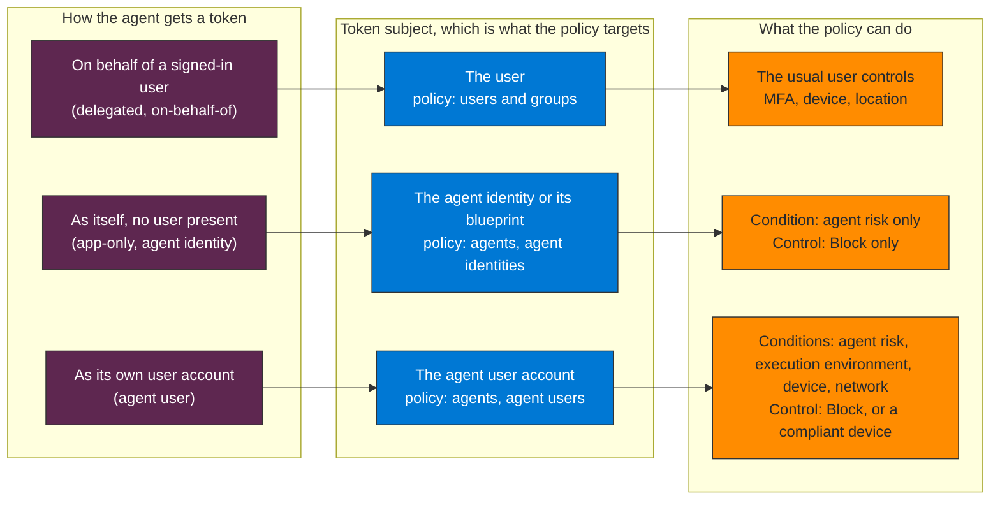

## When to use

- Registering any agent with Entra Agent ID: the policy comes right after
- Agents are found that no Conditional Access policy reaches (output of `govern-ca-policy-workload-identity` or the inventory)
- Moving from policies written for users to policies written for agents
- Before enabling any agent in production

## Prerequisites

- One of these license plans: Microsoft 365 E7 (includes Agent 365 and Microsoft Entra Suite), or a Microsoft Agent 365 license with at least Microsoft Entra ID P1 or Microsoft 365 E3
- The Conditional Access Administrator role
- Agents registered with Entra Agent ID (see `govern-entra-agent-id`)
- Agent risk comes from ID Protection and is in preview

Workload ID Premium is a different license: it covers Conditional Access for **workload identities** (classic service principals), not for agent identities. For an agent built as a plain service principal, use `govern-ca-policy-workload-identity`.

## Which policy covers which token

An access token has one subject, and Conditional Access evaluates the policy written for that subject. Learn's rule: a policy that targets an agent identity does not apply to the agent's user account, and the other way round. Create one policy per subject the agent uses.



**How to read it.** The middle column is the decision. A user policy never reaches an agent that acts as itself, and an agent policy for the agent identity never reaches the agent user. For agent identities the only condition is agent risk and the only control is Block, because there is no interactive remediation.

## Why MFA is not the control

Agents cannot complete interactive MFA, and Learn documents **Block** as the only access control for agent identities (agent users add "require a compliant device", only for agents that run on an endpoint). Two consequences:

- A user policy such as "all users must use MFA" does not cover agents: policies for all users do not include agent user accounts. It also should not block them by accident, so review broad user policies for agent impact and exclude agent identities from them.
- Build agent policies around Block with an agent-risk condition, or around "block every agent except the approved ones". This skill does not claim what the Graph API does when it is sent a grant control that the portal does not offer: Learn does not document it.

## Workflow

### Step 1 — Find the policies that already touch agents

Read-only. The agent properties exist only in the beta endpoint:

```http
GET https://graph.microsoft.com/beta/identity/conditionalAccess/policies?$select=displayName,state,conditions,grantControls
```

Keep the policies where `conditions.clientApplications.includeAgentIdServicePrincipals` or `conditions.agentIdRiskLevels` is set. For every other policy check that it does not block agent flows by accident.

### Step 2 — Create the policy for agent identities in report-only

Portal: Entra ID > Conditional Access > Policies > New policy. Assignments: Users, agents or workload identities > Agents > All agent identities. Target resources: All resources. Conditions: Agent risk (preview) = High. Grant: Block. Enable policy: Report-only.

The same policy in Graph (beta). This is the shape the portal produced for the "block high-risk agent identities" policy in the validation tenant:

```http
POST https://graph.microsoft.com/beta/identity/conditionalAccess/policies
Content-Type: application/json

{
  "displayName": "Agents: block high agent risk",
  "state": "enabledForReportingButNotEnforced",
  "conditions": {
    "clientAppTypes": ["all"],
    "applications": { "includeApplications": ["All"] },
    "users": { "includeUsers": ["None"] },
    "clientApplications": { "includeAgentIdServicePrincipals": ["All"] },
    "agentIdRiskLevels": "high"
  },
  "grantControls": { "operator": "OR", "builtInControls": ["block"] }
}
```

| Portal option | Graph property (beta) |
|---|---|
| All agent identities | `conditions.clientApplications.includeAgentIdServicePrincipals` = `["All"]` |
| Specific agent identities | the same property with the agent identity object IDs; exclusions in `excludeAgentIdServicePrincipals` |
| Agents tagged with a custom security attribute | `conditions.clientApplications.agentIdServicePrincipalFilter` |
| Agent risk (preview) | `conditions.agentIdRiskLevels`: `low`, `medium` or `high` |

Targeting a blueprint is documented for the portal's object picker: it covers every agent identity created from that blueprint, including the ones created later. The Graph reference I read lists object IDs of agent identities, not blueprints, so verify how your tenant stores a blueprint target before scripting it.

### Step 3 — Create the policy for agent user accounts, separately

Entra ID > Conditional Access > New policy > Agents > **All agent users (preview)**. Conditions: agent risk Medium and High. Grant: Block. Report-only first. Device compliance and compliant network apply only to agents that run on an endpoint (a Windows 365 Cloud PC for agents, for example): scope those policies with the **Agent execution environments** condition, or an agent that runs directly in the cloud has no device to prove and is blocked with no way to remediate.

### Step 4 — Allow only approved agents (optional)

A block policy for All agent identities that excludes the approved agents or blueprints, or that excludes by custom security attribute. Learn's pattern: tag approved agents and resources with attributes and let the policy follow the tags, so new agents are blocked until someone tags them. Start in report-only.

### Step 5 — Validate in report-only, then enforce

Use the sign-in logs (Service principal sign-ins, Conditional Access tab) or Query 2 in `queries/`: the policy appears in `ConditionalAccessPolicies` with `reportOnlyFailure` or `reportOnlyNotApplied`. Learn's agent articles validate with report-only mode and policy impact; they do not describe the What If tool for agents. After a minimum of 7 days without unexpected failures:

```http
PATCH https://graph.microsoft.com/beta/identity/conditionalAccess/policies/{policy-id}
Content-Type: application/json

{ "state": "enabled" }
```

### Step 6 — Connect it to containment

`confirmCompromised` raises an agent's risk to High, and this policy is what turns that into a block: without it the call changes a label and blocks nothing (see `detect-respond-playbook-agent-containment`). Create the High policy of Step 2 before you need the playbook.

### Step 7 — Monitor

Queries 1 to 3 in `queries/sentinel-ca-agents.kql`: the Conditional Access result per agent sign-in, which policies evaluated them, and the blocks.

## Where Conditional Access does not apply (Learn)

- When an agent identity blueprint requests a token to create an agent identity or an agent user
- During the intermediate token exchange at `AAD Token Exchange Endpoint: Public` (resource ID `fb60f99c-7a34-4190-8149-302f77469936`), whose tokens cannot call Microsoft Graph
- When security defaults are on
- For resources that do not authenticate with Entra ID: an agent that uses an API key never meets the policy

Not supported today: policies for all users do not include agent users; scoping an agent user by group membership; a policy for agent identities does not cover the agent user, and a blueprint target covers the identity, not the agent user.

## Verification

- [ ] A report-only policy blocks High agent risk for All agent identities, and a separate one for agent users
- [ ] Query 2 shows the policy evaluating the agent sign-ins that request a token for a real resource
- [ ] No user policy blocks an agent flow by accident
- [ ] 7 days of report-only without unexpected `reportOnlyFailure`, then `enabled`
- [ ] The playbook's `confirmCompromised` step has a policy behind it
- [ ] The Gap Assessment records which agents are covered and which resources bypass Entra (API keys)

## Implementation notes

- In the validation tenant the nine agent sign-ins in 30 days (a blueprint principal calling Microsoft Graph and an agent identity at the token exchange endpoint) all show `ConditionalAccessStatus` notApplied, with the four agent policies listed as `notApplied` or `reportOnlyNotApplied`. That is the documented boundary above, not a fault in the policies: judge a policy on the rows that request a token for a real resource
- The agent condition is `agentIdRiskLevels`, not `signInRiskLevels`; the sign-in risk and service principal risk conditions belong to users and workload identities
- Removed in this version, because it does not match Microsoft Learn or the tenant: the v1.0 endpoint and the string `"All"` (the property is a collection and exists in beta), `signInRiskLevels` as the agent condition, the "Blueprint-level" name for an all-agents policy, the What If steps for agents, the claim that `grantControls: mfa` is "silently invalid" and "appears active", the Entra ID P1 plus Workload ID Premium licensing for agents, and an inline query that read only the first evaluated policy
