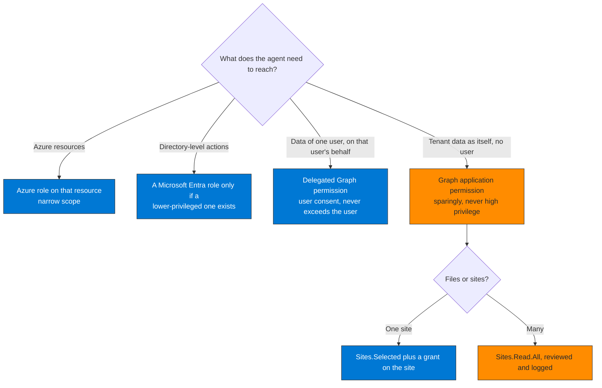

## When to use

- After the connector classification of Pillar 1: agents with excessive permissions were identified
- Before moving agents to production
- The quarterly audit of agent permissions

## Core principle

An agent holds only the permissions its declared use case needs. `Files.ReadWrite.All` for an agent that reads one SharePoint site is an unnecessary attack surface.

## Which kind of permission

Learn's guidance for agents (Authorization in Microsoft Entra Agent ID):



**How to read it.** Prefer the left-hand outcomes (blue): they are bounded by a resource, a role or a user. An application permission (orange) acts across the tenant and needs an administrator's explicit consent, so it is the last resort.

Microsoft blocks a set of high-risk Graph permissions for agents altogether. Learn's examples are `Application.ReadWrite.All`, `RoleManagement.ReadWrite.All`, `User.ReadWrite.All` and `Directory.AccessAsUser.All` (for the last one, not even an administrator can consent). Everything an agent holds beyond the blocked set is what this skill reviews.

## Workflow

### Step 1 — Inventory what the identity holds

```http
# Application permissions assigned to the service principal (act as the application, no user)
GET https://graph.microsoft.com/v1.0/servicePrincipals/{sp-id}/appRoleAssignments
  ?$select=id,appRoleId,resourceId,resourceDisplayName

# Delegated permissions granted to it (act on behalf of a user)
GET https://graph.microsoft.com/v1.0/servicePrincipals/{sp-id}/oauth2PermissionGrants
  ?$select=id,scope,consentType,principalId,resourceId
```

An `appRoleId` is a GUID: resolve it against the roles of the resource service principal (`GET /servicePrincipals/{resource-id}?$select=appRoles`).

For an **agent identity**, direct assignments are only part of the picture. It can also inherit from its blueprint:

```http
# Inherited application role assignments of an agent identity (beta)
GET https://graph.microsoft.com/beta/servicePrincipals/microsoft.graph.agentIdentity/{agentIdentity-id}/inheritedAppRoleAssignments

# What the blueprint lets its agent identities inherit
GET https://graph.microsoft.com/v1.0/applications/{blueprint-id}/microsoft.graph.agentIdentityBlueprint/inheritablePermissions
```

Inheritable permissions are what every agent identity of the blueprint receives without consent prompts (Learn describes them as delegated scopes). Learn recommends starting with an enumerated list of essential scopes (maximum 10 resource apps per blueprint and 40 scopes per resource app) and expanding as needed.

### Step 2 — Compare with what the agent uses

Query 1 in `queries/` (Microsoft Graph activity logs) lists, per application, the permission names carried by its token, the calls it made and how many were not `GET`. A permission with write capability in the name and no call other than `GET` in 30 days is the first candidate to remove. Query 2 shows the resources each service principal requests tokens for and the credential type it uses.

Limits to keep in mind: the Graph activity logs cover Microsoft Graph only; a POST is not always a write (searches and batches are POSTs); and a quarterly job can look unused for 30 days.

For each permission answer: does the agent use it, does the documented use case need it, does a lower-privilege permission cover the same need?

| Current permission (excessive) | Replace with |
|---|---|
| `Files.ReadWrite.All` | `Sites.Selected` (one site) or `Files.SelectedOperations.Selected` (files) |
| `Mail.ReadWrite` | `Mail.Read` if it only reads |
| `Directory.ReadWrite.All` | `Directory.Read.All` or a narrower scope |
| `User.ReadWrite.All` | `User.Read.All` or `User.ReadBasic.All` (application permissions; `User.Read` is a delegated permission only, and `User.ReadWrite.All` cannot be granted to an agent) |
| `Group.ReadWrite.All` | `GroupMember.Read.All` if it only reads membership |

### Step 3 — Revoke what the agent does not need

```http
# A delegated grant
DELETE https://graph.microsoft.com/v1.0/oauth2PermissionGrants/{grant-id}

# An application permission
DELETE https://graph.microsoft.com/v1.0/servicePrincipals/{resource-sp-id}/appRoleAssignedTo/{assignment-id}
```

Do it in the order replace first, revoke second, so the agent never loses a permission it still needs.

### Step 4 — Grant the narrow permission: Sites.Selected

Two steps. First the application permission, on the **Microsoft Graph** service principal (the role ID below is the one the validation tenant returned for `Sites.Selected`):

```http
# Find the Microsoft Graph service principal
GET https://graph.microsoft.com/v1.0/servicePrincipals(appId='00000003-0000-0000-c000-000000000000')?$select=id

POST https://graph.microsoft.com/v1.0/servicePrincipals/{graph-sp-id}/appRoleAssignedTo
{
  "principalId": "{agent-sp-object-id}",
  "resourceId": "{graph-sp-id}",
  "appRoleId": "883ea226-0bf2-4a8f-9f9d-92c9162a727d"
}
```

On its own `Sites.Selected` gives access to no site. Then the grant on the site:

```http
POST https://graph.microsoft.com/v1.0/sites/{site-id}/permissions
{
  "roles": ["read"],
  "grantedToIdentities": [{
    "application": { "id": "{agent-app-id}", "displayName": "{agent-name}" }
  }]
}
```

The caller of that request needs the `Sites.FullControl.All` application permission (or be a global administrator): it is a high privilege, so use it from an administrator session and not from the agent. The roles are `read`, `write`, `owner` and `fullcontrol`. `{agent-app-id}` is the application (client) ID. Never give the same app `Sites.ReadWrite.All` as well: the restriction does not apply then.

### Step 5 — Verify

Run the use case and confirm it works. A permission that was recut does not break the sign-in: the token is still issued and the call fails with 403 in Graph, so look for it in Query 3. A token already issued keeps its permissions until it expires (60 to 90 minutes by default), so check the `Roles` of new tokens after that.

### Step 6 — Review the grants regularly

Query 4 lists the application and delegated permissions granted in the last 90 days, with the high-privilege ones extracted.

## Verification

- [ ] The permission inventory is documented before and after, including inherited permissions for agent identities
- [ ] Excessive permissions are revoked (the GET returns a shorter list)
- [ ] The narrow replacement is granted
- [ ] The use case works, and Query 3 shows no new 401 or 403 after the tokens have expired
- [ ] Query 4 reviewed: no admin consent for all users with a long list of high-privilege delegated permissions that nobody can justify

## Implementation notes

- A token already issued keeps its permissions until it expires (60 to 90 minutes by default); Continuous Access Evaluation for workload identities applies to Microsoft Graph only and to single-tenant apps
- To get the `appRoleId` of a Graph permission, read the `appRoles` of the Microsoft Graph service principal. `Sites.Selected` for Microsoft Graph and the one of the SharePoint API are separate permissions; this skill uses the Graph one
- Use Graph Explorer to try the minimum scope before assigning it in production
- In the validation tenant the delegated grants were the largest finding: 24 grants in 90 days, several of them administrator consents for all users with lists of up to 140 permissions
- Removed in this version, because it does not match Learn or the tenant: queries that read a `Scopes` column that `AADServicePrincipalSignInLogs` does not have, the `User.ReadWrite.All` to `User.Read` substitution (an application cannot hold `User.Read`), `{sharepoint-sp-id}` as the resource of the Graph `Sites.Selected` role, the request to grant a site permission without saying what the caller needs, and the "up to 60 minutes to propagate" figure (the documented wait is the token lifetime)
