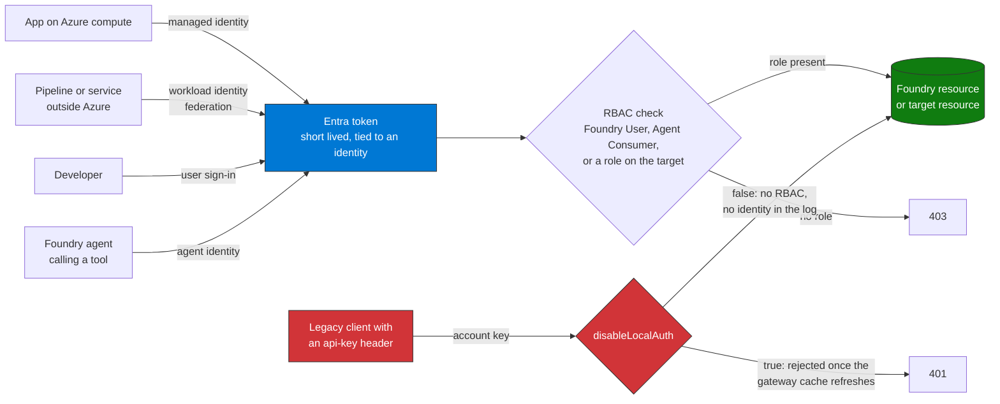

## When to use

- The inventory (Query 1, or the `discover-enumerate-foundry-agents` skill) shows Foundry resources with `disableLocalAuth` false
- Query 2 shows people or applications listing the account keys
- Applications, pipelines or scripts that send an `api-key` header to a Foundry or Azure OpenAI endpoint
- Agents whose tools use connection strings or keys instead of an agent identity
- Before moving any Foundry project to production

## What this skill covers

A Foundry resource is a `Microsoft.CognitiveServices/accounts` resource of kind `AIServices`; projects are child resources. Key access is a property of the
account (`disableLocalAuth`), not of an endpoint. Azure Machine Learning online endpoints (`az ml online-endpoint`, an `auth_mode` of `key` or `aad_token`) are
a different product and are not covered here.

## Why Entra ID instead of keys

A key is a static secret shared by everyone who holds it: it does not rotate by itself, it leaks into logs, environment variables and repositories, it says
nothing about who used it, and it carries the same access for every caller. An Entra token is short lived, belongs to an identity that RBAC can scope and that
the sign-in logs record.

There is a second reason that is easy to miss. While local authentication is on, role assignments do not limit key use: the built-in role Cognitive Services User
"lets you read and list keys", and Cognitive Services Contributor can view and regenerate them (the Cognitive Services OpenAI User role cannot). Whoever can list
the keys can call the account without a token. Only `disableLocalAuth` closes that path.

## Which identity does what

| Caller | Credential | Role it needs |
|---|---|---|
| Developer or application calling the project or its agents | Entra token for `https://ai.azure.com/.default` (user, managed identity or workload identity) | **Foundry User** to build; **Foundry Agent Consumer** if it only calls agents (project or agent scope) |
| The project's managed identity | Managed identity of the Foundry resource and project | **Foundry User** on the Foundry resource (Learn's minimum assignment) |
| An agent calling a tool or a downstream resource | Agent identity (a service principal), not a key | An RBAC role on the target resource (Storage Blob Data Reader, Key Vault Secrets User, and so on) |
| An application calling the account-level OpenAI endpoint directly | Entra token | **Foundry User** or **Cognitive Services OpenAI User** on the account |

Role IDs (use the ID in scripts: the Foundry roles were renamed from Azure AI User, Azure AI Owner, Azure AI Account Owner and Azure AI Project Manager, and the name
can differ while the rename rolls out):

| Role | ID |
|---|---|
| Foundry User | `53ca6127-db72-4b80-b1b0-d745d6d5456d` |
| Foundry Agent Consumer | `eed3b665-ab3a-47b6-8f48-c9382fb1dad6` |
| Foundry Project Manager | `eadc314b-1a2d-4efa-be10-5d325db5065e` |
| Foundry Account Owner | `e47c6f54-e4a2-4754-9501-8e0985b135e1` |
| Foundry Owner | `c883944f-8b7b-4483-af10-35834be79c4a` |

Two roles to keep out of Foundry assignments. Microsoft Learn says not to assign the built-in roles that start with `Cognitive Services` in Foundry scenarios
(the exception is Cognitive Services Usages Reader, to see quota), and not to use `Azure AI Developer`, which is scoped to Azure Machine Learning workspaces and Foundry
hubs and not to Foundry projects. One Learn page about keyless access for Foundry Models still names Cognitive Services User for inference callers; this skill follows the
RBAC article, because that role also lists keys.

## Architecture



**How to read it.** The top path is the one to keep: every caller proves who it is with an Entra token, and RBAC decides. The bottom path is the one to close: a key carries no identity and no role, so whoever holds it gets full access and the logs cannot say who they were.
`disableLocalAuth` is the switch between the two, which is why Step 6 comes after the callers have moved to tokens. For what the agent identity is and how its token is issued, see the identity chain in [`docs/architecture.md`](../../../docs/architecture.md#3-the-identity-chain-of-an-agent).

## Workflow

### Step 1 — Find the Foundry resources that still accept keys

Query 1 in `queries/` (Azure Resource Graph) lists every Foundry resource with its `disableLocalAuth` value. From the CLI (needs the `resource-graph` extension):

```bash
az graph query -q "resources | where type =~ 'microsoft.cognitiveservices/accounts' and kind =~ 'AIServices' | project name, resourceGroup, disableLocalAuth=tostring(properties.disableLocalAuth), identity=tostring(identity.type)" -o table
```

Then run Query 2 (who lists the keys) and Query 6 (who still calls the account, and from where) to know what will break when the keys go away.

### Step 2 — Give every caller an Entra identity

**An application on Azure compute**: a system-assigned managed identity on that host, or one user-assigned identity shared by several workloads.

```bash
az identity create   --name "mi-{app-name}"   --resource-group {resource-group}   --location {region}
```

Attach it to the host (App Service, Container Apps, Functions, VM, AKS) as that host's documentation describes.

**A pipeline or a service outside Azure**: a federated identity credential (workload identity federation) on an app registration or on a user-assigned managed
identity, not a client secret.

**An agent inside Foundry**: nothing to create. When the first agent of a project is created, Foundry provisions a default agent identity blueprint and a default
agent identity for the project. Publishing an agent creates a dedicated blueprint and agent identity for it.

### Step 3 — Assign Foundry roles at the smallest scope

Minimum for a new project: Foundry User on the Foundry resource for the user principal and for the project's managed identity (both are added automatically when the
project is created in the Foundry portal by someone who can assign roles). An application that only calls agents gets Foundry Agent Consumer.

```bash
# Foundry User on the Foundry resource
az role assignment create \
  --assignee-object-id {principal-id} \
  --assignee-principal-type ServicePrincipal \
  --role "53ca6127-db72-4b80-b1b0-d745d6d5456d" \
  --scope "/subscriptions/{subscription-id}/resourceGroups/{resource-group}/providers/Microsoft.CognitiveServices/accounts/{account-name}"

# Foundry Agent Consumer at project scope (the Azure portal only assigns it at account scope; use the CLI for project or agent scope)
az role assignment create \
  --assignee-object-id {principal-id} \
  --assignee-principal-type ServicePrincipal \
  --role "eed3b665-ab3a-47b6-8f48-c9382fb1dad6" \
  --scope "/subscriptions/{subscription-id}/resourceGroups/{resource-group}/providers/Microsoft.CognitiveServices/accounts/{account-name}/projects/{project-name}"
```

Query 3 lists the role assignments that touch Foundry and flags the ones that do not belong (Cognitive Services roles that can list keys, Azure AI Developer).

### Step 4 — Let agents reach tools and data through the agent identity

Unpublished agents of a project share the project's agent identity; a published agent has its own. Find the identity in the Azure portal: project (or agent application)
> Overview > JSON View, field `agentIdentityId`. Assign the role on the target resource to that identity:

```bash
az role assignment create \
  --assignee-object-id "{agentIdentityId}" \
  --assignee-principal-type ServicePrincipal \
  --role "Storage Blob Data Reader" \
  --scope "/subscriptions/{subscription-id}/resourceGroups/{resource-group}/providers/Microsoft.Storage/storageAccounts/{storage-account}"
```

For Key Vault use Key Vault Secrets User and the audience `https://vault.azure.net`; for Storage the audience is `https://storage.azure.com`, for Microsoft Graph
`https://graph.microsoft.com`. A wrong audience fails authentication even when the role is right. Only some tools support agent identity authentication, so check the tool.
When you publish an agent, its tools switch to the new identity: assign the roles again.

### Step 5 — Change the client code to tokens

```python
from openai import OpenAI
from azure.identity import DefaultAzureCredential, get_bearer_token_provider

token_provider = get_bearer_token_provider(
    DefaultAzureCredential(),
    "https://ai.azure.com/.default"
)

client = OpenAI(
    base_url="https://{resource}.openai.azure.com/openai/v1/",
    api_key=token_provider,
)
```

`DefaultAzureCredential` uses the managed identity when the code runs on Azure and the developer's sign-in on a workstation: no key in code, environment or Key Vault.

### Step 6 — Turn key access off

Learn documents three ways: the PowerShell cmdlet, the Azure Policy built-ins and the template property.

```powershell
Connect-AzAccount
Set-AzCognitiveServicesAccount -ResourceGroupName "{resource-group}" -Name "{account-name}" -DisableLocalAuth $true
(Get-AzCognitiveServicesAccount -ResourceGroupName "{resource-group}" -Name "{account-name}").DisableLocalAuth   # True
```

- Azure Policy, to enforce it by subscription or resource group: "Azure AI Services resources should have key access disabled (disable local authentication)"
  and the "Configure Azure AI Services resources to disable local key access" variant that applies the change.
- Bicep or ARM: `disableLocalAuth: true` on the account.

The change is made on the control plane at once, but the gateway can keep accepting a key that was valid until its cache refreshes: Learn says minutes in general and
up to several hours. Do not treat the control as active until a request with an old key returns HTTP 401 (`Access denied due to invalid subscription key or wrong API endpoint`).
Anything that still needs a key stops working (the policy description names Azure OpenAI Studio).

### Step 7 — If keys have to stay for a while

Rotate them and keep watching who lists them. Rotate one key at a time so the second one keeps serving until callers move:

```bash
az cognitiveservices account keys regenerate \
  --name {account-name} \
  --resource-group {resource-group} \
  --key-name Key1
```

Remove the role assignments that can list keys (Cognitive Services User, Cognitive Services Contributor, Contributor, Owner) from people who do not manage the resource, and
alert on Query 2. Once `disableLocalAuth` is true, listing and regenerating keys are rejected.

## Verification

- [ ] Query 1: every Foundry resource in scope shows `LocalAuthDisabled` true
- [ ] A request with an old key returns HTTP 401 once the change has propagated
- [ ] Query 2 returns no new `listKeys` rows after the change
- [ ] Query 3 shows only Foundry roles at the intended scope, and no Azure AI Developer or Cognitive Services roles on Foundry resources
- [ ] Callers sign in with Entra: Query 5 shows the managed identities and agent identities that now request tokens
- [ ] The application code has no key, and no Foundry key is kept in an environment variable or in Key Vault
- [ ] Each published agent has its role assignments on its own agent identity
- [ ] Call test succeeds with a token

## Implementation notes

- Creating a user-assigned managed identity needs Azure CLI, Bicep or ARM: Microsoft Graph does not create them
- To migrate a client secret to a managed identity: create the identity, assign the equivalent roles, switch the configuration, verify, then delete the secret. Service principals
  with a secret (`sp-*`) should be replaced progressively; start with those that write to `Mail`, `Files` or `Sites`
- Query 6 does not tell key calls from token calls: `callerObjectId` was empty in every diagnostic record of the validation account. `disableLocalAuth` is the control that decides
- The Activity Log records that the account was written (Query 4) but not which property changed; compare with Query 1. It does record `listKeys` (Query 2)
- The agent identity steps follow Learn's Agent Application publishing model; Learn notes that the publishing experience and the agent endpoint model are changing, so confirm which identity a
  published agent uses in your project before assigning roles
- Removed in this version, because it describes a different product: `az ml online-endpoint list`, `update` and `regenerate-keys`, an `auth_mode` of `key` or `aad_token`, the
  `FoundryAgents_CL` table (it does not exist in the validation workspace), the `Cognitive Services User` role assignment and the Azure AI Developer role for Foundry access
