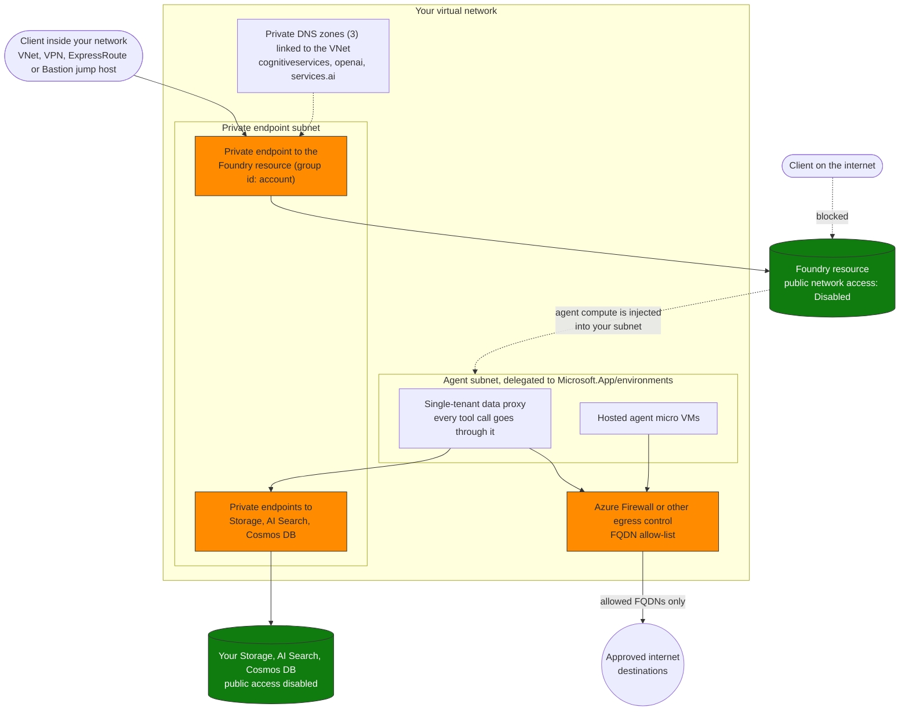
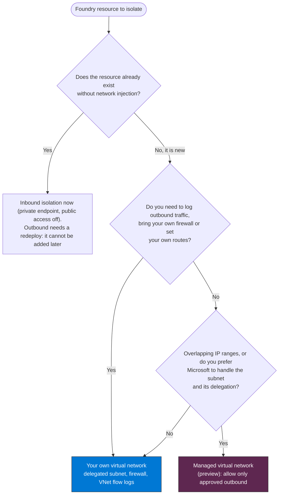

## When to use

- Foundry agents that process confidential data
- The risk register flags agents with generic HTTP tools or connectors (unknown destination)
- A compliance requirement that AI traffic must not cross the public internet
- Query 1 shows Foundry resources open to the internet

## Scope of this skill

Learn splits Foundry network isolation in three areas, and the choices are different for each:

1. **Inbound**: who can reach the Foundry resource and its projects. A private endpoint plus the public network access flag.
2. **Outbound from the resource**: the Foundry resource reaching other Azure services, over Private Link.
3. **Outbound from the Agent client**: the compute that runs agents and tools. Network injection into your own virtual network (BYO) or a Microsoft managed virtual network.

Copilot Studio is a different platform with its own controls (Step 4).

## Architecture of an isolated Foundry resource (your own network)



**How to read it.** Two separate boundaries. **Inbound** (top): a client reaches the Foundry resource only through its private endpoint, and the name resolves to the private address only if the three private DNS zones are linked to the network. **Outbound** (bottom): the agent compute sits in a subnet you delegated, its tool calls leave through the data proxy to your own Storage, AI Search and Cosmos DB over private endpoints, and anything bound for the internet has to pass the firewall.
What the diagram does not cover: tools that use public endpoints (Bing grounding, web search, SharePoint grounding) keep using them and are outside this boundary; block them with Azure Policy if the policy forbids them.

## Choose the outbound model first

Outbound isolation is decided when the Foundry resource is created: `networkInjections` cannot be added to an existing account, and the outbound settings cannot be
changed later (redeploy). Hosted agents need the network injection from the first creation of the account.

| | Managed virtual network | Your own virtual network (BYO) |
|---|---|---|
| Who builds the network | Microsoft (preview CLI group `az cognitiveservices account managed-network`) | You: a subnet delegated to `Microsoft.App/environments` |
| Egress control | `allow_only_approved_outbound` with service tag, private endpoint and FQDN rules (ports 80 and 443). FQDN rules create a managed Azure Firewall that you cannot replace | Your firewall (Azure Firewall, hub and spoke), your routes and your NSGs |
| Logging of outbound traffic | None yet | VNet flow logs and firewall logs |
| Limits | Cannot be disabled after it is enabled; the portal cannot create it; limited regions | /24 recommended for production (/27 is the minimum), RFC 1918 ranges only, your own Storage, AI Search and Cosmos DB with private endpoints you create |

Because the managed network has no outbound logging yet, choose BYO when you need to prove what left the agent.



**How to read it.** The first question is about the past: outbound isolation is decided when the resource is created, so an existing resource can only get the inbound half. For a new one, the deciding factor is evidence: the managed network gives a secure default with no outbound log, your own network gives you the firewall and the flow logs.

## Workflow

### Step 1 — Assess the current network surface

Query 1 in `queries/` (Azure Resource Graph) shows, per Foundry resource, `publicNetworkAccess`, the default network rule, the private endpoint count and whether outbound injection is set.

```bash
az cognitiveservices account show \
  --name {account-name} \
  --resource-group {resource-group} \
  --query "{PublicAccess:properties.publicNetworkAccess, Rules:properties.networkAcls, PrivateEndpoints:properties.privateEndpointConnections[].name, OutboundInjection:properties.networkInjections}"
```

`publicNetworkAccess: Enabled` with no private endpoint means the resource is open to the internet: that is the thing to change.

### Step 2 — Inbound: private endpoint, then public access off

```bash
az network private-endpoint create \
  --name "pe-foundry-{name}" \
  --resource-group {resource-group} \
  --vnet-name {vnet-name} \
  --subnet {private-endpoint-subnet} \
  --private-connection-resource-id $(az cognitiveservices account show \
    --name {account-name} --resource-group {resource-group} --query id -o tsv) \
  --group-id account \
  --connection-name "foundry-private-conn"
```

- The private endpoint must be in the same region and subscription as the virtual network. Only an **Approved** connection carries traffic; without Contributor or Owner on the Foundry
  resource the connection stays Pending until the owner approves it. Do not use `172.17.0.0/16` for the virtual network (Docker bridge).
- Private DNS: three zones, linked to the virtual network: `privatelink.cognitiveservices.azure.com`, `privatelink.openai.azure.com` and `privatelink.services.ai.azure.com`. A custom DNS
  server forwards them to `168.63.129.16`. Without the zones the name resolves to the public address.
- Then turn public access off: Networking > Disabled in the portal, the Azure Policy "Configure Cognitive Services accounts to disable public network access", or in the template:

```bicep
properties: {
  publicNetworkAccess: 'Disabled'
  networkAcls: { defaultAction: 'Deny' }
}
```

  "Enabled from selected IP addresses" is the middle setting if a private endpoint is not possible yet. Removing the private endpoint does not make the resource public again.
- Once public access is off, data-plane calls and deployments (`azd up`, ACR pushes) from outside the network fail: run them from a runner or a jump host inside the virtual network.
- Trusted services: Foundry Tools, Azure AI Search and Azure Machine Learning can reach a restricted resource through a network rule exception when their managed identity holds a role on it.

### Step 3 — Outbound from the Agent client

**Option A, managed virtual network (preview).** Needs Azure CLI 2.86.0 or later and Foundry Account Owner on the resource (Owner or Role Based Access Control Administrator to assign roles).

```bash
# 1. Create the account with network injection. It cannot be added later, and the CLI cannot create it yet, so Learn uses az rest.
#    Learn creates it with disableLocalAuth false; turn key access off afterwards (skill secure-managed-identity-foundry).
az rest --method PUT \
  --url "https://management.azure.com/subscriptions/{subscription-id}/resourceGroups/{resource-group}/providers/Microsoft.CognitiveServices/accounts/{account-name}?api-version=2026-05-01" \
  --body '{
    "location": "{region}", "kind": "AIServices", "sku": { "name": "S0" },
    "identity": { "type": "SystemAssigned" },
    "properties": {
      "allowProjectManagement": true,
      "customSubDomainName": "{account-name}",
      "networkInjections": [ { "scenario": "agent", "subnetArmId": "", "useMicrosoftManagedNetwork": true } ],
      "disableLocalAuth": false
    }
  }'

# 2. Let the account approve its own managed private endpoints (Azure AI Enterprise Network Connection Approver)
az role assignment create \
  --assignee-object-id {account-principal-id} \
  --assignee-principal-type ServicePrincipal \
  --role "b556d68e-0be0-4f35-a333-ad7ee1ce17ea" \
  --scope /subscriptions/{subscription-id}/resourceGroups/{resource-group}

# 3. Create the managed network
az cognitiveservices account managed-network create \
  --resource-group {resource-group} --name {account-name} \
  --managed-network allow_only_approved_outbound --firewall-sku Standard

# 4. Approve only what the agents need (types: fqdn, servicetag, privateendpoint)
az cognitiveservices account managed-network outbound-rule set \
  --resource-group {resource-group} --name {account-name} \
  --rule allow-storage --type privateendpoint \
  --destination "/subscriptions/{subscription-id}/resourceGroups/{resource-group}/providers/Microsoft.Storage/storageAccounts/{storage-name}" \
  --subresource-target blob
```

In `allow_only_approved_outbound` the system creates the rules the Agent service needs (private endpoints to your Cosmos DB, Storage and AI Search, and the Microsoft Entra service tag). You add
FQDN rules for the rest (for example `*.identity.azure.net`, `login.microsoftonline.com`, `mcr.microsoft.com` for the Agent service). Verify with `managed-network show` and
`managed-network outbound-rule list`, then run a basic agent. Once the mode is `allow_only_approved_outbound` it cannot go back to `allow_internet_outbound`.

**Option B, your own virtual network.** Use the Bicep sample `15-private-network-standard-agent-setup` (or the Terraform one) in `foundry-samples`, or the Network tab of the portal
(Virtual network injection). The subnet must be delegated to `Microsoft.App/environments`. Learn recommends /24 for production, RFC 1918 ranges only (no CGNAT) and keeping use under 80% of the
subnet. The private endpoints to AI Search, Storage and Cosmos DB are not created for you.

Egress control for option B belongs on a firewall (Azure Firewall, usually hub and spoke) with FQDN rules for the agent subnet. Do not use an NSG rule that allows the `AzureCloud` service tag
as the exception: a service tag covers every Azure customer and cannot be scoped to a tenant, a subscription or a resource, so it is not an exfiltration boundary. The destinations the Agent
service needs through the firewall are `*.identity.azure.net`, `login.microsoftonline.com`, `*.login.microsoftonline.com` and `*.login.microsoft.com` (or the Microsoft Entra service tag).

What isolation does not cover:
- Tools that use public endpoints keep using them: Bing grounding, web search and SharePoint grounding. Block them with Azure Policy if the policy forbids them.
- Not supported in a network-isolated project (per Learn at the time of writing): Fabric Data Agent, Logic Apps, Browser Automation, Computer Use and Image Generation tools, and
  outbound injection for Workflow Agents.

### Step 4 — Copilot Studio

Copilot Studio is not isolated by the Foundry controls. Learn documents two network controls for it, and both require a Managed Environment:

- **Virtual Network support for Power Platform** (outbound). A delegated subnet and an enterprise policy make the environment's outbound calls leave through your virtual network.
  The Copilot Studio scenarios Learn lists are the HTTP node calling Azure Key Vault, telemetry to a private-endpoint Application Insights, and virtual-network-supported connectors
  such as SQL Server. Needs the Network Contributor role in Azure and the Power Platform administrator role.
- **IP firewall for agents and Copilot Studio** (inbound, preview). Allowed IP ranges per environment, service tags, an audit-only mode and access for Microsoft trusted services. It
  is enforced on web chat and on the APIs that carry conversational content, and it blocks token replay from other networks. It is not enforced on the Teams and Microsoft Copilot
  channels, Facebook or the Dynamics 365 Customer Service connection, and it does not disconnect sessions that already exist. Using the IP firewall for Dataverse also requires the
  users of the environment to hold a Microsoft 365 or Office 365 A5/E5/G5 (or an equivalent compliance or Insider Risk Management) subscription.
- The control that needs no network configuration is the connector restriction in the data policy (see the `govern-dlp-policy-copilot-prompts` skill). It limits what an agent can call,
  not the network path.

### Step 5 — Keep the evidence

- BYO virtual network: enable VNet flow logs with traffic analytics on the virtual network or the agent subnet (the data lands in `NTANetAnalytics`; Query 2) and send the Azure
  Firewall logs to the resource-specific tables (`AZFWApplicationRule`; Query 3). NSG flow logs are being retired (30 September 2027) and their `AzureNetworkAnalytics_CL` data
  is replaced by `NTANetAnalytics`.
- Managed virtual network: there is no outbound traffic log yet. Query 5 and Query 6 still show who changes the network and who reaches the resource.
- Alert on Query 4 (NSG rules that open the network) and Query 5 (private endpoint changes).

## Verification

- [ ] Query 1 shows `Sin acceso publico` (or `Redes seleccionadas` with the intended ranges), at least one Approved private endpoint, and the outbound model you chose
- [ ] `nslookup` of the Foundry endpoint from inside the virtual network returns the private IP; from outside it returns the public address
- [ ] BYO: the agent subnet shows the delegation to `Microsoft.App/environments`; managed: `managed-network show` returns the chosen isolation mode and `outbound-rule list` the expected rules
- [ ] A basic agent created and run inside the isolated project completes
- [ ] A call to a destination that is not allowed fails and one that is allowed succeeds
- [ ] Copilot Studio: a request from an IP outside the allowed ranges is refused (use audit-only first, then enforce)
- [ ] Query 6 returns no rows once public access is off

## Implementation notes

- The Foundry private endpoint group ID is `account`, not `amlworkspace`
- In the azd hosted-agent preview the deployed agent endpoint URL stays publicly addressable (sessions are isolated by identity); a private agent endpoint is not available there
- A hosted agent's container registry can sit behind a private endpoint only for projects created after 25 June 2026; older projects need it reachable publicly
- A /27 delegated subnet supports roughly 20 concurrent sessions; plan the size from the peak and watch for HTTP 5xx from the data proxy or HTTP 429 `subnet_exhausted`, because the portal does
  not show IP use of a delegated subnet
- In the validation tenant ARM rejected api-version `2026-05-01` for `accounts/managedNetworks` (`NoRegisteredProviderFound`; it listed `2025-10-01-preview` to `2026-09-15-preview`), although
  Learn's `az rest` examples use it. Prefer the `az cognitiveservices account managed-network` commands or the Bicep template over raw `az rest` for the managed network child resource
- Removed in this version, because it describes a different product: `az ml workspace show` and `update`, `--managed-network` on a workspace, `az ml workspace outbound-rule set`, the
  `amlworkspace` group ID and the `privatelink.api.azureml.ms` and `privatelink.notebooks.azure.net` zones (Azure Machine Learning hubs, not Foundry resources), the `FoundryAgents_CL` and
  `AzureNetworkAnalytics_CL` tables, the NSG rule that allows `AzureCloud`, and the Copilot Studio options that said native VNet is unavailable on standard licenses and that routed calls
  through API Management
