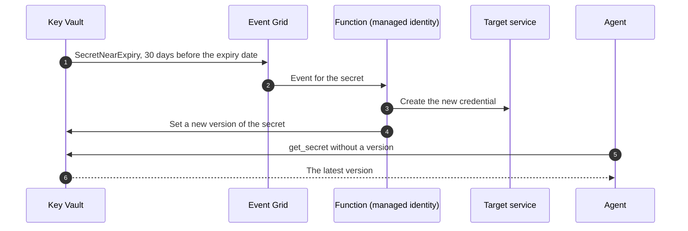

## When to use

- Agents that still need static secrets that cannot move to a managed identity
- Connection strings to external databases or third-party APIs
- Hardcoded secrets found in agent code or environment variables
- As a transitional control while moving to managed identity

## When NOT to use this skill

If the target is an Azure resource that supports Entra authentication, use a managed identity instead (see `secure-managed-identity-foundry`): there is no secret to store or rotate. Learn adds two rules about what goes in a vault: store credentials, connection strings and keys, not configuration (IP addresses, service names and feature flags belong in Azure App Configuration), and put management data such as the owner or the rotation schedule in secret tags, not in the value.

## Workflow

### Step 1 — Find the secrets and the vaults

Look for secrets in environment variables, repository configuration, Copilot Studio connector settings, Foundry connections of type `ApiKey` (see `govern-foundry-rbac`), and Azure App Configuration. Then check the posture of the vaults you already have with Query 1 in `queries/` (Azure Resource Graph): permission model, purge protection and network exposure; Query 2 lists who holds a Key Vault role and at what scope.

### Step 2 — Create the vault

```bash
az keyvault create \
  --name "kv-agent-{agent-name}" \
  --resource-group {resource-group} \
  --location {region} \
  --enable-rbac-authorization true \
  --enable-purge-protection true \
  --retention-days 90
```

- `--enable-rbac-authorization true` uses Azure RBAC (the recommended model) instead of access policies. A vault on access policies has to be migrated before role assignments take effect.
- Soft delete is on for every new vault and cannot be turned off; the retention (7 to 90 days, default 90) can only be set when the vault is created. Purge protection is **not** on by default: once it is on, nobody, Microsoft included, can purge a vault or an object before the retention ends, and it cannot be turned off.
- A vault per agent gives per-agent isolation with a simple role assignment. Use Azure Policy to require expiry dates ("Key Vault secrets should have an expiration date", Audit or Deny), soft delete and purge protection.

Network: reach the vault through a private endpoint (group ID `vault`, private DNS zone `privatelink.vaultcore.azure.net`) or restrict it with the vault firewall to known ranges, and turn public access off where you can. Do it before the first secret if the writer sits outside the network.

```bash
az network private-endpoint create \
  --name "pe-kv-{agent-name}" --resource-group {resource-group} \
  --vnet-name {vnet-name} --subnet {subnet-name} \
  --private-connection-resource-id $(az keyvault show --name "kv-agent-{agent-name}" --query id -o tsv) \
  --group-id vault --connection-name "kv-private-conn"
```

### Step 3 — Move the secrets in

```bash
# Read the value from a file, not from the command line (history and the process list)
az keyvault secret set \
  --vault-name "kv-agent-{agent-name}" \
  --name "{secret-name}" \
  --file ./secret.txt \
  --expires "$(date -u -d '+90 days' '+%Y-%m-%dT%H:%M:%SZ')" \
  --tags owner={owner} rotation-days=90
```

`--expires` does not enforce anything. The expiry date is informational: Learn says a `get` still works on an expired secret (it is useful for recovery). What the date does is start the near-expiry event (Step 7) and let Azure Policy audit that every secret has one. Delete the local file afterwards.

### Step 4 — Assign RBAC at the smallest scope

```bash
az role assignment create \
  --assignee-object-id {agent-principal-id} \
  --assignee-principal-type ServicePrincipal \
  --role "Key Vault Secrets User" \
  --scope "/subscriptions/{subscription-id}/resourceGroups/{resource-group}/providers/Microsoft.KeyVault/vaults/kv-agent-{agent-name}"
```

`Key Vault Secrets User` reads the value of the secrets and also lists their names and properties (the data actions are `getSecret` and `readMetadata`); it cannot write or administer. For a Foundry agent identity assign the role to the agent identity (`agentIdentityId`), and use the audience `https://vault.azure.net` when the agent requests the token. Give `Key Vault Secrets Officer` only to whoever writes secrets, and watch role assignments at resource group or subscription scope: they reach every vault below.

### Step 5 — Read from the vault, without a key

```python
from azure.identity import DefaultAzureCredential
from azure.keyvault.secrets import SecretClient

credential = DefaultAzureCredential()
client = SecretClient(vault_url="https://kv-agent-{agent-name}.vault.azure.net", credential=credential)
api_key = client.get_secret("{secret-name}").value   # no version: always the latest
```

Reading without a version is what lets rotation work: a new version replaces the old one and the agent picks it up.

**Copilot Studio:** use an environment variable of type secret backed by Key Vault, not the connector. Give the *Microsoft Copilot Studio Service* application the `Key Vault Secrets User` role on the vault, then say which agents may read each secret with a tag on the secret: `AllowedEnvironments` (environment IDs) for every agent of an environment, or `AllowedAgents` (`{envId}/{schemaName}`) for specific ones. The runtime caches the value for five minutes. Warning from Learn: anyone who can edit the agent can add a message node that prints the secret, so limit who can edit it. With a virtual network, an HTTP node can also read the vault through its private endpoint.

### Step 6 — Send the audit log to Sentinel

```bash
az monitor diagnostic-settings create \
  --name "kv-to-sentinel" \
  --resource "/subscriptions/{subscription-id}/resourceGroups/{resource-group}/providers/Microsoft.KeyVault/vaults/kv-agent-{agent-name}" \
  --logs '[{"category":"AuditEvent","enabled":true}]' \
  --workspace "/subscriptions/{subscription-id}/resourceGroups/{resource-group}/providers/Microsoft.OperationalInsights/workspaces/{workspace-name}" \
  --export-to-resource-specific true
```

`--export-to-resource-specific true` writes the resource-specific table `AZKVAuditLogs` (the one Queries 4 to 6 read). Microsoft Defender for Key Vault adds detection of unusual access on top of the logs.

### Step 7 — Rotate: the near-expiry event and a function

Key Vault has no rotation policy for secrets. Keys can rotate on a policy and certificates renew by themselves, but a secret changes through your own logic, triggered by Event Grid:



```bash
az eventgrid event-subscription create \
  --name "secret-near-expiry" \
  --source-resource-id "/subscriptions/{subscription-id}/resourceGroups/{resource-group}/providers/Microsoft.KeyVault/vaults/kv-agent-{agent-name}" \
  --endpoint-type azurefunction --endpoint "{function-resource-id}" \
  --included-event-types Microsoft.KeyVault.SecretNearExpiry
```

Learn publishes two function templates: one for resources with one set of credentials (a SQL password) and one for resources with two (storage account keys, alternating key1 and key2 so the agent has a full cycle to pick up the new one). Where rotation is not possible (an imported credential), use the same event as a reminder for a manual rotation. Remember that a vault recovered from soft delete does not bring back its Event Grid subscriptions or role assignments: recreate them.

## Verification

- [ ] The secrets live in the vault, not in variables or code
- [ ] The permission model is RBAC, purge protection is on and the vault is reachable only through its private endpoint or a firewall (Query 1)
- [ ] The agent identity holds `Key Vault Secrets User` on its own vault and nothing broader (Query 2)
- [ ] The agent reads the secret without a version and without any key in its configuration
- [ ] Every secret has an expiry date and the near-expiry subscription exists
- [ ] The `AuditEvent` log reaches the workspace (`AZKVAuditLogs`) and Queries 4 to 6 return rows

## Implementation notes

- In the validation tenant three vaults: one still on the access-policy model, none with purge protection, all three open to the internet without a private endpoint (Query 1); none sends diagnostics to the workspace, so Queries 4 to 6 were tested on a table built from Learn's schema and are marked NOT VERIFIED
- The structure inside the `Identity` column of `AZKVAuditLogs` is not verified: the queries use the whole value as the caller key
- Recommended Key Vault ARM API version: `2023-07-01`
- Use a naming convention for secrets (agent, environment, type), for example `sales-agent-prod-graph-secret`
- Removed in this version, because it does not exist or contradicts Learn: `az keyvault create-notification` (no such command; the near-expiry notice is the Event Grid event), the claim that `--expires` "forces rotation", the claim that `Key Vault Secrets User` cannot list (it reads names and properties), "automatic rotation" as a Key Vault capability for secrets, the Azure Key Vault connector for Copilot Studio (Learn documents the secret environment variable), and queries that read `CallerIdentity`, `resultCode_d` and a `SecretSet`-based expiry
